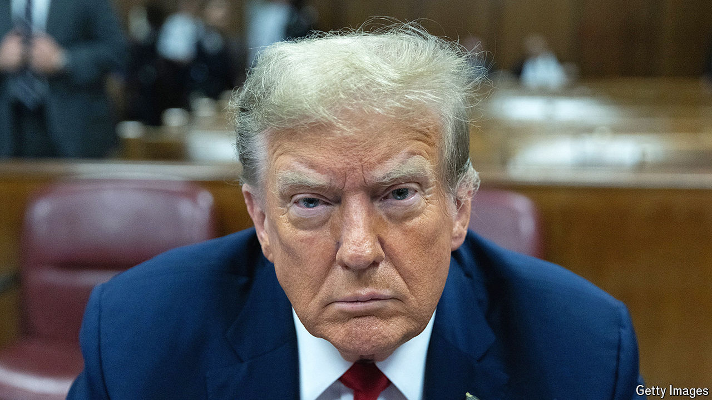

###### Burlesque hour

# Donald Trump’s first criminal trial will be both momentous and tawdry 

##### But will it even matter? 

 

> Apr 18th 2024 

Manhattanites once rolled their eyes at Donald Trump. Then they came to revile him. Soon 12 will decide if he is a felon. Jury selection in his first criminal trial, expected to last up to eight weeks in a shabby courtroom, has sped along; prosecutors will set out their case in a matter of days. One prospective juror confessed that the weight of the task at hand had kept her up at night: “This is, like, a big deal in the grand scheme of things.”

Yes and no. Manhattan’s district attorney, Alvin Bragg, has brought the first criminal indictment against a former president, who also happens to be running again. But the  are low-level and the details tawdry. The case is about sex, money and blackmail. Mr Trump’s former lawyer and fixer, who will testify against him, once described the conduct at issue as the “filth and muck of politics” and, less delicately, a “shit sandwich”.


The charges centre on Mr Trump’s efforts to buy the silence of Stephanie Clifford, a former porn star better known as , before the 2016 election. Prosecutors allege that the payment was made to protect his candidacy and thus amounted to an undeclared campaign expense. Mr Trump is accused of falsifying business records to hide the pay-off. He denies any such scheme.

Early in his first campaign Mr Trump met his lawyer, Michael Cohen, and his friend David Pecker, then the boss of a tabloid publishing company. Mr Pecker agreed to be Mr Trump’s “eyes and ears”—to look out for damaging stories and alert the campaign to them. When a former Trump Tower doorman tried to sell a bogus story to tabloids about how Mr Trump had fathered an illegitimate child, Mr Pecker warned team Trump, which directed him to buy exclusive rights to the story and bury it, a practice known as “catch and kill”. A similar deal was struck when Karen McDougal, a former  model, emerged from the woodwork to allege an affair with Mr Trump starting in 2006.

About a month before the election Ms Daniels surfaced, shopping around her story about a sexual encounter with Mr Trump, also in 2006. The “Access Hollywood” tape, in which Mr Trump bragged about grabbing women’s genitals, had just appeared in the press and nearly sunk his candidacy. The campaign could ill-afford headlines about how he had slept with a porn star while his wife was nursing their newborn son. This time Mr Cohen paid Ms Clifford $130,000 from his own pocket.

To reimburse Mr Cohen, Mr Trump allegedly agreed to pay him in monthly instalments and mislabel them as legal expenses in the company’s accounts. Hence the 34 felonies alleged by Mr Bragg: 11 related to invoices, 12 to ledger entries and 11 to cheques. Normally these would be misdemeanours. To upgrade them, prosecutors must show that the records were falsified to commit or conceal another crime. They have suggested a few: that the hush money violated federal campaign-finance rules, and that tax wasn’t properly paid on the reimbursements.

A parade of witnesses should bolster the prosecutors’ case. Mr Cohen and Mr Pecker will testify to Mr Trump’s alleged involvement in the scheme. There is an ample paper trail, including cheques that Mr Trump personally signed, and a recording of him discussing the payment for Ms McDougal’s silence.

Mr Trump’s lawyers, for their part, will contend that there was nothing illegal about the hush money: that it was paid purely to protect his personal reputation and spare his wife embarrassment, not to influence the vote or skirt campaign-finance rules. John Edwards, a former Democratic candidate for president, successfully made that argument and was acquitted of breaking campaign-finance laws to hide an affair and a child out of wedlock during the 2008 election. But it will not help that Mr Cohen has admitted in court that it was a crime. In 2018 he  to making an undeclared campaign contribution (among other charges) and spent just over a year in prison.

Mr Trump’s principal strategy, then, will be to impugn Mr Cohen’s credibility and paint him as a fabulist. Indeed Mr Cohen has an impressive record of lying under oath and a well-documented animus towards his former boss, who reportedly relished treating him like garbage. If Mr Trump is convicted, sentencing will be decided by the judge, Juan Merchan. Jail time seems unlikely for a first-time, white-collar felon. There is no mandatory minimum sentence. Each count carries a maximum of four years in prison.

Would a conviction ? That Mr Trump wanted his philandering kept quiet is neither surprising nor news; Americans are inured to his sex scandals by now. Compared with his other indictments this is small bore. Voters consider it the least serious of the four and a plurality thinks a guilty verdict will have no bearing on his political career, according to polling by YouGov. An acquittal would vindicate Mr Trump’s claim to be the victim of a political crusade by Mr Bragg, an elected district attorney who is a Democrat.

The indictment has come in for heavy criticism, even among lawyers on the left. There was doubt about whether state prosecutors could bring a case that rests on a federal campaign-finance violation, since that is the domain of federal prosecutors. Those questions might arise on appeal, but for now they are academic: judges have refused to toss the case out. Of the four indictments against Mr Trump, it may be the only one to produce a verdict before the election in November. The other, weightier charges, about alleged election interference and the mishandling of classified documents, are beset by delays. ■


