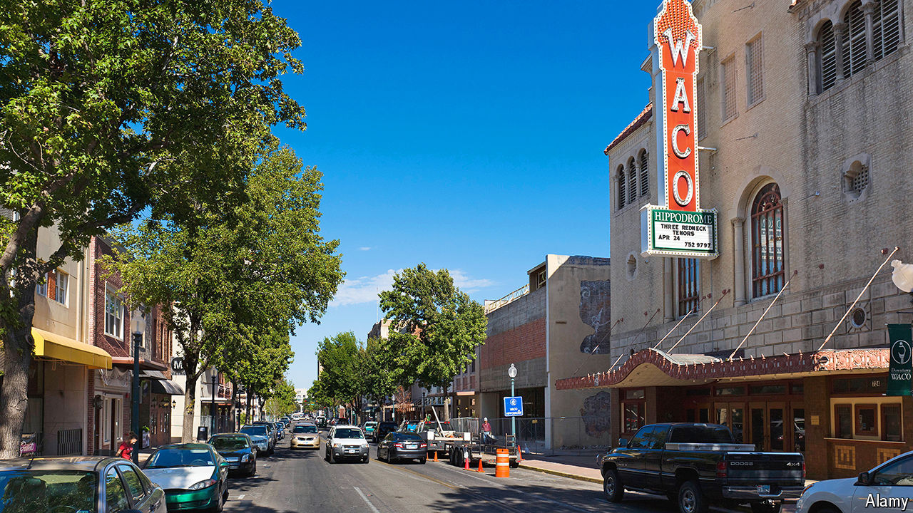

###### If you build it, they will sue

# How two small Texas towns became the patent-law centre of America 

##### Are entrepreneurial judges a good or a bad thing? 

 

> Apr 16th 2024 

In 2019 a federal judge named Alan Albright gave a presentation to a group of lawyers. His courthouse in Waco, Texas, where he is the only judge, sits near a sweet shop. The talk was called “Why You Should File Your Next Patent Case Across the Street from the ‘Hey Sugar’”.

The intellectual-property lawyers who heard his pitch were apparently persuaded. Less than two years after being appointed to the bench, Judge Albright had nearly 20% of the country’s patent cases, according to Lex Machina, a legal-analytics firm. By 2021, he had 23%. Trial teams of white-shoe attorneys from New York and California, representing clients such as Google and Intel, began streaming into Waco, a city of 140,000 people in central Texas more widely known for being the birthplace of Dr Pepper, a questionable fizzy drink.

Bill Wetterman, a real-estate developer and Waco native, spotted a business opportunity. In 2021 he opened up Legal Lawfts, rentable offices—“war rooms”, in the parlance—that come outfitted with security cameras, back-up internet and, by request, gluten-free Oreos.

In Waco Mr Wetterman’s competitors include Connect Litigation, a firm that runs a few war rooms downtown. But Connect focuses its operations about 200 miles north-east. The “patent docket” is a familiar term in Marshall, a faded but quaint town of about 24,000 people near the Louisiana border. Between 2000 and 2020, more than 17% of all patent cases filed in federal court were in the Eastern District of Texas—roughly 13,500. By comparison Delaware, where most big American companies are incorporated, had fewer than 10,000 cases; the Northern District of California, where Big Tech firms are based, had fewer than 5,000.

T. John Ward, Marshall’s federal judge from 1999 to 2011, is responsible for the town’s puzzling popularity. Patent cases are technical. Judges must referee the sharing of sensitive source code, for example: plaintiffs argue it will prove their case; defendants resist, fearing their secrets will leak. They also interpret what a patent’s words actually mean, which can be “outcome determinative”, says Mark Siegmund, a patent litigator in Waco. Cases can also take years to get to trial.

Mr Ward learned that Northern California’s court had implemented local rules to build what lawyers call “certainty”—a predictable process—into the unwieldy cases. He adopted similar ones, tweaking them to prioritise speed. Litigants reached trial in half the time it took in California. Around the same period, “it also happened that there was an explosion of patent-troll litigation,” says Paul Gugliuzza of Temple University, referring to plaintiffs who own bad patents and seek quick and cheap settlements. By the mid-2010s Mr Ward’s successor, Rodney Gilstrap, had about a quarter of the country’s patent cases.

Patentsville, USA

The caseload in Marshall books up the courthouse and boosts businesses downtown. One hotel bought a subscription to PACER, an online database for court records, to keep track of potential clients. In an apparent bid to make locals (read: jurors) like it more, Samsung, a frequent defendant, sponsored an ice rink across from the courthouse. TiVo spent $10,000 on a champion steer at a livestock auction, and named it TiVo.

This sits uneasily with some. Federal judges are meant to be generalists, and courts are not supposed to power their local economies. And the rules “tend to be more plaintiff-friendly”, says Andrew Russell, a patent litigator in Delaware. Defendants often try to transfer their cases elsewhere. Yet that is partly because the speedy tempo suits plaintiffs, as deep-pocketed defendants can afford to drag out litigation. Early on, verdicts in the Eastern District were lopsided, because the posh defence lawyers were “terrible” at arguing before juries, says Michael Smith, a longtime patent litigator in Marshall. Verdicts in the Eastern District now conform to national averages: in Waco, defendants actually win more, according to Lex Machina.

But the optics in Marshall were sufficiently bad that in 2017 the Supreme Court made it harder, in effect, for plaintiffs to file lawsuits there, by requiring defendants to have “regular and established” business where they are sued. Apple shut down its nearby stores. (Samsung did not and, despite the ice-rink, was hit with a $303m jury verdict in Marshall last year.)

By 2021 Waco’s patent docket—similarly speedy, thanks to local rules—was attracting scrutiny, too. John Roberts, the chief justice of the Supreme Court, acknowledged senators’ concerns about the “extreme concentration of patent litigation” there. Starting in 2022 Waco patent cases were required to be put into a lottery, so that any of the Western District of Texas’s 12 judges could draw them. In 2023 fewer patent cases were filed overall, and Waco saw a steep drop-off.

Patent litigation could reasonably warrant a specialised court, similar to the system America uses to handle bankruptcy cases, stacked with experienced judges. “There are compelling reasons why Congress might think it was wise to create a national patent court,” says Steve Vladeck of the University of Texas. “The problem is that it’s for Congress to decide, not the judge of the 37th-largest city in Texas.” Waco in fact ranks 24th in the state. Marshall is tied for 138th.■


