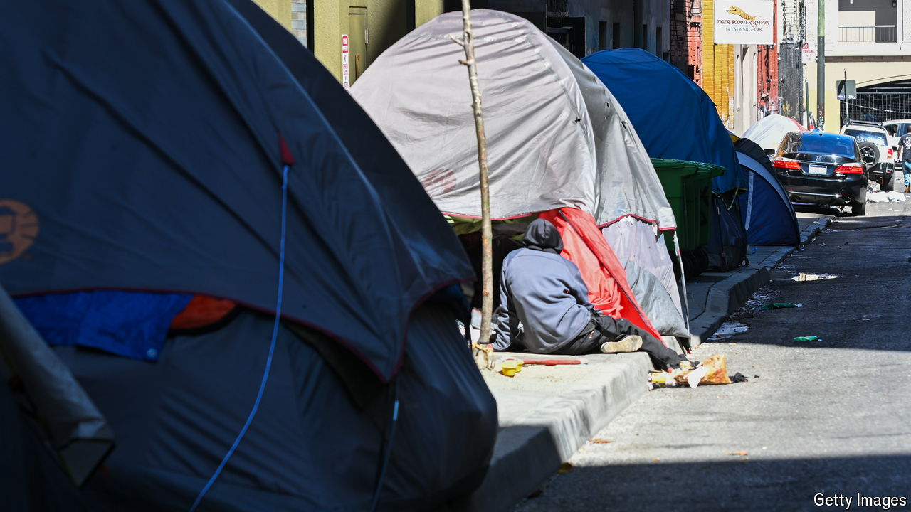

###### Sleeping rough

# Is ticketing homeless people a cruel and unusual punishment? 

##### The question has confounded western cities. The Supreme Court will weigh in 

 

> Apr 18th 2024 

IN 2013 local leaders in Grants Pass, Oregon, held a meeting to brainstorm ideas for how to tackle the city’s growing “vagrancy problem”. A record of that meeting states that participants suggested “driving repeat offenders out of town and leaving them there”, and buying homeless people a bus ticket to anywhere else. “The point”, said Lily Morgan, a city-council member, “is to make it uncomfortable enough for them in our city so they will want to move on down the road.” 

The city, tucked between the Cascade and Siskiyou mountains north of the California border, banned sleeping and camping in public places. Over the next few years Ed Johnson, the director of litigation for the Oregon Law Centre, a legal charity, started to hear from homeless people in Grants Pass. They were woken by police, he recalls, slapped with fines they couldn’t pay and thrown in jail. In 2018 Mr Johnson sued the city on behalf of his homeless clients. On April 22nd the Supreme Court will hear oral arguments in . The question at the heart of the case is whether penalising homeless people for sleeping outside when they have nowhere else to go counts as cruel and unusual punishment, which is banned by the Eighth Amendment. 

Two cases will serve as important precedent. In 1962 the Supreme Court found in  that a Golden State law making drug addiction illegal—rather than the use, purchase or sale of drugs—was unconstitutional. Jail time alone is not cruel and unusual, wrote Justice Potter Stewart, in his majority opinion. But the law criminalised a status rather than an act, and “even one day in prison would be a cruel and unusual punishment for the ‘crime’ of having a common cold.” 

In 2018 the Ninth Circuit Court of Appeals, which covers nine western states, applied the logic set out in  to homelessness. In  the court held that the city of Boise could not penalise people for sleeping rough when no shelter was available to them, as such citations ran afoul of the Eighth Amendment. The Supreme Court declined to review the case in 2019. Deciding to hear  gives the court, now more conservative than it was five years ago, another crack at the issue. 

Western politicians are hoping the court’s ruling will offer clarity on how to tackle the proliferation of tent encampments. Half of the growth in  between 2020 and 2023 came from the nine western states that comprise the Ninth Circuit. More than a quarter came from California alone. Oskar Rey, a lawyer who advised cities on how to comply with the Boise and Grants Pass rulings, argues that they are narrower than many think. “Sweeping” or breaking up encampments is allowable so long as cities aren’t ticketing homeless people who have no other shelter, argues Mr Rey. Sweeping encampments is anathema to activists who argue that tearing down tents is traumatising, but doing so does not criminalise homelessness. 

Still, some policymakers argue that the courts have tied their hands. In some cases that is true. In 2022 a federal judge interpreted the  and  rulings broadly, and blocked San Francisco from clearing encampments when there is no other shelter available. Politicians have another reason to blame the courts: it is easier to whine about judges than to shoulder the blame themselves for failed policies. 

The interest in  is also revealing of a larger trend. As recently as the early part of the covid-19 pandemic, Democrats were leery of sweeping away encampments. That liberal mayors around the West are now trumpeting their attempts to eradicate them is testimony to how fed up their voters are with homelessness in Los Angeles, San Francisco and Portland. Tents have come to symbolise disorder and failed policies. No wonder politicians who hope to stay in office want them gone.■


