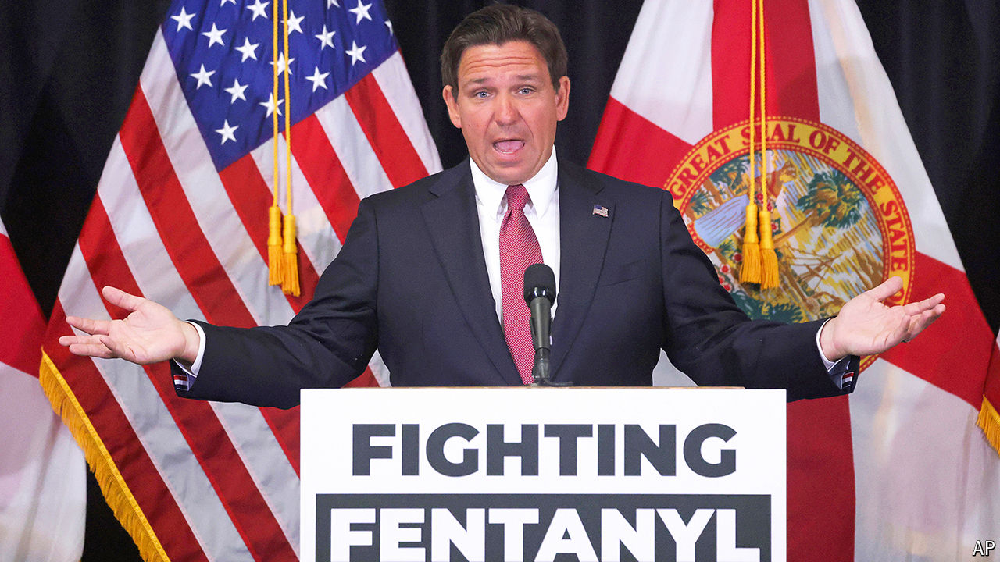

###### Can touch this

# Lots of state legislators believe any contact with fentanyl is fatal 

##### (It is not) 

 

> Apr 18th 2024 

In an episode of the cop drama “Blue Bloods”, Detective Maria Baez touches a dish covered in fentanyl, a . Moments later she is rushed to the hospital, fighting for her life. In the real world, viral videos show first responders seemingly harmed by the drug. In one, an officer is warned not to get too close to the substance. Within seconds he staggers back and falls to the ground. His peers administer , a drug that reverses the effects of opioid overdose, and he slowly regains consciousness.

The fear is so widespread that Florida’s governor, Ron DeSantis, even signed a bill on April 8th making it a felony, punishable with prison time, to recklessly endanger the life of a first responder by causing “inhalation” of fentanyl or “absorption through skin” which leads to “an overdose or serious bodily injury”. Yet there is no documented case of this taking place and medical researchers say it is extremely unlikely. “The law creates a felony assault charge for something that is scientifically impossible and has never happened,” says Ryan Marino, a toxicologist at University Hospitals Cleveland Medical Centre.

The Drug Enforcement Agency (DEA) has a webpage from 2017 warning first responders about the dangers of fentanyl. “The opioid epidemic nationwide has caused havoc and heartbreak…Any fentanyl exposure can kill innocent law enforcement, first responders and the public.” Fentanyl is indeed a scary drug. It is responsible for 70% of  per year. And policing is also a tough job. By the nature of the role, officers are at greater risk than the general public.

But toxicologists show that such incidental exposures are not harmful. The American College of Medical Toxicology and the American Academy of Clinical Toxicology say that “fentanyl and its analogs are potent opioid receptor agonists, but the risk of clinically significant exposure to emergency responders is extremely low.” According to the Centres for Disease Control and Prevention, no law-enforcement officers have died from fentanyl exposure while performing their duties.

If fentanyl were truly as toxic as claimed by agencies like the DEA, then everyone would be at risk. Researchers have found trace amounts of the drug in public spaces, such as buses. Yet passengers and drivers are not dying. Nurses and doctors administer the drug and treat overdose victims every day. Drug-dealers would also “be dropping dead left, right, and centre”, says David Juurlink of the University of Toronto, unless they wore protective equipment. But Brandon del Pozo, a former police chief and public-health professor at Brown University, says that during fentanyl-related drug busts, the scene was often quite casual. “There’s one guy watching TV, one guy eating Chinese takeout, another guy cutting fentanyl on the table,” he explains. “They are not wearing hazmat suits and gas masks.”

Perpetuating the myth of incidental harm makes an already tough job that much more fraught. “Imagine being a cop and believing that any time I go near these people, I could just die,” says Dr Del Pozo. “That is an incredibly needless source of stress.” Some medical professionals say that the officers in those viral videos probably had real physical reactions, but they do not resemble the symptoms of an opioid overdose. Some think the officers may have been stricken with panic instead. 

Confusion about the potency of fentanyl could also have consequences for people who are actually overdosing. Drug users may now hesitate to call for help for an overdose victim for fear of punishment. If first responders take time donning unnecessary protective gear, the victim could die.

Lawmakers in Florida passed the bill anyway. Jay Collins, a Green Beret army veteran and state senator who sponsored it, is undeterred by the naysayers. “We have to make sure we protect and preserve our law enforcement,” he says. “I want our law enforcement to know that, unequivocally, we here in Florida have their back.”■


