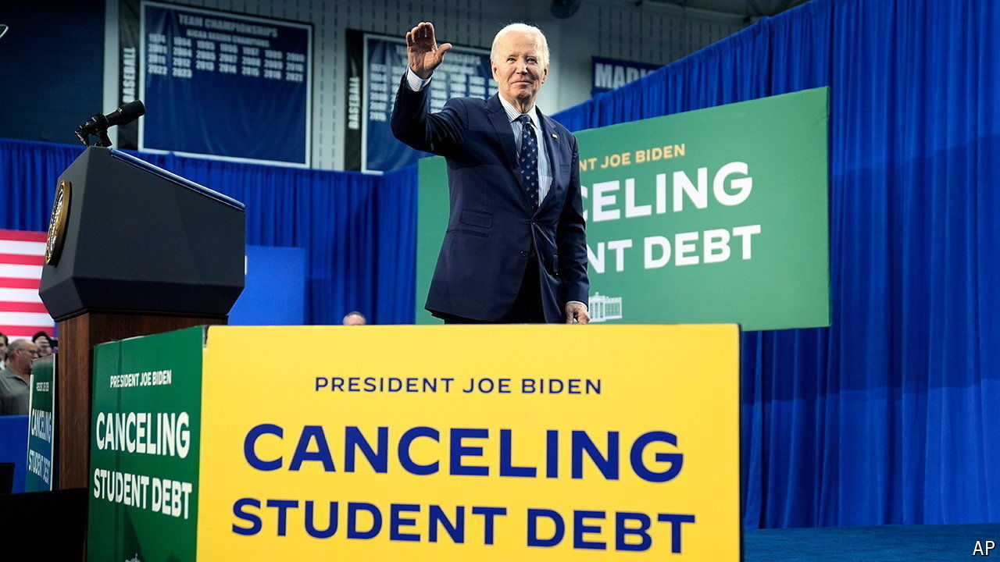

###### Biden and student loans

# The White House unveils a pair of bad policies to woo voters 

##### Tariffs for steelworkers and loan forgiveness for students are both regressive 

 

> Apr 18th 2024 

It is a Washington truism that little gets done in Congress during an election year. This means that pandering politicians, and particularly the president, need to get creative. Consider two recent moves by President Joe Biden to shore up support among blocs traditionally supportive of the Democratic Party.

On April 17th Mr Biden called for a 25% tariff on certain ; in some cases that amounts to more than tripling existing import taxes. This is in addition to tariffs put in place by Donald Trump on some products. Mr Biden also told a steelworkers’ union that his administration will investigate Chinese shipbuilding subsidies and work with Mexico to block Chinese tariff evasion.


The day before the tariff announcement, the Department of Education proposed a regulation that would forgive unpaid interest for Americans who owe more on their student loans than they originally borrowed. Around 25m voters could benefit. The plan would also help more than 2m borrowers who have held loans for at least 20 years and an additional 2m who qualified for existing assistance programmes but didn’t sign up. Those who attended “low-financial-value programmes or institutions” could get relief as well.

The rule faces a month-long public-comment period, then a review. The administration hopes to implement the new proposal by the autumn. All this follows an announcement on April 12th of another student-loan cancellation for 277,000 borrowers that adds up to $7.4bn. The Education Department is working on yet another proposal to help those “experiencing hardship” repaying their loans. 

These moves are the latest in a long White House campaign to relieve hundreds of billions of dollars in student debt. The White House estimates that it already has approved $153bn (or 0.6% of GDP) for more than 4m borrowers. The Committee for a Responsible Federal Budget (CRFB) believes the new policies cost $147bn. The hardship cancellation could range between $100bn and $600bn, depending how stringent the final proposal is.

This is probably good politics for Mr Biden, as the Democratic Party continues to consolidate support among college-educated voters and worries about losing rank-and-file union members seduced by Mr Trump’s overtures towards them. As policies, they are retrograde bungs to favoured groups at the expense of other Americans.

The steel and aluminium tariffs are inflationary, which makes them worse for low-income Americans. As for student-loan forgiveness, helping borrowers at high default risk could be progressive. But many borrowers in relatively good financial health carry debt because they choose to cover only their minimum monthly payments. Some voters might wonder whether law-school graduates really need more federal help than plumbers.

Congress has given the presidency broad but not unlimited authority to enact tariffs; Mr Biden’s student-loan actions are more dubious. The Supreme Court struck down a previous proposal, which relied on an overly expansive reading of a law that allowed for debt forgiveness during national emergencies. “This one is a lot more targeted, but if you pick enough targets, you get to a similar place,” Marc Goldwein of the CRFB says of the new proposal. 

Both parties see value in having a debate about the cost, legality and fairness of Mr Biden’s student-loan efforts. While that goes on, the country is avoiding a more serious conversation about what has made college so expensive in the past few decades. And Mr Biden’s tariff play is only the latest sign that embracing protectionism is now a bipartisan habit. ■


