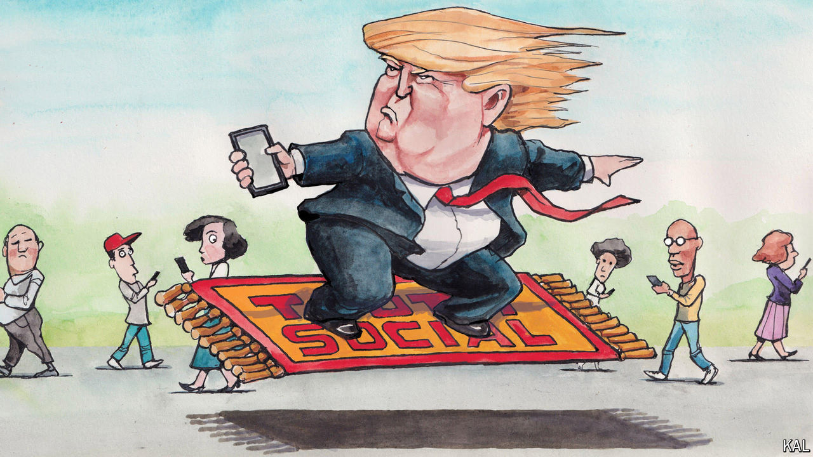

###### Lexington

# Truth Social is a mind-bending win for Donald Trump 

##### And disturbing evidence of how he destabilises reality for Americans 

 

> Apr 18th 2024 

Since shares in  began trading publicly on March 26th, their value has slid by more than half, prompting headlines, and some crowing from the left, about the decline. Which still seems less newsworthy than that anyone is buying at all: even at roughly $26 per share, investors are prizing Mr Trump’s social-media platform, Truth Social, at a heroic value relative to its performance or apparent potential. 

One must write “roughly” $26 per share because even the  has struggled to ascertain just how many shares are outstanding. Other possible red flags for investors include the company’s independent auditor reported on March 25th that its “operating losses raise substantial doubt about its ability to continue as a going concern”. After forecasting sales of $144m for 2023, Truth Social delivered just $4.1m, and a loss of $58.2m. 

Truth Social says it is contending with such entrenched giants as Facebook and Amazon, but it does not disclose its audience numbers. In a regulatory filing it tried to make a virtue of this by arguing that “adhering to traditional key performance indicators” such as traffic or advertising results—the sorts of results that typically obsess media investors—could “potentially divert its focus from strategic evaluation” of its business. For March, the analytics firm Similarweb found Truth Social had about 7.7m unique visitors, or roughly 0.05% of Facebook’s traffic. 

Maybe such realities will suddenly drag down the stock. But it has a long way to fall to depart the reaches of faith for the realm of reason. John Rekenthaler, a vice-president of Morningstar, an investment research firm, has estimated that if people valued Truth Social as they did the initial offerings of such firms as Tesla, Google and Facebook, the shares would be selling for 50 cents.

Investors in Truth Social, compared with those in other startups, are clearly not relying upon the same sort of analysis or even indulging the same sort of dream. They are not even playing the same game as the very online investors who drove up such  as AMC and GameStop to irrational valuations that were also relative fractions of the paper value of Mr Trump’s company.

Something else is happening here, a tremor in market logic, even a rupture with common sense. Maybe investors believe that Mr Trump will win in November and, as the first president with his own social platform, insist on making all his pronouncements upon it. Maybe they adore him and want to multiply his billions. Whatever their motives, the performance of Mr Trump’s stock so far represents the purest demonstration of his power not just to bend reality, but to convert illusion into reality—and also, maybe, of how Americans are coming to confuse the two. 

For years Mr Trump has used his mastery of the virtual world—the controversy and excitement he generates online—to increase his political power. He has just 7m followers on Truth Social, compared with 87m followers on X. But by taking ownership himself of the virtual events he is so skilled at provoking, he has created tremendous paper value, and he appears to be on his way to turning that virtual value into real wealth. Mr Trump holds 78.8m shares in the company, or about 57% of the total, and he is due to receive 36m more if the share price stays above $17.50 until late April. Under a “lockup” agreement Mr Trump cannot sell for six months, until September 25th, unless the company’s board releases him from the restriction.

What Mr Trump has called “truthful hyperbole”, and others call lying, has been . When he built Trump Tower it had 58 floors, but in numbering them he skipped ten to claim 68 instead. This tactic has occasionally caught up with him, most severely in the $355m penalty imposed on him in February after a New York judge found Mr Trump had lied for years to secure loans and make deals—trebling the size of his penthouse apartment, for example, and valuing his Mar-a-Lago estate in Florida based on its potential for residential development, though he had surrendered the rights to develop it as anything but a club. 

Yet Mr Trump’s trademark hyperbole is the very foundation of Truth Social. Its value rests on his participation—his agreement with the company constrains his posting elsewhere—and his posts are full of exaggerations if not lies, whether about the criminal cases against him, President Joe Biden, or the state of the country. Is that some sort of fraud? Or is it just life online, and how value is best created there, to be exchanged for an offline currency via advertising, the stockmarket or the ballot box?

There is no spoon

Virtual reality always seems to be a step away. Alternative digital worlds like “Second Life” have not caught on, and clunky AR headsets have proved more aversive than immersive. But Americans may not recognise the degree to which reality online—a reality that did not exist for most just a generation ago—has washed back into the real world, distorting their politics, their relationships, their apprehension of what is true or what has value. The rules governing all of this have changed, and it is not clear what the new rules are. Mr Trump and others are still inventing them.

Officials in the administration of President George W. Bush used to deride what they called the “reality-based community” and insist they could “create our own reality”. They were pikers compared with Mr Trump. It seemed like a joke, during his campaign for president in 2016, when he referred to his political following as a “movement”. Now it is reasonable to call him the most consequential figure in American politics since Ronald Reagan. Maybe Mr Trump will lose the election in November, and maybe that will cause stock in Truth Social to crash, if it does not collapse before then. But it does not seem like a crazy act to buy a few shares now, just in case. ■


