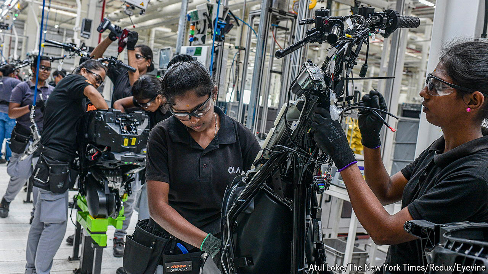

###### Jobs v the patriarchy

# Can women-only factories help more Indian women into work? 

##### Ola, an electric-scooter manufacturer, is trying to find out 

 

> Apr 25th 2024 

WHEN KAVIPRIYA, a 22-year-old from a village in the south Indian state of Tamil Nadu, decided to take a factory job, her family was not thrilled. “My mother-in-law wanted me to stay at home and look after my two-year-old son,” she explains. Her relatives eventually came around when they realised that Kavipriya would be earning good money to supplement her husband’s income as a cab driver. 

Women like her are still unusual. In 2023 only 33% of Indian women were active in the labour market, compared with around 50% of women globally and 37% in neighbouring Bangladesh, with which India shares many economic and social characteristics. The only countries where fewer women work are a handful of conservative Muslim countries across North Africa and the Middle East, Taliban-ruled Afghanistan and Pakistan, India’s troubled neighbour. Yet Kavipriya’s experience also illustrates one way of bringing more women into work: by designing jobs in a way that is acceptable to them and their families.

