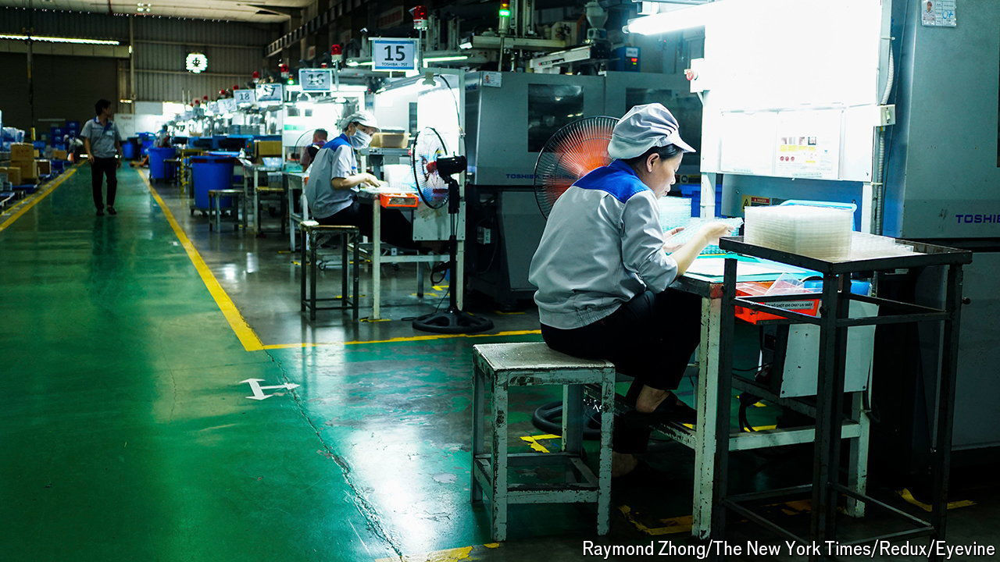

###### No longer just made in China

# Chinese firms are expanding in South-East Asia 

##### This new business diaspora is younger, better-educated and ambitious 

 

> Apr 25th 2024 

In 2021 the founders of PalFish, a platform based in China which connects English teachers and students, realised its future lay abroad. The Chinese government had just launched a crackdown on private tutoring, after Xi Jinping, its leader, accused the industry of preying on the educational anxieties of China’s parents. The firm considered expanding to Latin America, the Middle East or Russia before landing on South-East Asia. Three years on, 10m students in the region use it.

PalFish is part of a broader trend. Exact numbers for Chinese companies in South-East Asia are hard to come by, but there are thought to be thousands, as unpredictable politics in Mr Xi’s China, coupled with a slowing economy, are forcing businesses to look for opportunities elsewhere. This new Chinese business diaspora is different from previous ones: it is wealthier, highly educated and with ambitions beyond South-East Asia. 

