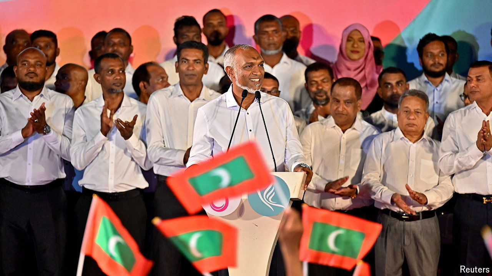

###### Pacific pivot

# The Maldives is cosying up to China 

##### A landslide election confirms the trend 

 

> Apr 25th 2024 

THE MALDIVES tends to evoke images of cocktails enjoyed on pristine white beaches framed by gently swaying palm trees. Thoughts of geopolitics rarely feature. Yet they were to the fore this week as the People’s National Congress, the party of President Mohamed Muizzu, won a landslide victory in parliamentary elections, claiming over two-thirds of seats. 

The victory is likely to help Mr Muizzu, who took over as president in November, change his country’s foreign policy. He has sought to make good on an election promise to reorient the archipelago away from India, traditionally the Maldives’ closest regional economic and security partner, and step up co-operation with China. 

