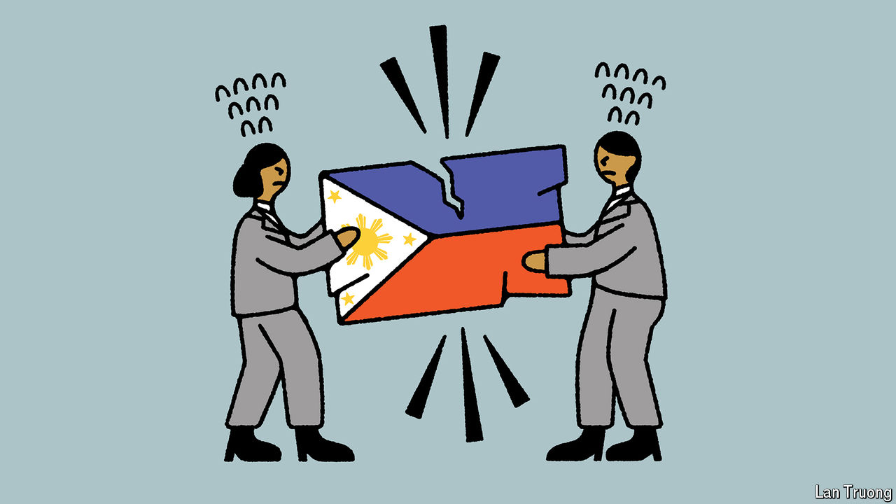

###### Banyan

# The family feud that holds the Philippines back 

##### Squabbling between the Marcos and Duterte clans makes politics unpredictable 

 

> Apr 25th 2024 

Like Romeo and Juliet, the president and vice-president of the Philippines come from rich, powerful families that are constantly at daggers drawn. Unlike Shakespeare’s star-crossed lovers, Ferdinand “Bongbong” Marcos and Sara Duterte detest each other. This makes governing the Philippines rather harder than it should be.

Both families have grubby histories. Mr Marcos is the son of a despot, also called Ferdinand Marcos, who stole billions, tortured thousands and was ousted by a popular uprising in 1986. (He died three years later.) Ms Duterte is the daughter of Rodrigo Duterte, who as president from 2016-22 urged the wholesale murder of drug suspects and called the pope a “son of a whore”.

