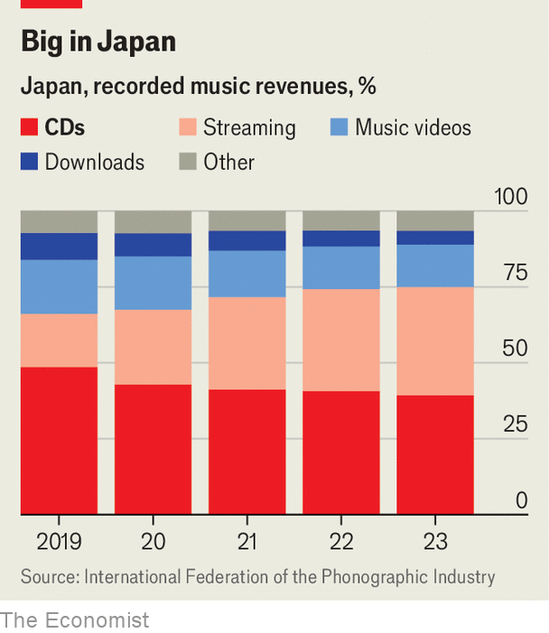

###### Back to the future

# Why do the Japanese love CDs? 

##### They have not taken to streaming as keenly as the rest of the world 

 

> Apr 25th 2024 

When Prince sang “Tonight, I’m gonna party like it’s 1999” on his 1982 hit “1999”, he was describing a party during a turn-of-the-millennium apocalypse. He could have been singing about the music industry. In 1999, according to the International Federation of the Phonographic Industry (IFPI), global recorded-music revenues soared to $22bn ($40bn in 2023 prices). That revenue was largely driven by the compact disc (CD). Over the next 15 years, those revenues would fall as consumers turned to streaming. The IFPI recently reported that streaming accounts for 67% of revenues. CDs account for just 10%. 

 


