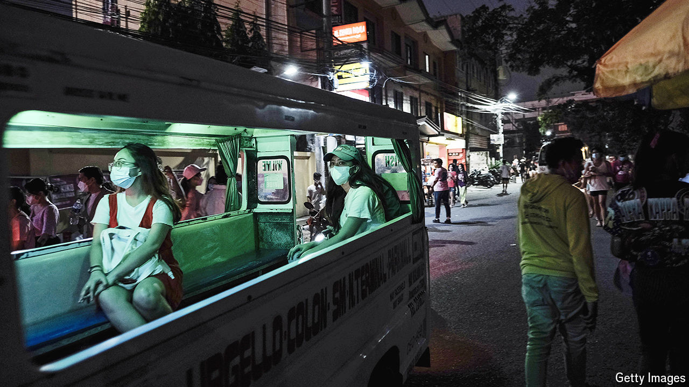

###### Trump-proof tiger

# Without fanfare, the Philippines is getting richer 

##### And its economy is unusually well-defended against American politics 

 

> Apr 23rd 2024 

At Cotabato airport travellers must join a long sweaty queue to pay a tax of ten pesos (less than $0.20). Having handed over their cash—cards are not accepted—they must wait while three unhurried officials produce a paper receipt and stamp it. If they could avoid this hassle by having the tax added to their ticket, most would be delighted, even if the tax were ten times larger. Yet this simple reform has not happened, perhaps because it would cost those three unhurried officials their jobs. 

Visitors to  have ample time to imagine ways to make its transport system less frustrating. When not queuing in rickety airports, they are . A typical commute from an outlying suburb to the centre of Manila, the capital, takes two hours, including nearly 30 minutes waiting for a bus to show up.

