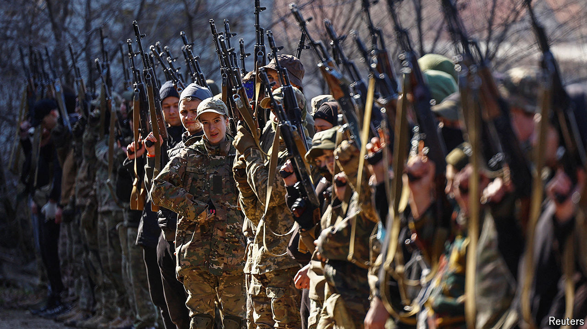

###### Last-minute reprieve

# America’s $61bn aid package buys Ukraine time 

##### It must use it wisely 

 

> Apr 25th 2024 

Since late February Russia’s army has been creeping across eastern Ukraine. First the town of Avdiivka fell—Russia’s biggest advance in almost a year. Next its soldiers occupied a series of villages farther west. Russia’s progress is a reflection of its overwhelming advantage in firepower: on some parts of the front line, for every shell the Ukrainians have shot at Russian lines, the Russians have rained down 17 in response. Ukrainian forces have been rationing ammunition, for fear of running out. That scarcity, in turn, was a reflection of America’s failure to approve any new military aid for Ukraine since last summer.

This week, however, after months of dithering, Congress approved $40bn of such assistance, a sum roughly equivalent to all America’s military aid to Ukraine since the war began. (There was also some humanitarian aid and help for I) Joe Biden, America’s president, signed the bill into law on April 24th and ordered the immediate dispatch of the first $1bn of supplies, to arrive in days.


It comes just in time. In March Emmanuel Macron warned the heads of French political parties that Russia might break through Ukrainian lines and advance towards Kharkiv or Odessa. On April 18th Bill Burns, the director of the CIA, warned that Ukraine would be in a “dire” position if Congress did not approve the aid package. “There is a very real risk that the Ukrainians could lose on the battlefield by the end of 2024, or at least put Putin in a position where he could essentially dictate the terms of a political settlement.”

Such a calamity has now been averted. With the assistance Congress has approved, Mr Burns has said that Ukrainian forces should be able to “hold their own” on the battlefield this year and dispel the “arrogant view” of Vladimir Putin, Russia’s president, “that time is on his side”. The new aid should include around a year’s worth of shells, reckons Michael Kofman of the Carnegie Endowment, a think-tank.

But the imbalance in firepower of recent months has already had grim consequences. Russia’s advantage in artillery has provided cover for its troops to advance. Worse, it has forced Ukraine to repel assaults using infantry armed with grenades and small arms, rather than its own artillery. This has led to more Ukrainian casualties and fewer Russian ones than would otherwise have been the case (though Russian losses are still appallingly high: about 1,000 killed and wounded a day during offensives, Western officials reckon).

Half a step forward

What is more, even the fresh infusion of weaponry will not wholly eliminate Russia’s advantage in terms of firepower. With its huge population and oil wealth, Russia also finds it easier to drum up new recruits. Ukraine is therefore likely to remain on the back foot, unable to mount new offensives. And uncertainty about Western aid will not go away: America may become much less friendly to Ukraine after presidential and congressional elections in November. 

 


The fiercest fighting at the moment is in Chasiv Yar, a town just to the west of Bakhmut, the city Russia captured a year ago after nine months of trying. For Russia, seizing Chasiv Yar would open a path towards bigger cities in Donetsk province. Donetsk and neighbouring Luhansk (almost all of which is already in Russian hands) form the Donbas region, which Russia has annexed in theory and would like to do so in practice (see map). For Ukraine, Chasiv Yar is a strategic stronghold, on high ground and shielded by a canal, trenches and other recently strengthened fortifications. Russian forces have reportedly been ordered to advance as far as they can before May 9th, Victory Day, which commemorates the end of the second world war and is an occasion for bombastic military parades and jingoistic speeches.

Colonel Pavlo Fedosenko, who leads a brigade defending the city, says Ukrainian forces maintain a substantial degree of control there. During the past month of all-out fighting, Russia has shown it “lacks the strength and means” to advance. In the meantime, Ukraine has inflicted serious losses, destroying around 100 armoured vehicles in a month in this section of the front alone. Now, he says, the Russians are “largely attacking on off-road motorcycles, buggies and quad bikes”. Surveillance drones allow Ukrainian forces to detect movement as much as 10km away and react promptly. But Russian attack drones torment Ukrainian forces: stay at any point in the city for more than a few minutes and they begin to rain down. Although news of the new aid package was greeted with cheers in the local command room, Colonel Fedosenko says, he and others suspect Chasiv Yar will fall eventually. 

 


The infusion of arms should, however, put Ukraine in a stronger position to fend off a bigger Russian offensive that Kyrylo Budanov, the head of Ukraine’s military-intelligence service, has said he expects in May. Ukrainian forces predict a push in the east to capture more of Donbas. They have also noticed an increase in Russian reconnaissance farther north, around Kharkiv, Ukraine’s second city. Capturing such an important place would be a huge psychological victory, but Russia almost certainly lacks both the troops and sufficient mechanised vehicles for a decisive attack.

Defending Ukraine’s skies will also be hard. Russia has hammered Ukraine’s defence industry and power grid with barrages of drones and missiles. Ukraine tries to defend against these assaults with a hotch-potch of American, European and Soviet-era anti-missile systems. But as with its artillery, its stock of ammunition has dwindled. Videos published on social media in recent weeks show Russian Su-25 jets flying at relatively low altitudes in the east, providing close support to troops. Russian reconnaissance drones have also penetrated as far as 40km behind the front lines without being shot down. Such incidents suggest that Ukraine is running short of interceptor missiles. 

The erosion of Ukraine’s air defence has several malign effects. On the front lines, the shortage of interceptor missiles has given more freedom of manoeuvre to Russian jets and guided aerial bombs, which have been flying in at a rate of 100-130 a day. The worst-case scenario is that Russia achieves air superiority, allowing it to bomb the front lines at will, as it did in the city of Mariupol in the first months of the war. That would make it vastly harder for Ukraine to hold its current lines.

Many possible steps back

There is also the damage to infrastructure away from the front. On April 16th a Ukrainian official said that Russia had destroyed seven gigawatts (GW) of power-generation capacity in previous weeks, leaving just 10GW or so operational. Ukraine is now almost entirely reliant on nuclear plants. Although Russia is unlikely to bomb those, it may well strike transmission lines. Kyiv is already suffering from rolling blackouts, which sap morale. 

Small wonder, then, that Ukraine is desperate for more air-defence systems. America’s new aid is likely to include some missiles. Ukraine also needs launchers. It has between five and ten Patriot batteries, which protect against longer-range and faster-moving ballistic missiles. But these are defending cities, which leaves infrastructure and the front lines exposed. Ukraine is hoping Poland and Spain, among others, will donate more. The catch is that they are in high demand elsewhere, as Iran’s drone and missile barrage against Israel on April 13th underscored.

Even before any ammunition arrives, America’s latest aid provides Ukraine’s weary forces with a psychological boost. Mr Putin might have hoped that a well-timed offensive over the summer would capitalise on Ukraine’s shell shortage and make great headway. That, in turn, might have heightened doubts within NATO and among American politicians about the long-term viability of Ukraine’s resistance. If Mr Putin could show that Russia’s war machine was unstoppable and Ukraine was a lost cause, he might have hoped to strike an advantageous deal with Donald Trump, were he to become America’s president again in January, and so force a Ukrainian surrender on humiliating terms. 

The approval of the aid bill may change his calculations. In the very short term, it may spur Mr Putin to intensify assaults on places like Chasiv Yar, to try to make gains before much new ammunition arrives. But if Ukraine is properly armed in the coming months, any offensive is likely to peter out or make only marginal gains at eye-watering cost in lives and equipment—exactly as happened to Russia in early 2023 and, to a lesser extent, to Ukraine in its own unsuccessful counter-offensive in the summer and autumn of that year. 

If so, that would be a heavy blow. Mr Putin’s war machine cannot maintain its current pace indefinitely. Russia’s artillery is keeping up such a heavy barrage that the barrels of the guns are wearing out. It is likely to run very low on replacements next year, requiring it to use more rockets instead. But artillery rockets need five times as much explosive material, which is also in short supply. By the same token, Russia is thought to have lost around 3,000 armoured vehicles in the year to February, according to data collected by the International Institute for Strategic Studies, a think-tank in London, and around 9,000 since the start of the war. It has replaced them from Soviet-era stockpiles, but those are expected to run out in about two years. “Russian defence industrial capacity maxes out in 2025,” says a Western official.

The capacity of Ukraine’s allies, meanwhile, is growing. The bill Congress has just passed includes investments to increase the rate of ammunition production. Annual output of PAC-3 interceptors, the missiles fired by Patriot launchers, could rise by about a fifth over the coming year, from the current 500 or so. America’s annual production of shells should rise to about 1.2m next year. Add to that European shells—1.4m this year and 2m next—and Ukraine’s allies should soon be able to match Russian production. 

Stepping up

In the long run, Ukraine’s biggest shortage is not likely to be munitions, but manpower. On April 3rd Volodymr Zelensky, the president, signed a long-delayed bill lowering the conscription age from 27 to 25. The bill also requires all military-age men to register on a new database, potentially bringing many previously overlooked candidates to draft officers’ attention. The armed forces had lobbied for these steps for months; Mr Zelensky had resisted, concerned about the political and economic fallout. Mr Kofman has argued that manpower is likely to be the “decisive” factor for Ukraine this year. Many battalions, already under strength, also have relatively few soldiers young, fit and well-trained enough to undertake serious assaults.

Ukraine’s counter-offensive last year fizzled for a variety of reasons: delayed arms deliveries from the West, a dramatic expansion of Russian fortifications during the resulting hiatus, miscalculations over how lethal a drone-saturated battlefield had become and strategic mistakes such as the decision to launch attacks in both the east and the south, splitting Ukraine’s forces. But high on the list was a lack of skill. Ukrainian units, armed with unfamiliar Western weapons, were expected to wage complex “combined-arms” warfare against prepared defences with a meagre five weeks’ training. The lack of experience in such co-ordinated attacks means that both Ukraine and Russia are largely fighting at the level of companies, rather than battalions or brigades. Even if one side could find or make a breach in the other’s lines, they would struggle to exploit it.

The side that can master large-scale operations first will have a big advantage. If Ukraine is to get there, it will take lots of training. One difficulty is withdrawing entire units from the front for long enough to provide that training. Another is where to do it. Poland, an obvious candidate, is hesitant to host training on such a scale. An alternative would be for Western troops to do it on Ukrainian soil—an idea aired by Mr Macron in March which is under consideration in Western capitals. European governments suggest that they would be unlikely to take this risk without American involvement, not least because any training sites would need to be bristling with air-defence systems.

Wherever the training occurs, it will take time. A person familiar with the planning says that it would probably take until 2026 or 2027 for Ukraine to develop a serious offensive capacity. In the interim, Ukraine would need to continue to degrade Russian combat power. A strategy paper published by Estonia’s defence ministry last year argued that Ukraine would need to kill or seriously wound 50,000 Russian troops every six months to prevent Russia from building a stronger army. It would also need to keep up long-range strikes against Crimea, the Black Sea Fleet and Russian air bases, which in turn would require a steady supply of long-range missiles. Ukraine is husbanding a relatively small stock of British and French cruise missiles; America, it emerged this week, has quietly provided some long-range ATACMS ballistic missiles, which have already been put to use. Western sanctions would also need to be tightened, to hobble Russia’s defence industry.

In other words, a big military breakthrough could be several years away for Ukraine and, even then, only if large-scale Western support is maintained and enhanced. That is far from certain, especially given the vagaries of American politics. Mr Trump is much less resolute in his support for Ukraine than Mr Biden. And even if Mr Biden is re-elected, the next Congress may be even more cantankerous about Ukraine than the current one. 

 


In private, some Western officials argue that, given the likelihood of a long period of—at best—stalemate, a peace deal which froze the front lines and took the rump of Ukraine into the European Union and (less probably) NATO would constitute a strategic victory for Ukraine and a defeat for Russia. Others are sceptical that Russia would agree to such a deal or abide by it, or that Western countries would be able to provide sufficient guarantees to coax Ukraine to accept. Yet others want Ukraine to keep fighting, in the hope that Russian weaknesses will eventually force the Kremlin to withdraw or accept a more favourable deal. The mood inside Ukraine remains surprisingly defiant. A recent poll finds that 73% of the population is prepared to “tolerate as much as victory requires”. Some military leaders think the fighting will continue as long as Mr Putin is alive. “This war will be ongoing while this regime remains in place in Russia,” Mr Budanov recently told the .

Congress, by coughing up $61bn, has fended off the worst, without setting Ukraine clearly on the path towards any of these outcomes. But the newly signed military-assistance bill also includes a series of provisions requiring Mr Biden’s administration to submit a strategy for Ukraine to Congress within 45 days. Officials will be obliged to spell out specific objectives, along with a budget for bringing them about, and update them each quarter. This exercise may be a figleaf, but at the very least it will show that coming up with a plausible, palatable long-term plan is even harder than coming up with more cash. ■


