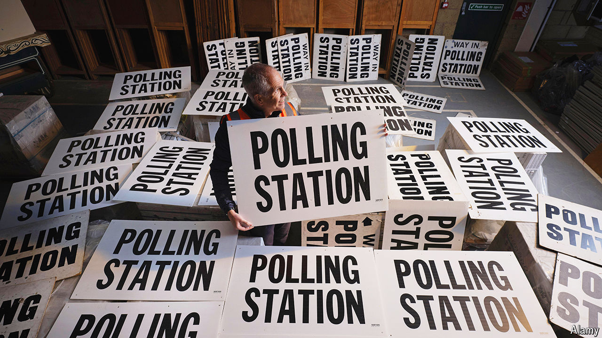

###### Local democracy

# English local government is in a dire state 

##### The excitement over metro mayors cannot disguise the rot 

 

> Apr 25th 2024 

One leaflet being stuffed into letterboxes by Liberal Democrats in Hull, a city of almost 270,000 people in East Yorkshire, argues that Labour politicians spent too much money on some car-park gates. Another boasts that trees have been pruned near a supermarket and that a new grit bin has been installed. All politics is local, goes the old saying. Increasingly, all English local politics is trivial. 

On May 2nd local elections will be held in much of England and Wales. If the Tories lose many seats, internal grousing about the prime minister, Rishi Sunak, will intensify—though Hull cannot add greatly to his misery, since it has no Tory councillors. The grumbling will grow louder if the party loses two metropolitan mayors in Tees Valley and the West Midlands. Local elections have become referendums on national governments and not much more. 

