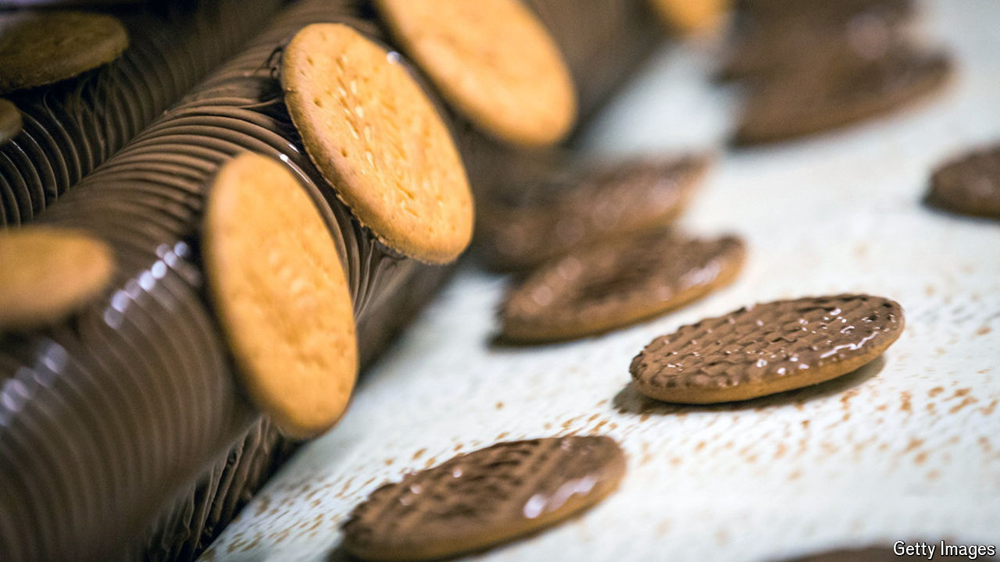

###### Put VAT on everything

# How to fix Britain’s barmy VAT regime 

##### Britain’s second-most-important tax is riddled with holes 

 

> Apr 22nd 2024 

Biscuits are tricky tax terrain. One way they can fall foul of Britain’s value-added tax (VAT), a consumption levy, is to have an overindulgent chocolate coating. But how much is too much? A McVitie’s chocolate digestive faces 20% VAT, a conventional one 0%. A chocolate-chip cookie is safe. So is a gingerbread man, so long as he has chocolate only in dots for his eyes. Add any more and he is taxed at 20%. 

Keep digging and the perversity continues. Children’s clothes, newspapers (including this one), cruises, solar-panel installations, bicycle helmets, coffins and sports lessons all also sidestep VAT.

