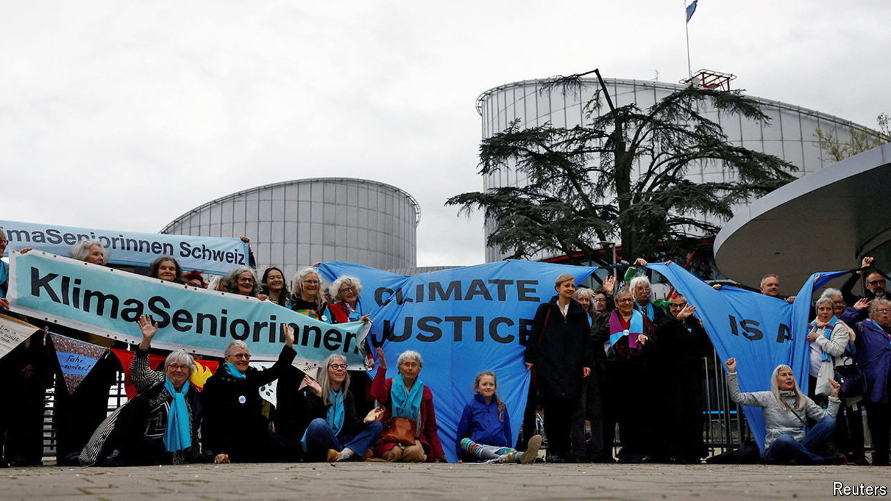

###### Court out?

# The ECtHR’s Swiss climate ruling: overreach or appropriate? 

##### A ruling on behalf of pensioners does not mean the court has gone rogue 

 

> Apr 25th 2024 

IT COULD BE the plot of a kitschy tear-jerker: a group of elderly Swiss ladies sue their government in an international court over greenhouse-gas emissions, and win. On April 9th the European Court of Human Rights (ECtHR) upheld the claim of the Verein KlimaSeniorinnen (Climate Seniors’ Association), an organisation of some 2,000 older women, that Switzerland had failed to protect them from climate change. The country’s Greens celebrated the verdict. Others were less impressed. The populist Swiss People’s Party (SVP) attacked “interference by foreign judges” and called for quitting the Council of Europe, the court’s parent body. In Britain the judgment confirmed the scepticism of many Tories about the court: “complete overreach” was the verdict of Rishi Sunak, the prime minister. 

In fact, the decision was less striking than it seemed. The court held that Switzerland had violated Article 8 of the European Convention on Human Rights (ECHR), which protects private and family life. This may seem odd grounds for a climate-change decision but Article 8 has long been the standard vehicle for environmental cases, since pollution almost always affects private life. Switzerland has signed the Paris accords and committed to curbing emissions so as to hold global warming to 1.5°C above pre-industrial levels. But it missed its target for 2020 and had no clear plan to meet its aim of a 50% cut by 2030. The ruling holds that Switzerland must implement regulations that achieve these goals. That is similar to recent decisions by the Dutch and German courts. 

