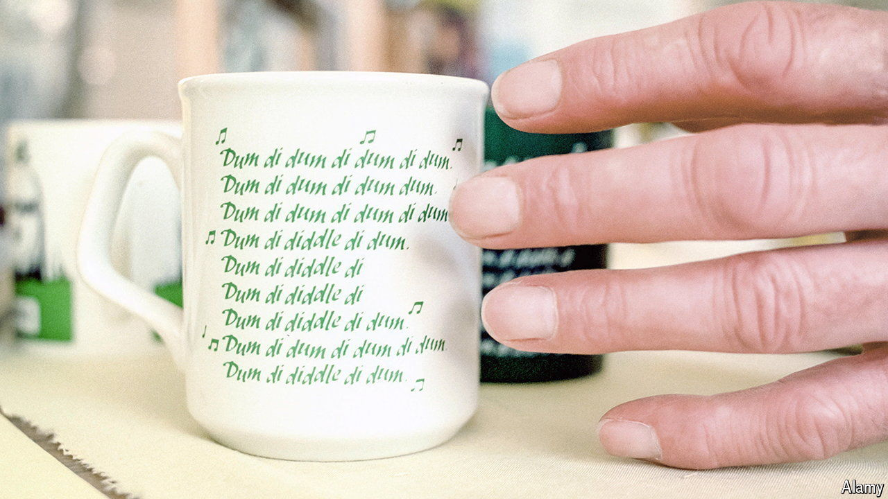

###### Queering Ambridge

# When academics meet “The Archers” 

##### An annual conference offers Foucauldian analyses of the BBC radio drama. And cakes 

 

> Apr 25th 2024 

It feels less like a fact than a philosophy problem. “The Archers”, a BBC radio drama centred on the fictional rural village of Ambridge, contains numerous silent characters, spoken about but never heard from. Some have been in the show for years. There is Barry, who plays (wordlessly) for the local cricket team; Derek, who chaired the parish council (inaudibly) and even had an affair with another silent character; and Molly Button, who misbehaves (mutely). Their existence raises troubling questions, among them “Why?” and “What is the sound of a silent radio character?” 

The second question is easier to answer. Broadly speaking, it sounds like this: “…”. The first is trickier, which is why an academic paper has been published on the topic. It contained a Foucauldian analysis of Archers dialogue and was presented in 2018 at the “Academic Archers”, an annual research conference devoted to all things Ambridge. This year’s conference, on April 27th and 28th, will discuss papers such as “The only gay in the village? Queer(y)ing family in rural Borsetshire”. An edited volume of papers, “Flapjacks and Feudalism: Social Mobility and Class in The Archers”, appeared in 2021. 

