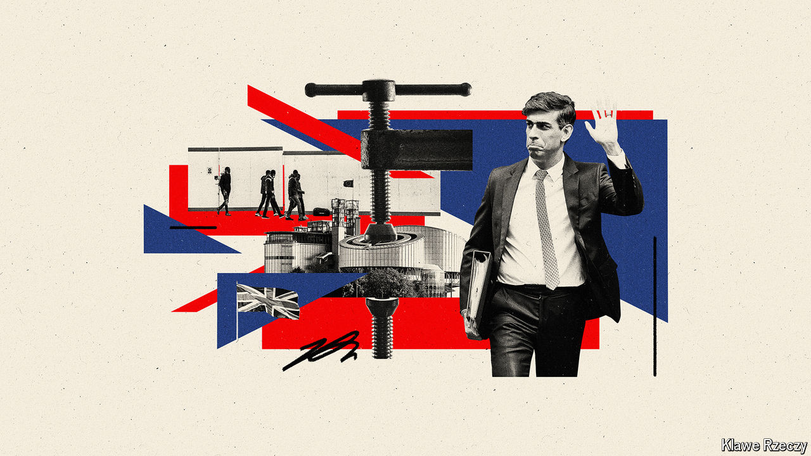

###### Rights and flights

# Why Britain’s membership of the ECHR has become a political issue 

##### And why leaving would be a mistake 

 

> Apr 25th 2024 

“Beware! I am going to speak in French!” So said Winston Churchill as he stood in Place Kléber, a square in central Strasbourg, on August 12th 1949. In the speech that followed, Britain’s former prime minister set out his vision of a “united Europe” that would stand against tyranny. Central to it, he said, was the declaration of human rights by the United Nations in Geneva. Two years later, Britain became the first country to ratify the European Convention on Human Rights (echr), which was based on that declaration and largely drafted by British lawyers. 

This is a history many Conservatives would like to forget. Facing an election drubbing and threatened on their right flank by , a party that is polling well, some Tories are coalescing around the idea of abandoning the convention. Two potential leadership candidates, Suella Braverman and Robert Jenrick, have called for Britain to leave. Liz Truss, a former prime minister, has done the same. Rishi Sunak, her successor, has suggested he is prepared to countenance leaving. The grassroots of the party are in favour of quitting. Why has the ECHR become such a bugbear? And are there grounds to leave?

