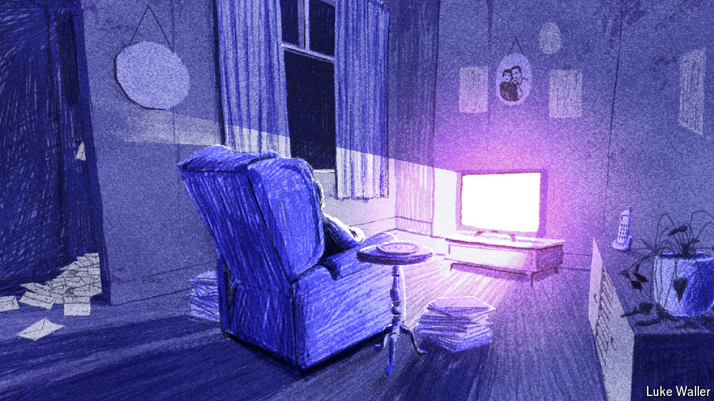

###### A silent scandal

# Why are so many bodies in Britain found in a decomposed state? 

##### To understand Britons’ social isolation, consider their corpses 

 

> Apr 25th 2024 

GRAHAME GIDDINGS was born on Valentine’s Day in 1952. Nobody knows when he died. He had not been seen in weeks when police forced their way into his north London home on December 28th 2023. Unopened post was piled high on his doormat. His body was decomposing on the bedroom floor. 

Giddings’s sad fate is becoming increasingly common. In a recent study in the, the authors looked at records of deaths for which pathologists were unable to determine a cause during an autopsy (coded as “unascertained”). In the vast majority of cases, including Giddings’s, this is usually because a body is too decomposed to examine properly. Their research suggests that the number of unascertained deaths in England and Wales increased five-fold between 1992 and 2022, even as overall mortality rates were falling.

