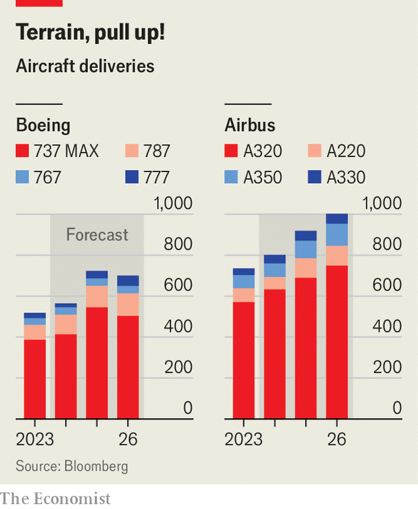

###### Wings of change

# Can anyone pull Boeing out of its nosedive? 

##### The American planemaker needs one hell of a pilot 

 

> Apr 24th 2024 

Few companies have had a worse start to the year than . In January a panel masking an unused emergency exit blew out of a 737 MAX over Oregon. Thankfully the plane landed safely. A preliminary probe into the near-disaster concluded that the bolts that should keep the panel in place were missing. The incident prompted internal investigations and brought federal regulators to Boeing’s factories to audit manufacturing processes. If that were not enough, on April 16th a whistleblower claimed that unacknowledged defects with 787 Dreamliners were symptomatic of a firm with “no safety culture”.

 


The immediate consequences of the added scrutiny was a sharp fall in deliveries of planes—83 commercial jets in the first quarter, compared with 130 a year ago and, gratingly, with 142 by Airbus, Boeing’s European arch-rival (see chart). The damage was apparent when Dave Calhoun, its boss, presented quarterly results on April 24th. After announcing a net loss of $355m, he sought to assure sceptical investors that the company was making good progress in resolving its manufacturing problems. Hanging over the earnings call was also the question of Boeing’s next pilot, after Mr Calhoun a month ago  at the end of the year amid a big shake-up of management and the immediate appointment of a new chairman.

Mr Calhoun’s successor will face an unenviable in-tray. A comparison with the fortunes of Airbus highlights Boeing’s slide. In 2017 the market value of the American firm was two and half times its only rival’s; now it is roughly the same. Since 2019, when the entire 737 MAX fleet was grounded for nearly two years after two fatal accidents attributable to faulty software, Boeing’s combined annual net losses have amounted to $24.5bn. In that period Airbus has made profits of nearly $10bn. Boeing’s orders of 5,700 planes are far below the 7,700 in the European firm’s books.

The roots of Boeing’s many crises are summed up by Aviation Strategy, a consultancy. An “obsession with quarterly results and share price momentum” resulted in too much cash being returned to shareholders and too little put into developing new products or ensuring production quality. Between 2014 and 2020 Boeing handed out $61bn in dividends and share buy-backs. It was not just shareholders who benefited. So did managers, whose bonuses were tied to their employer’s surging share price. Ron Epstein of Bank of America notes that a merger with McDonnell Douglas in 1997 foreshadowed a “cultural shift away from engineering excellence”. Boeing began to favour short-term financial management in a long-term industry, while Airbus focused less on investors and more on its aircraft, which might have a life-cycle measured in decades.

Reversing the cultural slide will be the hardest job for the new boss. It could take years. More immediately Mr Calhoun’s replacement will have to ramp up production of the 737 MAX and guide new variants of this and other, long-haul planes to certification. At the same time, he or she must prepare the ground for the next generation of short-haul passenger jets. Airlines are angry with Boeing for delivery delays of the 737 MAX. Regulators, awaiting Boeing’s plan to improve quality control, have capped production at 38 a month. Boeing’s troubles mean that it does not actually expect to hit that rate until later in the year, by which time Airbus may be making 65 of its competing A320s.

Delays could have a lasting effect. Switching to Airbus would be no easy matter for airlines, not least because the European firm has no free delivery slots for its short-haul jets until the end of the decade. Yet a point could come when carriers feel they can no longer depend on Boeing. United Airlines is rumoured to be considering replacing an order for a larger version of the 737 MAX that is five years behind schedule and, with certification still pending, with no prospect of delivery.

Boeing’s reliance on its past reputation as an American industrial behemoth won’t cut it. As Mr Epstein observes, it may be “too big to fail but it is not too big to be mediocre”. A struggling Boeing could open the door for challengers. COMAC, a Chinese one, has long-standing plans to break the duopoly, though so far without a plane that can truly compete with a Boeing or an Airbus. Embraer, a Brazilian maker of smaller regional jets, could also make a move into bigger aircraft. 

New short-haul jets, likely to enter service around 2035, are another priority. It is a huge and expensive task that Mr Calhoun reckons will cost $50bn. To investors’ consternation, that is nearly double the figure for Boeing’s previous clean-sheet designs. Choosing the right technology is a task that Boeing has to get right. But some observers fear that the firm, which has not launched an all-new plane since the 787 in 2004, may have lost the institutional memory for such a huge undertaking.

The new boss will inherit other problems. A third of Boeing’s revenues comes from its defence-and-space arm. The division’s profits used to insulate Boeing from the cycles of the passenger-jet business. In the past two years they have turned to losses. Boeing has mismanaged fixed-price development deals, even as the Pentagon increasingly favours these to conventional “cost-plus” contracts, which remove most financial risk from the contractor. Boeing has also fallen far behind Elon Musk’s SpaceX, whose rockets are already serving the International Space Station. Starliner, the rival vehicle from Boeing, has yet to make a crewed test flight.

Who, then, might take the yoke? External candidates are thin on the ground. Larry Culp, who has successfully turned around GE, another troubled icon of America Inc, appears to have ruled himself out. Bill Brown, who led the merger that in 2019 created L3Harris, a defence company, is instead taking the top job at 3M, an industrial conglomerate. Pat Shanahan, currently the boss of Spirit AeroSystems, one of Boeing’s suppliers, could be a contender—were it not for the fact that Boeing is seeking to acquire his company in an effort to improve oversight. The most plausible insider is Stephanie Pope, promoted to head of the commercial-aircraft division in the recent reshuffle. Accepting the top job at Boeing would once have been a no-brainer. Now Ms Pope, or anyone else, will think long and hard about it. ■


