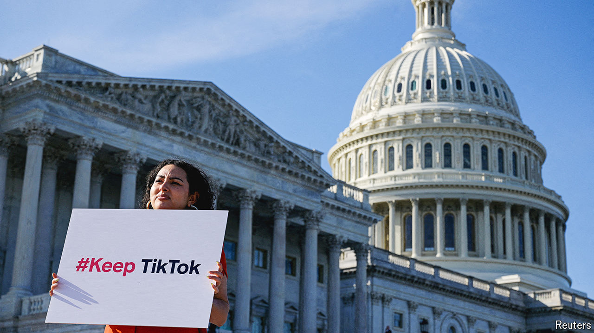

###### Social media and security

# Congress tells China: sell TikTok or we’ll ban it 

##### Only America’s courts can save the video app now 

 

> Apr 24th 2024 


Joe Biden joined  only two months ago, with a short video entitled “lol hey guys”. On April 24th America’s president approved a bill that could ban the popular app. The previous day, the Senate had passed a measure to crack down on “foreign adversary controlled applications”, including TikTok, as part of a package of legislation allocating  to Ukraine, Israel and Taiwan. Mr Biden wasted no time signing it into law, no matter the feelings of his 300,000 followers, or TikTok’s 170m American users.

The law gives , TikTok’s Chinese owner, up to 12 months to sell to non-Chinese interests. (A previous version of the bill allowed six months; the new deadline pushes the matter conveniently beyond November’s elections.) A wild selection of possible buyers is touted. Microsoft, Oracle and Walmart have all shown an interest in TikTok in the past. Steven Mnuchin, a former Treasury secretary, says he is putting together a group of investors.

They may not get the chance to bid. China’s government, which owns a stake in a ByteDance subsidiary, has indicated it does not want to part with TikTok. It has classified the app’s recommendation algorithm as a sensitive technology, whose export needs official approval. In March a Chinese government spokesman warned that, in the case of TikTok, “the relevant party should strictly abide by Chinese laws and regulations.” The comment was read by some as a warning to ByteDance. 

That would leave TikTok no choice but to shut down in America, where last year it earned revenues of $16bn, according to the . The company is therefore pinning its hopes on an appeal to America’s mighty courts. A memo sent to staff on April 21st described the new bill, which at the time had just been passed by the House of Representatives, as a “clear violation of [users’] First Amendment rights”, which enshrine freedom of speech.

TikTok has a strong case, believes Evelyn Douek of Stanford Law School. “Decades of precedent hold that the government can’t ban a form of communication because they don’t like the content on it, even when it involves foreign adversaries,” she says. TikTok has won in court before. Last year a judge overturned a ban imposed by the state of Montana, partly on free-speech grounds. An executive order to ban the app by then-president Donald Trump was blocked by judges in 2020.

Those in favour of a ban say the problem is not the content on TikTok, but the company’s conduct. It is accused of harvesting users’ data and manipulating what they see, both of which it denies. If courts can be persuaded that TikTok is up to no good, a free-speech defence will not necessarily save it. In 1986 an adult-book seller in New York lost a Supreme Court appeal against its closure, when judges argued that the reason for its shutdown was not the content of its books, but other, illegal activity taking place on the premises. 

If TikTok wins, it could become an even stronger force in social media. “TikTok has been fighting with one hand tied behind its back against domestic competition,” argues Mark Shmulik of Bernstein, a broker. While Meta, its arch rival, has come up with technical fixes to help its advertisers get around privacy changes Apple introduced for iPhones, TikTok has played it safe. If courts remove the threat of a ban, the company “could feel empowered to step on the gas”, Mr Shmulik notes. It might also stem the exodus of senior staff. Kevin Mayer, a former chief executive hired from Disney, left amid Mr Trump’s efforts to ban the app. Vanessa Pappas, its chief operating officer, departed last year. Now Erich Andersen, the chief counsel, is reportedly preparing to move on.

Whatever happens in court, TikTok is already wondering which countries might follow America’s hawkish lead. India, where TikTok had 200m users, banned it in 2020 (along with several other Chinese apps) following a skirmish at the border with China. Countries including Indonesia and Pakistan have imposed and then lifted short-term prohibitions. The Taliban, naturally, outlawed TikTok on returning to power in Afghanistan. 

Juicier markets look safe for now. No big European country is demanding TikTok be sold. But Europe has a record of eventually following America when it comes to China-related security matters, as in the case of its belated clampdown on Huawei, a Chinese maker of telecoms gear. Countries’ willingness to act will depend partly on the closeness of their security relationship with America. America’s fellow members of the Five Eyes intelligence alliance—Australia, Britain, Canada and New Zealand—have already banned TikTok on government devices.

Out of lip-sync

Further restrictions on TikTok could disrupt more than the market for social media—if China chooses to retaliate. It fired a warning shot earlier this month, banning app stores from offering apps including WhatsApp and Threads, a pair of Meta products, on national-security grounds. China could make life difficult for plenty of other big American companies. Tesla is suffering because of . Apple’s iPhone sales in the country are ebbing. American chipmakers like AMD are being hurt, too, as China encourages its smartphone-makers to use domestic chips. America may find that banning a short-video app has long-term consequences. ■


