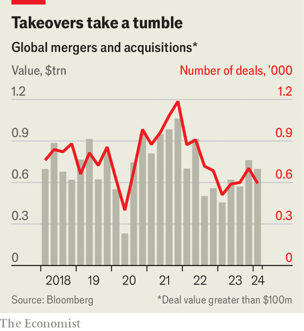

###### Joint adventures

# How to build a global business empire in the 21st century 

##### Disney, Ford, Microsoft and the age of the quasi-merger 

 

> Apr 22nd 2024 

No firm is an island. All strike contracts and compete with others. Conversely, when bosses decide a relationship would be better governed by fiat, one firm may acquire another—as BHP, a $150bn mining giant, proposed to do with a $35bn rival, Anglo American, on April 24th. Yet between the poles of contract and total commitment are plenty of ways for firms to combine capital, knowledge or other resources, without fully tying the knot. 

Such in-between arrangements are winning favour across the economy, from tech and artificial intelligence (AI) to carmaking and energy. While corporate takeovers stalled in 2023, a few mega-mergers notwithstanding, the number of joint ventures (JVs) and partnerships jumped by 40%, according to Ankura, a consultancy. They are especially popular in areas of rapid technological change and in places given to protectionism, which these days and poor countries alike. With barriers to commerce rising,  contining to bite and regulators bridling at takeovers, such liaisons are becoming the go-to way to enlarge a business empire, as the recent actions of companies including ,  and  illustrate. Call it the age of the quasi-merger.

 


When the scope of co-operation is clear, firms often choose to share ownership of a separate entity through a JV. In February Disney announced a new  bringing together its ESPN network with the content of two rivals, Fox and Warner Bros Discovery. Weeks later it made a similar move in India, joining forces with Reliance, a giant Indian conglomerate, in an $8.5bn deal. 

Many constructs are fuzzier. Microsoft has forged partnerships with some of the hottest makers of AI models: of San Francisco,  of Paris and, this month, G42 of Abu Dhabi. The investments give the world’s most valuable firm minority stakes in Mistral and G42. After backing OpenAI to the tune of $13bn, it holds a non-controlling interest in the ChatGPT-maker’s for-profit subsidiary. In February Ford, an American carmaker, joined forces with , a Chinese battery giant, to build a $3.5bn battery factory in Michigan. CATL would bring the know-how via a licensing deal, but not own a stake in the project. If TikTok’s Chinese owner, ByteDance, sells the app rather than shutting up shop in America, as a , the short-video time-sink may end up in the hands of a consortium of Western firms. 

Quasi-mergers are not new. Firms have long teamed up to manage project costs, new technologies and manufacturing-obsessed governments. This year  are celebrating a quarter-century of carmaking’s biggest alliance, which Mitsubishi, another Japanese firm, joined in 2016. CFM International, co-owned by GE Aerospace, an American industrial giant, and Safran, a French one, has been making aircraft engines since the 1970s. In the 1990s, notes Melissa Schilling of New York University, companies scrambled to form partnerships to capitalise on the new technology of the day—the internet. Developing countries, including China, have often obliged foreigners looking to take advantage of cheap labour and vast markets to hand over technology through JVs with local partners. 

Today’s more complicated world is leading to more complicated arrangements. One hotspot is, again, carmaking. The industry is being remade by the shift from combustion engines to electric vehicles (EVs)—and by fears of deindustrialisation as Chinese firms dominate the market. In October Stellantis, formed by the merger in 2021 of Fiat Chrysler and PSA Group, owner of Peugeot and Citroën, announced the purchase of 20% of Leapmotor and the establishment of a JV to build and sell the Chinese firm’s EVs abroad. (Stellantis’s biggest shareholder part-owns ’s parent company.) The next month Renault and Nissan ratified a new, looser pact with more equal cross-shareholdings. In March Nissan and Honda, another Japanese rival, said they were exploring a strategic partnership to develop EVs.

Many of the new carmaking ventures are not about making cars—at least not directly. Last year Stellantis bought nearly 20% of McEwen Copper, a small miner, as part of a deal (which also involves Rio Tinto, a giant one) to extract the red metal in Argentina. That copper may eventually make its way to Kokomo, Indiana, where Stellantis owns 49% of two battery factories being built with Samsung SDI, a South Korean battery firm part-owned by the electronics giant of the same name. Stellantis is also part of IONNA, a JV among seven carmakers that plans to build 30,000 charging stations in America.

Digital titans are building similarly intricate webs of co-operation. In contrast to those between lumbering carmakers, whose rationale is to spread costs, the AI deals have more to do with . In March Amazon said it had invested $4bn in Anthropic, securing access to the AI firm’s Claude 3 model for its customers and crowning itself the model-maker’s “primary cloud provider for mission-critical workloads”. Alphabet has promised Anthropic up to $2bn and also crowed that the startup uses its cloud infrastructure. 

Microsoft team-ups

AI’s most ambitious dealmaker, Microsoft, is well aware of the dangers posed by stickier red tape. Its full-blown acquisition of Activision Blizzard, a video-game developer, took nearly two years to complete and was nearly derailed by trustbusters. The software behemoth first began working with OpenAI in 2016; $13bn later and it is integrating OpenAI’s models into its consumer and enterprise products. In the shadow of turbulence at the startup, which in November led to the swift firing and re-hiring of its boss, Sam Altman, Microsoft has begun to spread its bets. 

The $16m investment in Mistral, announced in February, may be tiny but helps bring France’s best shot at becoming an AI superpower into Microsoft’s orbit. In March the tech world was stunned by an even more creative “no-deal” deal whereby senior employees at Inflection AI, another model-maker, decamped to Microsoft. The startup’s other investors are reportedly being compensated by an unusual licensing agreement. (One of Inflection’s founders, who also moved to Microsoft, sits on the board of ’s corporate parent.) Microsoft’s $1.5bn G42 transaction is half partnership and half high-stakes diplomacy—the deal came with hope of closer co-operation on AI between the American and Emirati governments.

The success of the quasi-merger wave is hard to predict. Though alliances pass the desks of regulators more easily than takeovers, they can still come unstuck. Last year American Airlines and JetBlue ended theirs on America’s east coast after being sued by the Department of Justice. Disney’s new sports venture is getting a close look from antitrust referees. Earlier this year the Federal Trade Commission, another American trustbuster, opened an inquiry into the AI deals. European and British regulators are making similar noises.

Cross-border deals, in particular, tread a narrow path. Teaming up in emerging economies has always needed careful management, lest politically connected locals turn on foreign partners or an entire jurisdiction becomes uninvestable. The turn away from free markets in the West has, to some extent, globalised this political uncertainty. The flexibility inherent in a partnership or JV but absent from a full-on takeover could make such structures more politically acceptable. But even transactions crafted to avoid tripping wires can come under scrutiny. Although CATL’s partnership with Ford does not involve an equity investment by the Chinese firm, that hasn’t stopped American lawmakers from calling for close scrutiny of the deal.

Perhaps the biggest threat to the new-fangled partnerships is the partners. Aligning firms’ incentives is notoriously tricky. The crucial fine print of quasi-mergers is kept secret, giving shareholders little insight into what bosses have actually agreed to. Disputes are ten a penny. In March an American judge ruled that Walmart could end its partnership with Capital One after the supermarket and credit-card provider fell out over the terms of their agreement. A fraught game of linguistic chess has the oil industry on the edge of its seat. ExxonMobil is warring with Hess, a smaller rival, over what should happen to their JV in  should Hess sell itself to Chevron, Exxon’s rival American supermajor. 

A global slowdown in EV sales will put stress on carmakers’ new constructs (Ford has already scaled back plans for its battery plant in Michigan). Being a novel technology, AI raises novel questions about things like safety or copyright that may not lend themselves to shared decision-making. Quasi-mergers are here to stay. Many may prove only quasi-successful. ■


