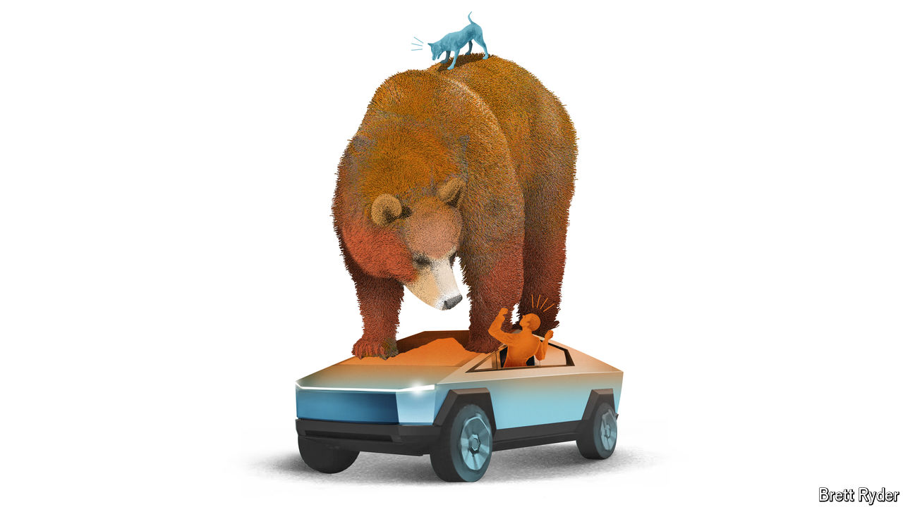

###### Schumpeter

# Tesla faces an identity crisis: carmaker or tech firm? 

##### Elon Musk’s fiendish conundrum 

 

> Apr 24th 2024 

On the night before Elon Musk unveiled Tesla’s first-quarter results on April 23rd, your columnist brought his car to a halt, noticing a futuristic vehicle hooked up to a Tesla charging station in Los Angeles. It was a dark-purple Cybertruck. Twinkling lights glittered behind the tinted windows. It looked so wedgelike, angular and otherworldly that it could have moonlighted as an armoured personnel carrier in “Civil War”, a new apocalyptic film. 

Its owner, Dennis Wang, is a Tesla devotee. Besides his four-month-old Cybertruck, he has owned Mr Musk’s original (“sexy”) quartet: the Models S, 3, X and Y. He has held shares in the company since 2018. He has full faith in Mr Musk. Despite a 40% plunge in Tesla’s share price this year in the run-up to the earnings report, as well as the announcement in recent weeks of falling vehicle sales and unprecedented lay-offs, he believes the billionaire remains the best person to run the company. Even an embarrassing Cybertruck recall, caused by a stuck accelerator, was quickly fixed, he says, pointing to a new bolt in the pedal. 

Yet however much Mr Wang loves Teslas, he does not think of Tesla as a car firm. He says it is a tech company. As he puts it, all electric vehicles (EVs) offer a similar driving experience. What differentiates them is the software—the brains beneath the dashboard. In Tesla’s case, that is the latest version of its self-driving technology, which he calls “fantastic”. His view is shared by many Tesla loyalists. It is why the company’s shares trade at a multiple of earnings typical of a zippy software firm, not of a metal-basher.

Wall Street takes a different view. Though investors hope Tesla will one day make money from its snazzy artificial intelligence (AI), for now they want it to restore growth by selling more cars—the cheaper the better. Hence the sigh of relief when Tesla outlined plans within an otherwise dismal earnings report (revenues, profit margins and free cashflow all crashed) to start producing affordable vehicles by 2025 that would not rely on big new investments. Tesla’s share price promptly soared more than 10%. Call that a $50bn thumbs-up from the unit-economics guys. 

Mr Musk has a history of trying to have it both ways. When investors were doubtful about demand for Tesla’s EVs at the end of the 2010s, he promised shareholders that its so-called full self-driving (FSD) technology would put 1m robotaxis on the road by 2020. That did not happen, so during the pandemic, as Tesla’s sales rocketed, he changed his tune. He boasted that sales were growing faster than Henry Ford’s Model T, and that Tesla aspired to sell 20m EVs a year by 2030.

This year it is touch and go whether Tesla will sell more than the 1.8m cars it shipped in 2023. So Mr Musk has flipped the script again. Once more he is highlighting FSD, though this time with a twist: the latest version is so good, he told analysts this week, that it is impossible to understand the company without trying it. He went so far as to say: “If someone doesn’t believe Tesla will solve autonomy, I think they should not be an investor in the company.” His competing narratives create quite the conundrum among investment types. Can Tesla be a car company as well as a tech company? The answer, broadly, is yes. But it depends on which of its markets you are talking about. 

From a volume-growth perspective, no country is more important than China. It is the world’s biggest EV market, and though growth is slowing, sales are still rising much faster than in America. However, competition is fierce and a price war is shredding Tesla’s business there. Tesla has not said where the cheaper model it is planning will be sold. But if it is made available globally, it could help it fend off competition from BYD, a low-cost Chinese competitor that is not just the biggest EV seller in China but also has a strong presence around the world (though not in America).

Tesla’s American home turf is different. Mr Musk’s firm is already the market leader, so its growth prospects are probably constrained, more so because of the rising popularity of hybrids. Yet it has to sell more cars to generate cash to fund the purchase of huge volumes of AI chips that it needs to run its FSD technology. That is where a cheaper car comes in. It could help Tesla cross a bridge to the future while it attempts to overcome the huge engineering and regulatory challenges necessary for cars to drive people, rather than the other way round. 

There are lots of potential roadblocks ahead. First is the risk of crumbling morale. Besides the sacking of one-tenth of its workforce, Tesla has lost several highly respected executives recently (the latest announced his departure on the quarterly earnings call). Second, trust between Mr Musk and big investors is gossamer-thin. Who knows how he will react if a majority at next month’s shareholder meeting vote against the board’s efforts to reinstate his $56bn payout from 2018 that was voided by a Delaware judge. Third, the difficulty of running many businesses besides Tesla is compounded by Mr Musk’s “demon mode”—irascible outbursts that can leave rubble in their wake. 

View from the Cybertruck

Like many Muskophiles, Mr Wang expects Tesla’s boss to pull through. As a carmaker, Mr Musk excels. The Cybertruck, says its driver as his corgi scampers on the back seat, is the most comfortable car he has ever owned. As a technologist, Mr Musk continues to improve. Though Mr Wang acknowledges that the latest version of FSD requires driver supervision, he says being able to “sit back and decompress” on his commute is as valuable to him as a pot of money. Above all, no one matches Mr Musk when it comes to turning engineering dreams into reality. As he puts it, “If Elon wants to put a chip in your head, you will get a chip in your head.” Just don’t expect it to be implanted until years after it is promised. And be prepared for its Svengali to melt down in the meantime. ■


