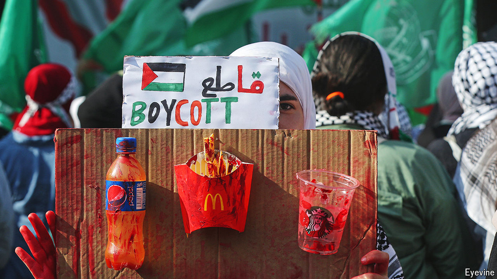
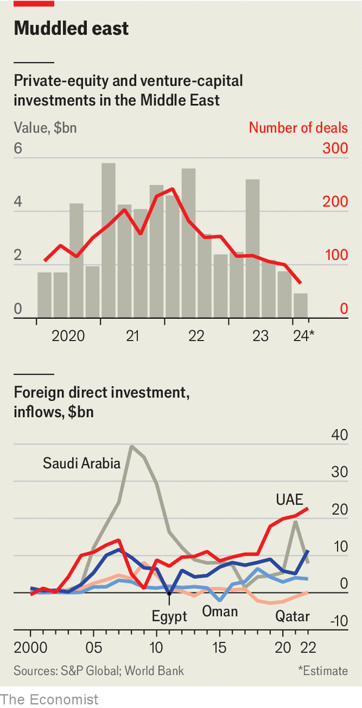

###### Tinderboxed in

# Will war snuff out the Gulf’s global business ambitions? 

##### Companies far and wide are feeling the effects of the conflict 

 

> Apr 25th 2024 

It was supposed to be the new Middle East: a quieter, neutral entrepot where Arabs and Jews, Shia Iranians and Sunni Arabs, Americans, Chinese and even Russians could all rub along in the common pursuit of profit. In the past six months that vision, championed most vigorously by leaders of Saudi Arabia and the United Arab Emirates (UAE), and embraced by chief executives the world over, has come under assault—first by Israel’s war with Hamas militants in Gaza, then, this month, by the first ever  between the Jewish state and Iran. Can the dream withstand the throwback to turmoil?

Thankfully, the Iranian and Israeli (largely victimless) strike and counterstrike have not escalated into a larger conflict. However, combined with the much bloodier war in Gaza and its fallout in places like Egypt, Jordan and Lebanon, the missile skirmish leaves the region on tenterhooks—and its commercial ambitions in a state of uncertainty. 

Six months after Hamas’s terrorist attack in Israel on October 7th, the knock-on hostilities with the most immediate consequences for global business have occurred along the region’s waterways. Houthi rebels in Yemen have, ostensibly in solidarity with Gazans, been firing Iranian missiles on ships plying the Red Sea. On April 13th Iran seized what it described as an “Israeli-linked” merchant vessel in the Gulf of Oman, allegedly for “violating maritime laws and not answering calls made by Iranian authorities”. 

A.P. Moller-Maersk, the world’s second-biggest container-shipping company, has suspended port calls in Saudi Arabia and Oman, and rerouted ships around Africa, adding two or three weeks to transit times between Asia and Europe. Overall, ships are making 65% fewer stops in Jordan and 40% fewer in Saudi Arabia than they were last October. The volume of freight has sunk by as much as 75% across the Bab el-Mandeb Strait and the Suez Canal, at either end of the Red Sea, and across the Strait of Hormuz, which links the Persian Gulf and the Arabian Sea. 

Many oil tankers are steering clear of the rough waters. Cruise lines have cancelled or rerouted voyages. Beach-ready tourists are staying away from Egypt and Jordan, which depend on them for 10-15% of GDP. Hopes of luring 160m tourists a year to the region by 2030, three times the number in 2023, are receding. 

Multinational businesses are feeling indirect effects of the fighting, too. In Israel, where more than 400 multinational firms have offices, executives worry about employees being called up for reserve duty. Progressive pro-Palestinian tech workers in America are pushing Google to drop a $1.2bn cloud-computing project in Israel. The conflict has contributed to slowing revenue growth at Snap. The social-media company says that advertisers are cutting spending in the region, where 30m of its 400m or so daily users reside. Meta, which owns Facebook and Instagram, has voiced similar concerns. 

Meanwhile, American brands such as Coca-Cola and Starbucks are facing boycotts in Muslim countries, where consumers are angry at America’s steadfast support for Israel. Some restaurants refuse to serve Pepsi or Coke, instead offering local alternatives like Matrix Cola. In February the boss of McDonald’s said the burger chain was facing a “pronounced impact” on Middle Eastern sales (it bought out the Israeli franchise owner, after he offered meals to Israeli soldiers free of charge). 

 


Having nearly doubled between 2017 and 2022, annual foreign direct investments in five Arab economies—Egypt, Oman, Qatar, Saudi Arabia and the UAE—are showing signs of softening. Between January and mid-March, even as global dealmaking has rebounded, buy-out barons and venture capitalists struck less than $1bn-worth of transactions in the Middle East, down from a quarterly average of $4.7bn in 2021 (see chart). The private sector is unlikely to be “adventurous at a time like this”, says the chairman of a Gulf-based company. “You want to remain much more liquid.” Now it is all about being “cautious with extra investment”, adds a private-equity executive. Companies must think harder about “physical protection of infrastructure, the way you choose your financing partners and risk scenarios around new projects”, explains a European chief executive. Yields on Saudi and Emirati bonds have risen since October, as has the price to insure those bonds against default, suggesting that investors are jittery.

Not everyone is exercising the same level of caution. Amazon’s cloud-computing arm still plans to spend at least $5bn on Saudi data centres, drawn by cheap energy and a strategic location. Microsoft, a tech titan with a rival cloud offering, is also building server farms and, in the UAE, a 5G mobile network. This month it announced a $1.5bn investment in G42, an Emirati artificial-intelligence darling. Rather than give in to its progressive techies on the Israeli project, Google has sacked 50 of the rabble-rousers. Last year Asian companies announced more than $29bn-worth of investments in the Middle East. 

Overall, though, the mood in business circles is one of concern. Even if the conflict does not spiral out of control, the flare-ups could, executives worry, prompt the region’s rulers to funnel resources away from economic development and towards security and stability. That has happened before—but never against the backdrop of a business boom. ■


