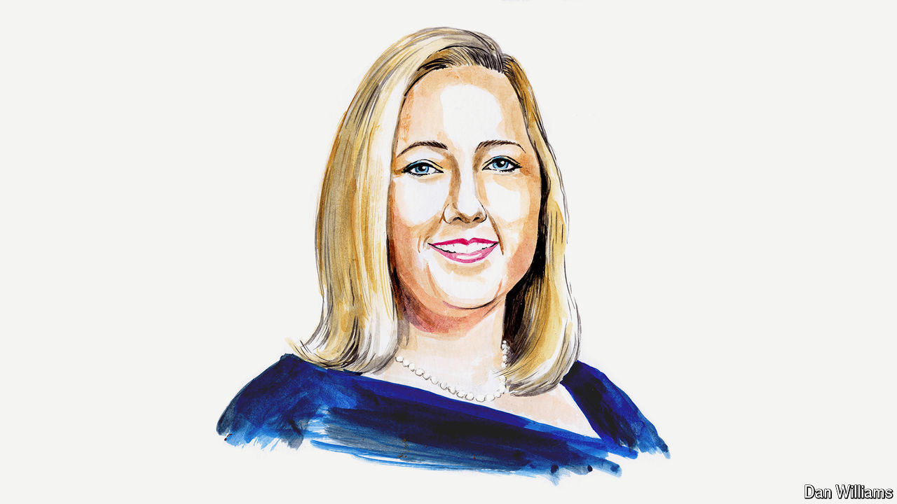

###### American politics

# A conservative strategist on how Joe Biden can win 

##### Sarah Longwell says “double-haters” will decide the election 

 

> Apr 23rd 2024 

DURING HIS term in office, Donald Trump lied more than any American president in history. He threatened nuclear war, called neo-Nazis “very fine people”, mismanaged a pandemic and incited an insurrection at the Capitol. Yet he is still polling roughly evenly with President Joe Biden. Who wins in November—and by what margin—will be determined by what I call “double-haters”: those who are sceptical of both Mr Trump and Mr Biden. 

I hold weekly focus groups with voters, and I hear from double-haters all the time. They tend to skew moderate, educated and suburban. They are overrepresented in swing states, especially the critical “blue wall” states of Pennsylvania, Wisconsin and Michigan. The coarseness and dysfunction of politics frustrates them and their feelings on 2024 can be summed up by what one voter told me recently: “It’s actually a very disgusting choice.” 


Most feel as though they are picking between two evils. They associate an array of negative things with Mr Biden, from inflation and crime to chaos at the border. At the same time, voters have Trump-amnesia. They have forgotten the daily outrages, the tantrums, the abuses of power and the ambient sense of panic that hung in the air throughout his years in office. 

To win the election, the Biden campaign must remind voters of the reasons Mr Trump is uniquely unfit for office. The president doesn’t have to convince every swing voter that he is their ideal candidate; he just has to present himself as a better option than Mr Trump. As he likes to say, “Don’t compare me to the Almighty, compare me to the alternative.” 

What many voters do remember are the good times before 2020. Many have fond memories of low interest rates and a booming pre-covid economy. Mr Biden should continue emphasising that today the economy is getting better. Voters tend to be a lagging indicator of economic improvement; many have not yet felt the impact of recent positive developments, including lower inflation and higher wages. But they are beginning to come around. These days I hear less from voters about America being in the midst of a second Great Depression, and more about how we are steadily digging ourselves out. This is good news for Mr Biden.

At the same time, voters think the president is old—very old. Concerns about his age come up in every focus group. Though his age is far from an advantage, the president should fully embrace the “wise old man” schtick. His strong performance in the state-of-the-union address in March helped offset some of these concerns. Recently he has put his age front and centre in advertising.

Voters’ concerns about Kamala Harris, Mr Biden’s vice-president, are trickier. One of the most common refrains I hear about Ms Harris is “Where is she?” The job is a notoriously thankless one, and many of the gripes that people have about Ms Harris are the same ones they were making about Mr Biden when he was vice-president. Although people do not traditionally vote based on the vice-president selection, it feels more pressing this time since many expect a health event to incapacitate Mr Biden before he can finish his term. The only way for him to offset this vulnerability is to give voters a clear picture of the danger posed by Mr Trump, given that he is the only viable alternative.

Since so many voters in swing states say they will choose the lesser of two evils, it is Mr Biden’s job to hammer home the thought of what a second Trump term would mean. That requires reaching them with credible messengers who speak to their concerns. These messengers must look, sound, talk and act like voters. In short: it takes regular people. My organisation, Republican Voters Against Trump, is tapping Republicans who have previously voted for Mr Trump but refuse to do so again in 2024, and amplifying their voices in key swing states.

A two-minute testimonial from Dave in Pennsylvania, for example, probably cannot convince a conservative-leaning mother in the Philadelphia suburbs that Mr Biden is actually a great president. But it might be enough to convince her that four more years of Mr Trump is beyond the pale. At the same time, it would help if those who served under him at the highest levels and saw the chaos first-hand—people like Mike Pence, James Mattis, John Kelly and Nikki Haley—spoke up. If not for Mr Biden, then at least against Mr Trump. 

Many of the most senior and respected former members of Mr Trump’s cabinet think he is unfit to be president; some, including John Bolton, his former national security adviser, and Mark Esper, his former defence secretary, have even vowed not to vote for him. Going on the record with reporters is one thing, reaching the electorate at large quite another. It requires organisation, advertising and millions of dollars to reach the voters who matter most. 

If these former officials really believe that Mr Trump is uniquely dangerous, then logic dictates they support the only person who can keep him out of the White House, even if they disagree with some of his policies or wish he were younger. 

At this moment, Mr Biden looks like the underdog. But that’s what campaigns are for. He and his team have time to turn things around. Mr Trump and his movement lost in 2020 (as well as in midterm elections in 2018 and 2022). The path to victory this time runs through the people who are sceptical about both candidates but still open to being convinced by one or the other.

In 2020 Mr Trump was beaten by a broad coalition that included everyone from progressive Democrats to principled Republicans. It wasn’t so much a pro-Biden alliance as an anti-Trump one. It must regroup again if Mr Biden is to win in November.■


