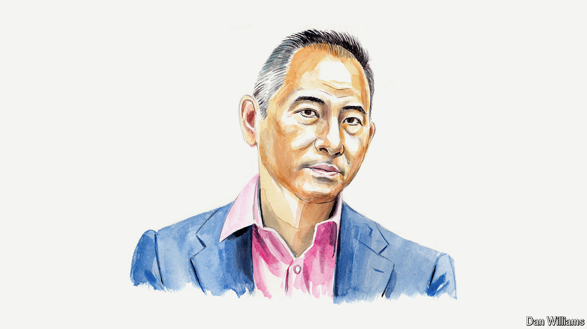

###### Power in China

# Desmond Shum on how Xi Jinping beat down China’s red aristocrats 

##### It took one of their own to do it, says the businessman and author 

 

> Apr 22nd 2024 

THE RED aristocrats of modern Communist China behave very similarly to the blue-blood aristocrats of the Western world in medieval times. This elite group is distinguished by its hereditary bloodlines: it includes descendants of revolutionaries who fought alongside Mao Zedong and the children of those who ran China after the Communist takeover in 1949. Because of their high social standing, these red aristocrats—sometimes referred to as “princelings”—enjoy privileged access and influence in every aspect of Chinese society. Their awareness of their status can sometimes instil in them a sense of noblesse oblige. 

This is an extremely exclusive group—and its archetype would be Xi Jinping, general secretary of the Chinese Communist Party (CCP) and the country’s president. As a son of Xi Zhongxun, a member of Mao’s ruling cadre, Mr Xi was segregated from normal society at birth: he was most likely born in the special ward of a hospital in Beijing reserved for CCP aristocrats. He grew up in a gated compound reserved for senior party figures. He was admitted to Tsinghua University not on merit but because of who he was. 

Mr Xi started his political career as secretary to a leader in the Central Military Commission, a highly selective position for someone yet to exhibit talent and prowess. He went on to be groomed by the Central Party Organisation Department, again because of his bloodline, and rose steadily through the CCP’s ranks. “Power has to be handed over to our children; if not, our graves will be dug up later on,” Chen Yun, a former vice-premier, said to Deng Xiaoping after the Tiananmen massacre in 1989. Mr Xi was fast-tracked in his bureaucratic career path, gaining promotions in two-to-three-year intervals over a 30-year span. For a normal comrade, a promotion every five years would be considered good fortune.

During Mr Xi’s ascent to the CCP’s ultimate leadership role, the red-aristocrat clan was his strongest support base. However, the relationship became complicated after he assumed power in 2012, and with his subsequent efforts to solidify his control. 

In the past, there had been unspoken power-sharing among prominent red families. This allowed some to exert strong political influence over provinces, others over major industries, and a few over both. It was, for instance, well understood within certain segments of Chinese society that the family of Ye Jianying “owned” Guangdong, the family of Wang Zhen “controlled” Xinjiang and the family of Li Peng had a lock on the electric-power industry. This oligopolistic arrangement reaped astronomical financial profits for some families.

Mr Xi innately views the other prominent families as potential threats to his dictatorial rule. Certainly, you can argue that only the red clan, with its resources and bloodline entitlement, could mount a fight strong enough to topple him. 

In response, Mr Xi has dealt severely with members of the clan who have shown opposition or voiced criticism of him—among them Bo Xilai, a former Politburo member and party secretary in Chongqing, whose political ambition led to his imprisonment; and Ren Zhiqiang, the ex-head of a state-owned property company, whose public criticism of Mr Xi, such as calling him “a clown with no clothes on”, earned him an 18-year sentence. Mr Xi has also “encouraged” other red aristocrats to retire from their senior leadership roles in the People’s Liberation Army. 

China has a long history of emperors playing off bureaucrats from the peasantry against those from the hereditary aristocracy. Mr Xi has acted no differently. To further strengthen his control and continue loosening the red aristocracy’s long-term hold on political power, he has consistently elevated bureaucrats from outside the red bloodlines to the CCP’s central power functions. Witness the makeup of the seven-member Politburo Standing Committee, the party’s top leadership body, not a single current member of which could be viewed as having red-aristocratic lineage. This has never happened before.

In addition to the loss of political prerogative, red aristocrats have suffered significant economic losses under Mr Xi. As China’s major wealth-owners, red aristocrats have shouldered a disproportionate share of the heavy losses suffered by Chinese stocks in recent years. 

The wealth accumulated by the red families in recent decades, both onshore and offshore, is an important part of their power. The offshore wealth is also their insurance policy if things don’t pan out in China. How Mr Xi chooses to handle those riches—and the extent to which he is prepared to confiscate them in order to keep the clan compliant—is, therefore, of paramount importance to the red aristocrats.

Confiscation of wealth as a way to bring down politically powerful or financially influential figures has been used throughout Chinese history—including by the CCP since it took power in 1949. Mr Xi has already targeted several red billionaires. A recent case in point is the downfall of Wu Xiaohui, founder of Anbang Insurance Group and grandson-in-law of Deng Xiaoping. In 2018 he was sentenced to 18 years in prison and stripped of his entire stake in the company, which he had founded.

Furthermore, restraints have been placed on the red aristocrats’ creation of new wealth. The last-minute cancellation of the initial public offering by Alibaba’s Ant Group in 2020, for instance, prevented numerous red families from monetising their shares in the business. Rumour had it that the order to cancel the flotation came from the highest level.

The red aristocrats’ web of influence, stretching across the bureaucracy, the armed forces and business, has been spun over the seven decades since the CCP took over China. They continue to enjoy exclusive privileges—including the right to engage in politically themed gatherings—and remain a cohesive and influential group. But their grip on power has been loosened by one of their own. After a decade of power being concentrated through Mr Xi’s “anti-corruption” movement, the clans are no longer strong enough to pose a serious political threat to him. Their heyday is over.■


