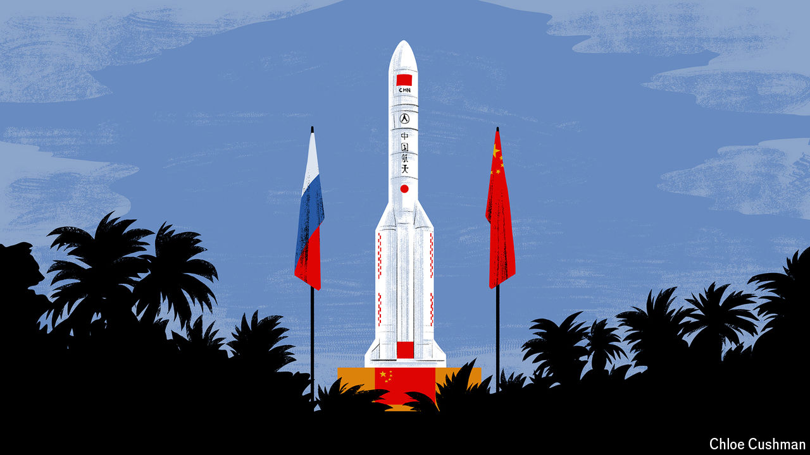

###### Chaguan

# China’s ties with Russia are growing more solid 

##### Our columnist visits a future Russian outpost in China’s most advanced spaceport 

 

> Apr 25th 2024 

CHINA’S FIRST tropical spaceport, Wenchang, is proof of national swagger. During the cold war, China launched rockets from the Gobi desert and other desolate inland spots, for fear of enemy attack. Once China was more confident that it could deter invaders, though, Wenchang became a fine gateway to space. This close to the equator, on the southern island of Hainan, the Earth’s rotation gives a boost to every launch. The palm-fringed coastal site allows the largest Long March rockets to be delivered by sea. Wenchang finally opened in 2016. Its well-guarded launch areas are flanked by a science-education centre (closed to foreign visitors), replicas of rockets, statues of flag-waving astronauts and other tourist kitsch, like a Communist Party homage to Florida.

Here, in this showcase for Chinese technology, a privileged foreign friend—Russia—is being given a precious piece of real estate. Moscow Power Engineering Institute, a large Russian technical university, has been invited to open a branch in Wenchang with room for 10,000 students of aerospace engineering and science. Russian and Chinese scholars and officials held a ground-breaking ceremony in January. Though the 40-hectare campus is bare earth for now, Chinese media have already announced that, unusually, the Hainan institute will be a Russian-led academy, rather than a joint venture with a Chinese university. 

