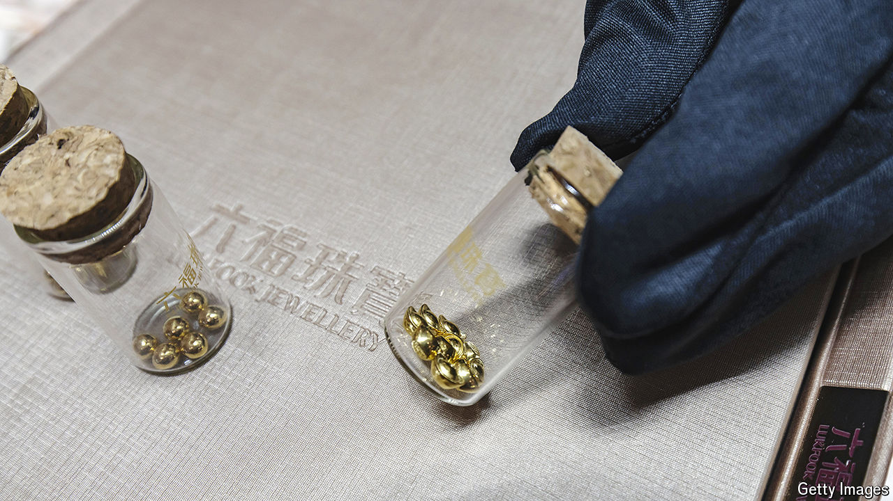

###### Bean counting

# China’s young people are rushing to buy gold 

##### They seek security in troubled times 

 

> Apr 25th 2024 

CHINA’S GOLD market, which accounts for about a fifth of global sales, used to attract an older crowd. Many buyers were middle-aged women looking to add to their nest-eggs or buy chunky bracelets. But these days Chinese gold shops regularly serve customers in their 20s. Xiaohongshu, a social-media site favoured by “Generation Z” (those born between 1997 and 2012), is buzzing with talk of the precious metal. 

Young people don’t have much spare cash. The youth-unemployment rate in cities is about 15%. Many companies are cutting salaries. So youngsters are hoping to make the most of what little savings they have. But traditional investments aren’t doing well. The stockmarket is slumping and house prices have fallen for ten months in a row.

