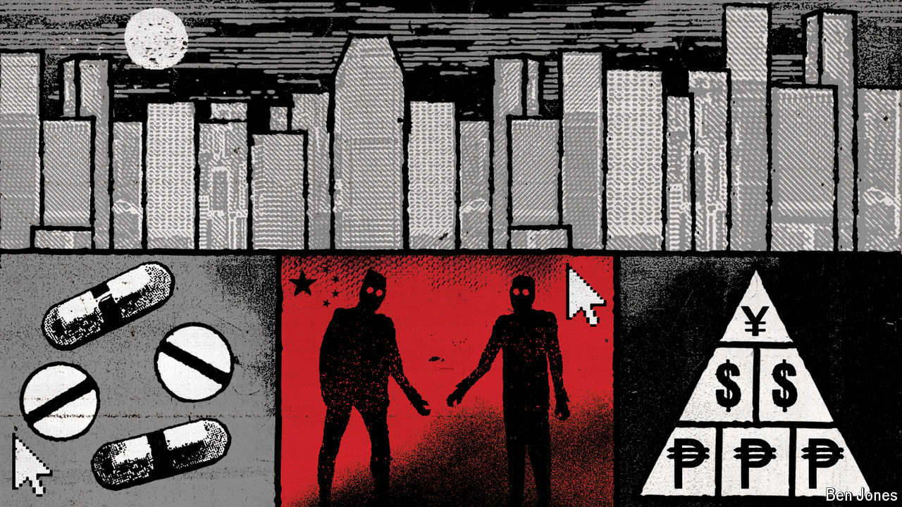

###### Mules and motorcades

# How Chinese networks clean dirty money on a vast scale 

##### These shadowy “banks” are becoming the financiers of choice for transnational criminal gangs 

 

> Apr 22nd 2024 

IT IS RARE these days for America and China to co-operate on anything. As  went to press, America’s secretary of state, Antony Blinken, was on a trip to China, in part to press his hosts  weapons-related materials to Russia’s defence industries. He will be lucky to get a polite smile. So it is noteworthy that the two countries have recently decided to boost mutual support in another domain: the fight against . This month they launched a bilateral forum to discuss the problem. Unlike Russia, it is a big one for both of them. 

The menace has grown in recent years, fuelled by underground Chinese networks equipped with new technologies that can enable dirty money to be washed clean in minutes. For transnational criminal gangs, these shadowy “banks” are becoming the financiers of choice. Suppressing them requires the two great powers to talk. Amid their political rancour, discussions about money-laundering had been on ice for years. Their resumption marks “a big change, a big positive change”, says an official from America’s Treasury Department. 

