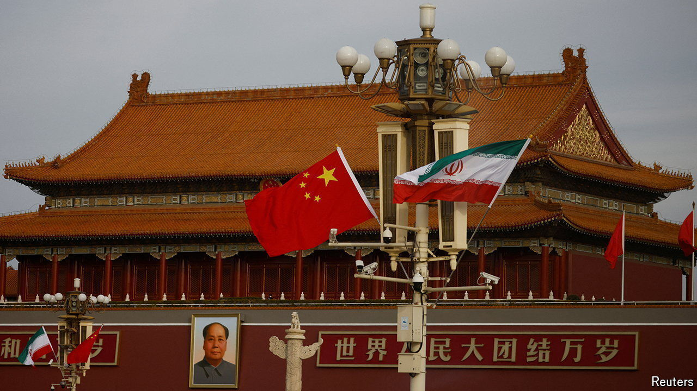

###### Friends, sorta

# Why China is unlikely to restrain Iran 

##### Officials in Beijing are looking out for China’s interests, not anyone else’s 

 

> Apr 25th 2024 

EARLIER THIS year, when the Iranian-backed Houthi rebels in Yemen were attacking commercial ships in the Red Sea, America approached China for help. In talks with their Chinese counterparts, American officials reportedly asked them to urge Iran to rein in the Houthis. Months later, after Israel struck the Iranian consulate in Syria, America again approached its biggest rival. This time it was said to have asked China to tell Iran not to retaliate.

During crises like these China would seem a useful interlocutor. It has good relations with Iran. Last year it facilitated a deal to re-establish diplomatic ties between Iran and Saudi Arabia. It also allowed Iran to join its regional security group, the Shanghai Co-operation Organisation, as well as the BRICS, a bloc of big emerging economies. After the Iranian-Saudi rapprochement, China’s top diplomat, Wang Yi, heralded a “wave of reconciliation” in the Middle East.

