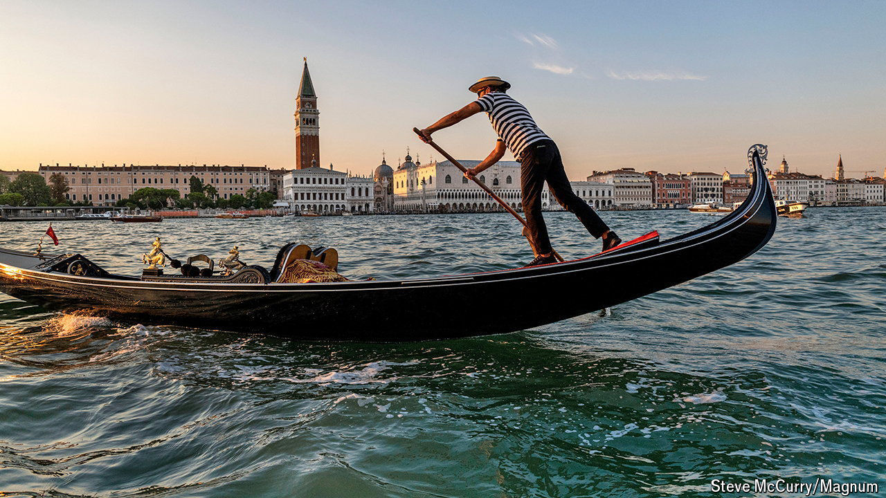

###### The tides of Venice

# From spies to sea-level rise, Venice’s history is enthralling 

##### Dennis Romano has produced a sparkling account of the city’s past and future 

 

> Apr 25th 2024 

. By Dennis Romano. 

Visiting the Venice Biennale, one of the world’s largest art fairs that opened on April 20th and runs until late November, often evokes a disconcerting emotion. You come to see the works on display in the exhibitions that sprawl across the city, only to leave feeling guilty at having paid too little attention to the work of art that is 

Bedazzled by its loveliness and wondering at its sheer implausibility, outsiders have seldom managed to make objective appraisals. Dennis Romano, an emeritus professor at Syracuse University in New York, embarked on this new history of the city with the notion that “deromanticising Venice does not strip it of its power. It makes the achievements of the lagoon city and of all Venetians more fascinating and remarkable still.” 

The result is a triumph. Ignore the vacuous subtitle of his book (“The Remarkable History of the Lagoon City”). This is contemporary historical writing of the highest quality: clear, entertaining and yet academically rigorous. Mr Romano has already written four books on the city’s long and turbulent history. With his fifth he has done for Venice in the 21st century what John Julius Norwich, an English historian and travel writer, did for the city in the 20th. As time goes by, this monumental chronicle should gradually replace its distinguished forerunner as the history of choice for readers in English who want to better understand Venice’s rich past.

Norwich’s work told the story of the Venetian Republic, which endured for more than 1,000 years until swept out of existence by  in 1797. This is a more comprehensive account. It covers the entire story from Venice’s elusive origins to today’s city, wrestling with the problems that arise from . It goes even further, in fact, looking ahead to thousands of years from now when “sedimentation and tectonic overriding will transform the northern Adriatic into dry land”. Venice, if it has survived, will be landlocked.

Mr Romano also differs from Norwich in discarding a doge-by-doge approach: as he remarks, Venice’s republican rulers were, for the most part, a colourless bunch. Instead, he weaves a great deal of social and economic history into the broadly chronological narrative. He also digresses into such arcane but intriguing fields as 16th-century espionage. Inevitably, the Venetians often deployed the vocabulary of commerce: a prediction that someone “in prison for debts would be released in June” was code for “the Turkish fleet will sail in June”. A Jewish spy used “sacks of cotton” to denote Turkish galleys.

The thematic treatment means readers are sometimes whisked back and forth in time, but the effect is to make more sense of the politics, the diplomacy and the military context. Knowing that Egypt during the Fatimid caliphate was desperately short of timber and pitch helps explain why Venice, and not Egypt, for all its wealth and might, became the dominant naval power in the eastern Mediterranean by the 12th century.

Not that this dominance was always put to a use of which fellow Christians approved. The lagoon city played a decisive role in the sack of Constantinople, which, though it strengthened Venice’s commercial position, irretrievably weakened the Byzantine Empire and Christian Europe’s eastern flank. Medieval Venetian merchants cheerfully traded slaves, particularly those extracted from the lands around the Black Sea—and, to the outrage of successive popes, sold most to Muslim states. Mr Romano does not develop this point, but the strongest and ablest males became enslaved mercenaries and battled Christian troops in the Levant and beyond.

Venice has always had dark aspects. It gave ghettos their name (a foundry, was where  was in the 1500s); as Mr Romano shows, its slums in the 19th century were as squalid as any in Europe. Yet the very fact of its survival is testament to the Venetians. In its spectacular ingenuity, fragility and resilience Venice is a metaphor for humankind. ■


