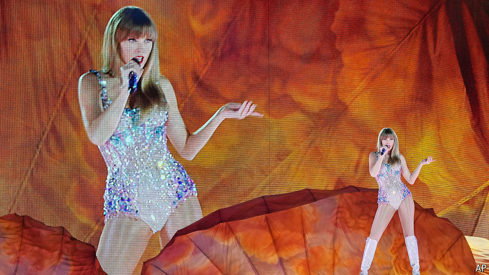

###### Shake it off

# Has Taylor Swift peaked? 

##### The musician is at the height of her commercial, but not her creative, power 

 

> Apr 24th 2024 

TAYLOR SWIFT has a strong claim to being the most popular entertainer of the 21st century—and perhaps of all time. Five of the ten most popular albums in America in 2023 were hers, according to Luminate, an analytics firm. Ms Swift’s albums have now cumulatively racked up 384 weeks in the top ten of the  chart, beating a record previously held by  She is halfway through the most  ever. A film version of it grossed over $260m at the box office last year.

On April 19th she released a double album entitled “The Tortured Poets Department: The Anthology”. Over the course of 31 songs, Ms Swift wields her scalpel and dissects every inch of her recent relationships. Few songwriters have been better at transmuting heartbreak into hits. (“The high”, as she sang on “Blank Space”, has surely always been “worth the pain”.) Unfortunately, on this album, she has eschewed danceable pop for something as downcast as the title implies. 

Gone are the irresistibly catchy choruses of “I Knew You Were Trouble” and “We Are Never Ever Getting Back Together”, replaced with dreamy synths, muted drums and languorous vocals. Ms Swift can do melancholy and wistfulness well. Yet “The Tortured Poets Department” is mournful without being memorable. For a woman who launched her career as a precocious  teen, her new lyrics sound jarringly immature, with unimaginative rhymes. “Like I lost my twin / Fuck it if I can’t have him,” she sings in “Down Bad”.

It is a sign of her stardom that many Swifties rushed to buy the record anyway: within a day of its release “The Tortured Poets Department” sold 1.4m copies in America. But some are breaking ranks to confess that they think the songs are underwhelming and samey. Is Ms Swift falling into the trap that ensnares those who reach the highest echelons of their fields, from auteurs to chief executives? Perhaps no one—including her songwriting collaborators—wants to tell music’s biggest star that her tunes are bland. 

On “I Can Do It With A Broken Heart” she boasts that she is “so productive, it’s an art”. Indeed it is quite common for great artists at the height of their fame to release lengthy double albums: think of the Beatles’ 30 songs on the “White Album” or ’s 20 on “The River”. But both of those could have benefited from more selective editing and still have become the treasured classics that they are today. For Ms Swift, it is the quality of her output, not the quantity, that has set her apart from her peers.

Ms Swift’s latest offering is some way short of her usual standard. In one of the songs, she claims to be in “her glittering prime”. Fans both devoted and casual may wonder if the lustre is fading. ■


