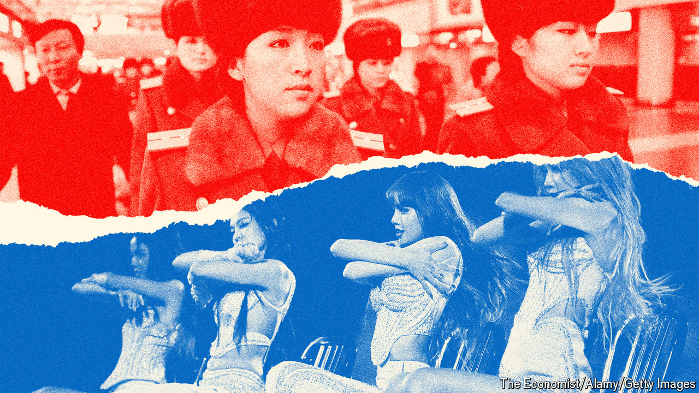
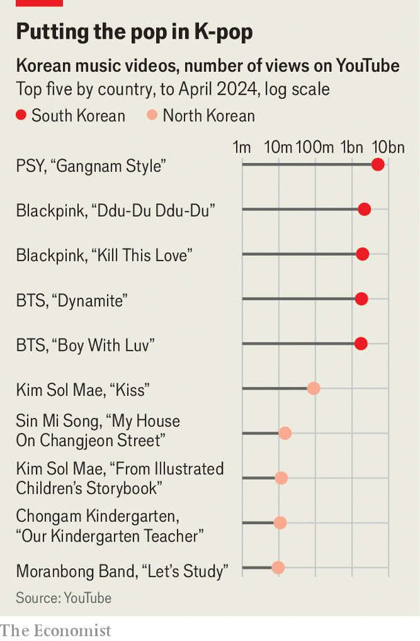
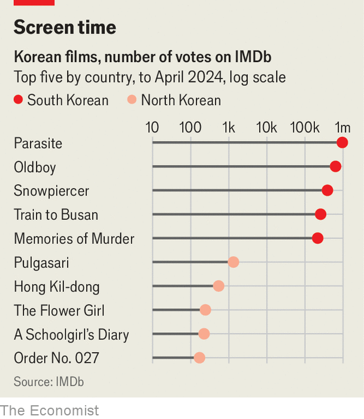

###### Gangnam style v gulag style

# Why South Korean pop culture rocks and North Korea’s does not 

##### Dictatorship stifles creativity and joy 

 

> Apr 22nd 2024 

North Korea’s rulers have always had strong views on art. Kim Il Sung, the regime’s founding despot, said artists should “arouse burning hatred for the enemy through their works”. His son and successor, Kim Jong Il, was such a cinema enthusiast that he kidnapped a South Korean director and his actress ex-wife and forced them to make propaganda films, including a (surprisingly good) revolutionary -style monster flick. Kim Jong Un, the current ruler, demands “masterpieces pulsating with the sentiment of the times”, by which he means praise for himself. 

The president of South Korea probably has views on the arts, too. But because it is a democracy, its artists do not have to care what he thinks. Which helps explain why South Korean pop culture has spread joy across the world, whereas North Korean “people’s culture” has not. 

 


On YouTube , a South Korean rap video, has been viewed 5bn times—nearly 60 times as often as “Kiss”, a popular children’s song from the North. On IMDb, an online film database, the top South Korean films have hundreds of thousands of ratings; the top northern ones, hardly any. The gulf is so vast that only a logarithmic scale can illustrate it (see charts). 

Cultural success translates into cash. Half of the top ten bestselling albums in the world last year were South Korean, according to the International Federation of the Phonographic Industry, a trade group. The country’s pop-culture exports were a whopping $13bn in 2022, up from just under $5bn in 2013. This sum dwarfs North Korea’s official exports of all goods and services combined

The two Koreas share 5,000 years of history and were separated only after the second world war. So a comparison of their modern pop culture offers a useful insight into the effect of politics on creativity. 

The first difference is freedom. In the South, artists are allowed to criticise, satirise and expose uncomfortable truths. , the first foreign film to win Best Picture at the Oscars in 2020, presents a bleak picture of inequality in South Korea (which is not especially bad by rich-country standards). , a television series, offers a gory and original take on the same theme: cash-strapped contestants in an imaginary game show compete for a huge jackpot—and face death if they lose. 

 


North Koreans are free only to criticise the South. One northern newspaper called “Parasite” a “masterpiece” for its examination of working-class woes in Seoul. But any art about North Korea must glorify the regime and vilify its enemies. This makes for dreary, predictable fare. 

The sole feature film North Korea has released in the past five years is “A Day and a Night”, a tiresome yarn about a humble nurse exposing counter-revolutionaries. Whereas South Korean shows depict complex protagonists facing difficult moral choices, characters in North Korean ones must simply be good (heroic workers) or bad (traitors, spies). Foreign characters are either evil (Americans, Japanese) or implausibly devoted to the Kim family. 

Furthermore, all parts must be played by actors who have never displeased the regime. This applies retroactively, which can be awkward. The lead role in “The Taehongdang Party Secretary”, a television drama about a land-reclamation project to grow potatoes, was originally played by Choe Ung Chol, who later fell from grace for unclear reasons. (Rumour has it that he was associated with , who was executed for treason in 2013 and more or less airbrushed out of history.) When the show was recently rebroadcast, Mr Choe’s face and voice had been digitally removed from every scene and replaced with those of a new actor. 

Ideological conformity extends to music, too. “Leader, Just Give Us Your Order!” is a typically bombastic anthem, with a video of soldiers goose-stepping and charging into battle through sheets of fire. Few foreigners enjoy such tracks, and many North Koreans only pretend to. Choi Il-hwa, who escaped from North Korea when she was 14, recalls that she and her friends would “twist the lyrics” of state-approved songs, substituting “love” and “friends” for “glory” and the Kim dynasty, thus risking horrific punishment for a few moments of artistic freedom. 

When imitation is and isn’t flattery

The second big difference concerns foreign influence. South Korean artists borrow widely. Film directors such as  and Bong Joon-ho draw inspiration from Hong Kong gangster movies, Taiwanese neo-realist flicks and American classics. Blackpink, the first female to top America’s Top 200, reimagine American hip-hop and pop in a style that is uniquely their own. On their debut song, “Whistle”, they rap in a mix of English and Korean over skittering trap-style hi-hats. South Korean music firms make 80-95% of their profit from new releases, estimates Suh Bo-kyung of Bernstein Research, so they are always after new sounds to plunder.

North Korean artists, by contrast, must pretend that good ideas come only from North Korea, and especially from the Kim family. The state ideology is  (self-reliance). Citizens can be sent to the gulag merely for possessing foreign films or music. Kim Jong Il warned that the “corrupt pop music” of foreigners would “stimulate vulgar and unhealthy hedonism”. 

Just a few trusted artists are allowed access to foreign material, and typically disguise their borrowing. Thus, many North Korean mobile games are uncredited rip-offs of Western titles like “Angry Birds” and “Bejewelled”, which are unavailable on North Korea’s walled-off internet. Its most famous original game, “Pyongyang Racer”, is an uninspired driving simulation. Its main virtue is verisimilitude: the streets are as empty as those of the capital, where only the rich own cars. 

The third difference is capitalism. Pop culture in South Korea is produced by a variety of private companies. These firms are  and notorious for micromanaging stars’ lives. But they never forget that fans have choices. 

Mindful that their country has just 52m people, they have strived to please a global audience, just as South Korean industrial firms have aimed to export cars and mobile phones. K-pop groups often feature members with different styles, who speak different languages and sometimes come from different countries. Lyrics and videos tend to be less raunchy than their Western equivalents, making them palatable to censors and parents in more of the world. South Korean artists have been swift to embrace new technology. For example, the country is a pioneer of webtoons, a form of comic designed to be scrolled downwards on a phone screen. Koreans now dominate the Japanese webtoon market. 

Most important, South Korean artists have grappled with universal themes. The way that television series such as “Squid Game” and “The Glory” (which deals with bullying) explore economic and social injustice resonates with global audiences, who “share similar agonies”, says Jin Dal-yong of Simon Fraser University in Vancouver, Canada.

North Korean pop culture, by contrast, is state-directed and aims to please one man. Since Kim Jong Un’s life experiences are a trifle unusual—he was brought up to be a god-king and can have anyone who annoys or ridicules him put to death—this does not always yield content to which normal people can relate. 

On “Grandfather’s Old Tales”, a children’s show on North Korean television, an “imperialist” wolf rips apart a rabbit. (“Baby Shark”, a South Korean children’s song, is less bloody and far more popular.) In “A Sick and Twisted World”, a comic book series, readers are invited to look down on depraved foreign customs, such as eating contests in America.

To be fair, Mr Kim has tried to modernise some of his country’s cultural output. He personally launched Moranbong, a girl band in short skirts, in 2012, around the time when the whole world was dancing to “Gangnam Style”. Moranbong signalled a flirtation with openness: members played covers of Western songs such as “My Way” and the theme from “Rocky”. But since then the group has grown more conservative, ditching their risqué outfits for military garb, belting out songs such as “Fly High, Our Party Flag” and offering videos of nuclear missiles destroying America. 

Occasionally, despite the obstacles, North Korean artists produce art that speaks to people. “Comrade Kim Goes Flying”, a film from 2012 about a coalminer who wants to be a trapeze artist, was well-received by foreign film-festival-goers, as was “A Schoolgirl’s Diary”, a coming-of-age tale about a girl struggling to accept her father’s commitment to his work. 

Years after she escaped, Ms Choi and her parents were driving, and she put on some North Korean pop, including “Whistle”. Not the Blackpink song, but one with a similar love theme and an unmistakably North Korean lyric: “Today I smiled and told you I’d exceeded production goals three-fold.” Ms Choi’s father grew nostalgic. Ignore the oppressive words; the tunes helped him realise it was OK to miss the place where he was born, even if he has absolutely no desire to return. 

North Korea has talent: cartoonists who can draw, composers who can create a tune. It is only their rulers who hold them back. When it comes to hard power, the two Koreas are in the same weight class, thanks to the North’s nuclear weapons. But culturally, the South is a colossus, whereas the North’s soft power is as weak as the rationale for making a communist dictatorship hereditary. ■


