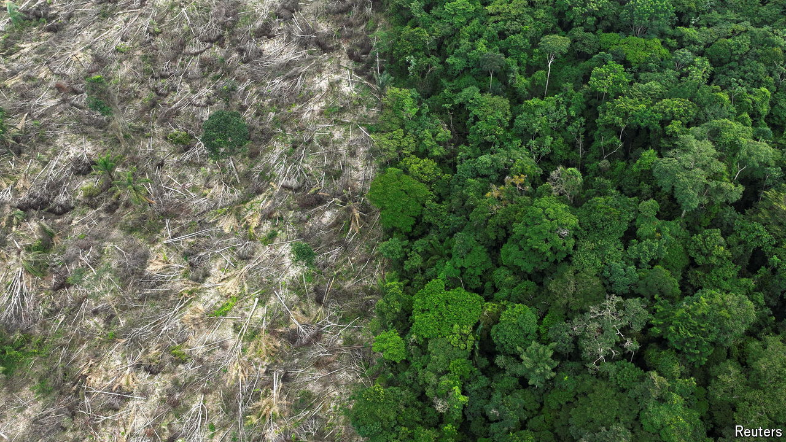

###### Jungle book

# “The Vortex”, written 100 years ago, anticipated eco-literature 

##### One of Latin America’s most important books is also timely 

 

> Apr 25th 2024 

The book is on the minds and lips of presidents. Recently , Colombia’s leader, praised “La Vorágine” (“The Vortex”), a novella by José Eustasio Rivera, for having words that “still shine like stars” and showing how “the destruction of the jungle fills human beings with nothing but hatred”. Mr Petro and Luiz Inácio Lula da Silva, Brazil’s president, both spoke about “The Vortex” at the International Book Fair of Bogotá. This year’s biblio-bonanza is celebrating the relationship between literature and nature, as well as the centenary of the publication of “The Vortex”, which was written in April 1924.

Rivera told his story through Arturo Cova, an equivocal narrator who seduces a woman, Alicia, in Bogotá and then flees with her to  in the east. Greed and cruelty drive the people they encounter, who desire only to “steal rubber and hunt Indians”. 

“The Vortex” evokes the region’s colonial history, when conquistadors pillaged jungles and slaughtered inhabitants in pursuit of riches. It also excoriates the abuses that the  inflicted on indigenous people serving as indentured workers in the Amazon, the world’s largest rainforest. As the forest is despoiled and a tug-of-war plays out between those wanting to prioritise environmental protection over economic growth, the book feels modern and timely.

It can also be read as pioneering eco-literature. Rivera’s vivid, poetic prose transforms the jungle into a living being, “a green hell” that fights back against its persistent invaders. Thundering rapids drown men; ants as poisonous as scorpions prey on human flesh. At one point Cova hears a tree’s vengeful thoughts. 

By the end of “The Vortex”, the rainforest devours the protagonist. The message is that, if the destruction of ecosystems persists, humans suffer. Fortunately, renewed  are focused on preserving what remains of the Amazon. But plenty of deforestation continues. No one can be sure of what will be left a hundred years from now. ■


