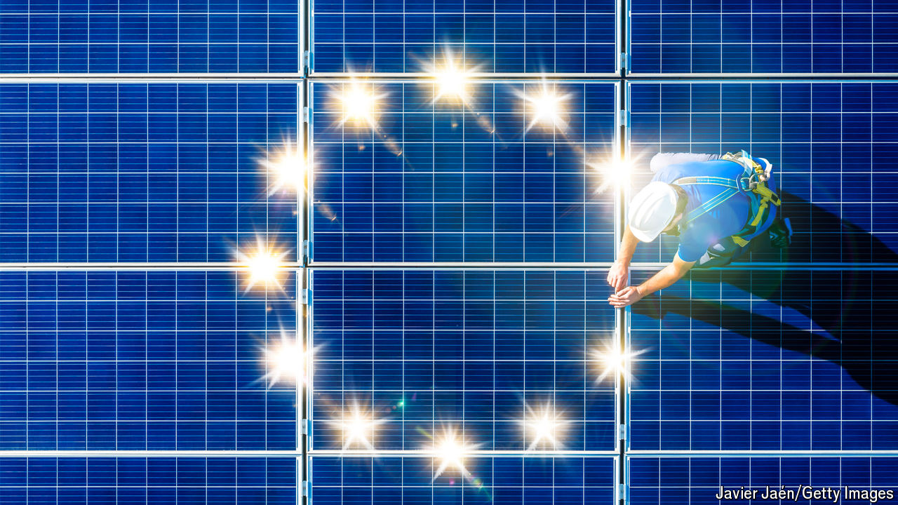

###### Tackling the climate

# Carbon emissions are dropping—fast—in Europe 

##### Thanks to a price mechanism that actually works 

 

> Apr 25th 2024 

“OUR MOST pressing challenge is keeping our planet healthy,” declared Ursula von der Leyen on the day she was elected president of the European Commission in July 2019. Five years on, it still ought to be. Global surface temperatures were 1.48°C higher in 2023 than pre-industrial levels, and 2024 is on course to be hotter still. But Russia’s war in Ukraine and the prospect of another Trump presidency get more attention these days. 

Good news, then, that the greening of the continent is making progress anyway. Emissions fell by a steep 15.5% in 2023, largely driven by reductions in carbon from electricity generation and industry. EU countries added 17 gigawatts (GW)-worth of windmills and covered roofs and fields with 56GW of new solar panels. (For comparison, nuclear-power capacity in the EU was roughly 100GW, though it can run 24 hours a day.) Officials reckon 2024 will be another record year for renewables. The commission’s modelling suggests that current policies should get the bloc to an 88% reduction of overall emissions by 2040, compared with 1990 levels. With the 2030 target of a 55% reduction within reach, the EU should be able to agree to a target for 2040 of 90%. The main target, to get to net zero by 2050, is unchanged.

