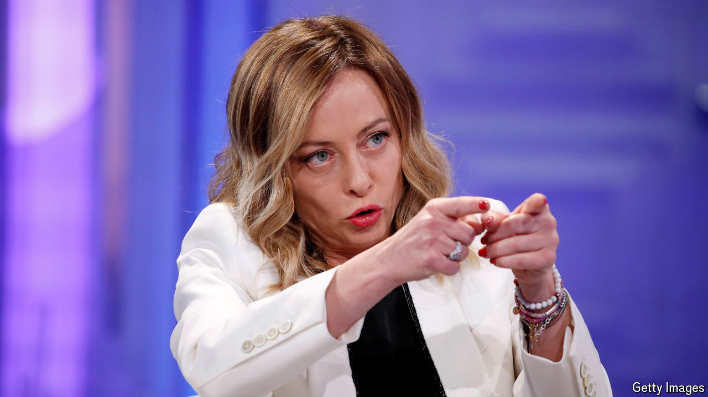

###### Meloni and the media

# Italy’s government is trying to influence the state-owned broadcaster 

##### Giorgia Meloni’s supporters accuse RAI of left-wing bias 

 

> Apr 25th 2024 

Antonio Scurati is one of Italy’s leading authors. His historical novel “M: Son of the Century” won the Strega prize, Italy’s most prestigious literary award, and has been widely translated. It was the first in a series that chronicles the rise and fall of Italy’s fascist dictator, Benito Mussolini. So Mr Scurati was an obvious choice to give a talk on RAI, Italy’s public broadcasting network, ahead of April 25th, the public holiday that marks the country’s liberation from fascism in 1945.

But Mr Scurati never got to read it on air. RAI withdrew its commission. Mr Scurati said it was because it was critical of Giorgia Meloni and her refusal to disown the fascist past. RAI said that the reason was that he had demanded too high a fee. Ms Meloni responded with her usual deftness, claiming she did not know who was right and publishing the text of Mr Scurati’s talk on her Facebook page. Not that that was necessary: it had already been published in the press, from where it went viral on social media.

