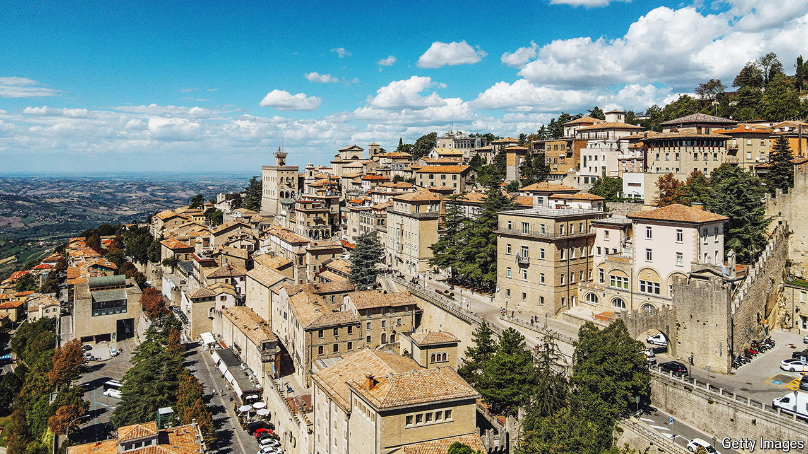

###### A weak link

# The tiny republic of San Marino is alarmingly friendly to Russia 

##### Intelligence sources are concerned about the country, which is surrounded by Italy 

 

> Apr 24th 2024 

EMMANUEL Goût has a long record of involvement with Vladimir Putin’s Russia. The 65-year-old Frenchman has acted for some of Russia’s leading energy groups and helped set up the French-language service of the Russian state-controlled television channel, RT. In 2020 he was awarded Russian citizenship by means of a special decree issued by the president.

Yet, for the past two years, and despite his history of close relations with Mr Putin’s Russia, Mr Goût has been the diplomatic representative of a western European state, albeit one of the tiniest. On February 7th 2022, with Russian soldiers massing on Ukraine’s borders ahead of the invasion that came 17 days later, the republic of San Marino named him as an ambassador-at-large. According to Luca Beccari, the microstate’s foreign minister, Mr Goût was appointed because of his “experience over many years in numerous sectors of interest to the Republic”. Yet his name does not appear on San Marino’s own list of its envoys available to the public through its website. His appointment was announced only on a government portal reserved for diplomats, but left unsecured. 

