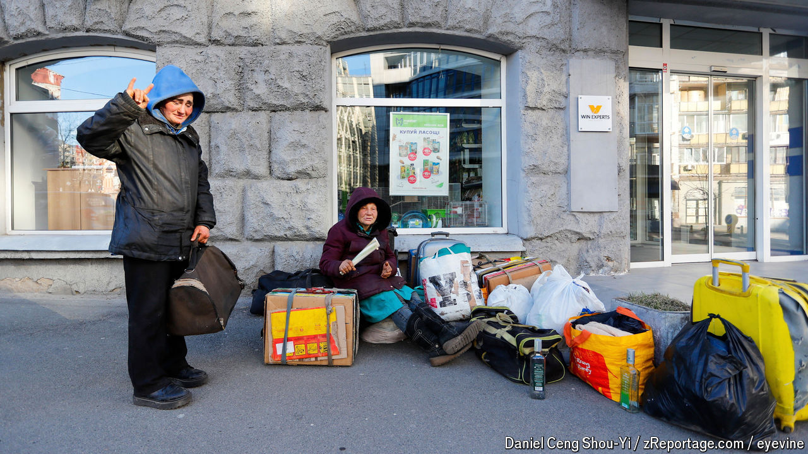

###### Hard times

# Two years of war have impoverished many Ukrainians 

##### The elderly, the displaced and the disabled are the worst affected 

 

> Apr 21st 2024 

AS SOON AS the volunteers appear, those that have been waiting for them on Kyiv’s central Independence Square (known as Maidan) form a queue, shuffle forward and take a warm drink and a freshly cooked meal. An elderly man tries to calm a noisy outburst from his mentally disabled adult son. The war has left millions struggling economically, but two years after the beginning of the full-scale invasion some are suffering much more than others. The hardest hit are the elderly, the disabled and the displaced. 

In 2023  GDP was 72% of what it was in 2021. Millions have either lost their jobs, or had their pay cut by struggling employers. But walk around any of the big cities set back from the frontlines and today you would hardly know there was a war on. Last month a huge new bookshop opened a few minutes’ walk from where the volunteers of Sant’Egidio, a Rome-based charity, distribute their food. Shops, businesses, cafés and restaurants are packed and plenty of people are driving fancy cars. 

