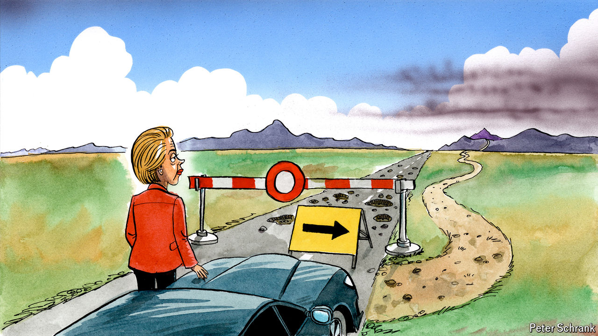

###### Charlemagne

# Ursula von der Leyen is the favourite to keep leading the EU—right? 

##### Potholes lie in the road to a second term 

 

> Apr 25th 2024 

If a politician gives a speech but no one is around to hear it, does it make a sound? Ursula von der Leyen, president of the European Commission since 2019, might have pondered this as she addressed the largely empty chamber of the European Parliament in Strasbourg on April 23rd. Despite grandiloquent claims of holding the European Union’s powerful executive arm to account, a mere handful of the over 700 MEPs showed up. Granted, those lawmakers who deigned to attend were treated to little more than a platitudinous account of an unremarkable meeting of European leaders the previous week. But the lack of cheering—the lack of for Mrs von der Leyen among her fellow denizens of the EU bubble is enough to raise eyebrows. For soon the head of the 30,000-strong Brussels machine will have to persuade a majority of those MEPs to back her for a second five-year stint. The aura of inevitability of a von der Leyen second term has dimmed of late. 

The 65-year-old German is hardly the first commission president to address a largely empty parliament (MEPs are often said to be busy with some other vital business). She is, however, the first to run for a second term since a new constitution-like treaty changed the way the EU was run in 2009. An attempt to make the top brass in Brussels seem more accountable to the public, by linking their appointment to the results of European Parliament elections, was well-intentioned, but has the capacity to kick up unpredictable results. As the incumbent, and only credible, candidate, Mrs von der Leyen remains odds-on to stick around after the elections on June 6th-9th. But her path to reappointment is more difficult than it once looked. At worst, a mishap could leave the EU ditching a competent and experienced leader at a time of war, economic torpor and potential Trumpism.

