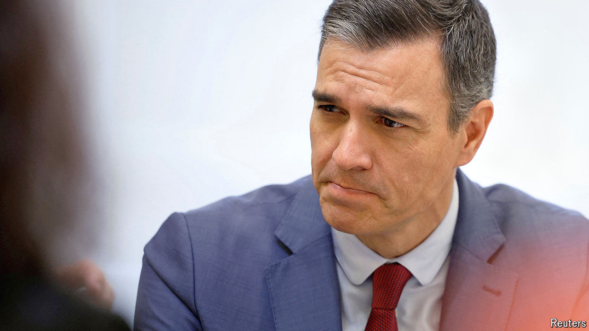

###### Drama king

# Will Spain’s prime minister suddenly quit? 

##### Pedro Sánchez stunned Spain with a promise to announce plans on April 29th 

 

> Apr 25th 2024 

PEDRO SÁNCHEZ knows drama. When he was clobbered at last May’s regional and local elections, Spain’s prime minister promptly called national ones. To bet it all at his weakest moment might have seemed crazy, yet Mr Sánchez overperformed, assembled a rickety majority and came back as prime minister. 

Drama has returned with his surprise decision, on April 24th, to clear his calendar until Monday 29th when he will announce whether he plans to stay on the job. The cause of his “reflection”, he said, was an attack on his wife, Begoña Gómez. A group called Manos Limpias (“Clean Hands”), founded by a former far-right political activist, has brought an influence-peddling complaint against her, and a court is making preliminary inquiries.

