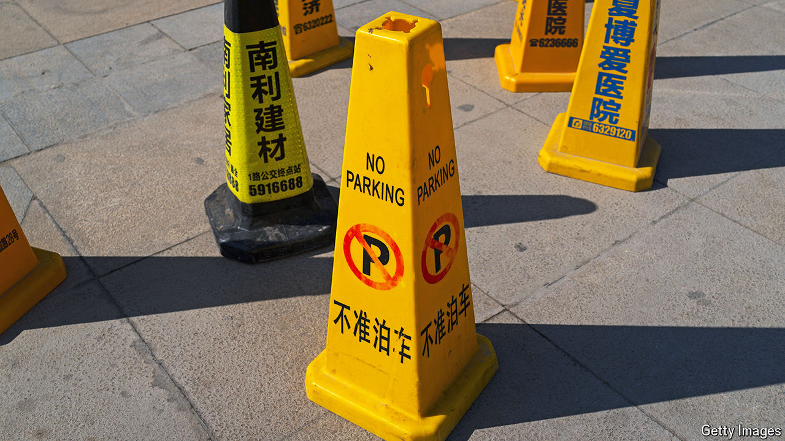

###### Fiscal fiasco

# Chinese authorities are now addicted to traffic fines 

##### What that tells you about the country’s economic woes 

 

> Apr 25th 2024 

Ma Yijiayi was locked up in November. She did not stand in a square demanding political rights. Nor did she steal from state coffers. Instead, her crime was to ask a deadbeat debtor to pay her back. The local government in Liupanshui, a city in the province of Guizhou, owes Ms Ma, who is a contractor, 220m yuan ($30m) for building schools. Officials had offered her a mere 12m yuan. She refused.

Chinese citizens and business owners are increasingly victims of unscrupulous attempts by local governments to shore up their finances. An investigation in January found that almost all the traffic fines issued last year by police officers in Hebei province rested on bogus claims. In a neighbouring region, truck drivers allege that officials are putting their fingers on the scale, issuing excessive penalties for overweight loads. Jacked-up parking fees and stricter inspection of restaurants have also become municipal money-spinners. 

Creative money-raising demonstrates just how desperate local governments are to find new sources of income. Between 2021 and 2023 provincial authorities’ non-tax revenues grew by 20%, three times faster than their tax takings. The Ministry of Finance says the cash came from squeezing money from state assets, such as by putting tolls on bridges. But leaders in Beijing have been increasingly open about worries that pickpocketing local governments may be playing a role, too—and hurting public trust in the process. 

Local authorities face a dire financial situation. Slower economic growth, compounded by falling public land sales and turmoil in the property market, has dented revenues. All but two of China’s provinces are forecasting lower growth in their tax takes this year than last, according to , a business magazine. On April 9th Fitch, a rating agency, cited yawning budget deficits as a justification for downgrading China’s credit outlook to negative.

China’s central government struggles to put a number on local-government liabilities. Lots of debt is held by subsidiary financial entities and off official balance-sheets. Victor Shih and Jonathan Elkobi of the University of California, San Diego, estimate that local governments owe 90trn-110trn yuan, or 75-91% of national GDP. Over half of China’s provinces report debt-to-GDP ratios above 50%. The number of local-government vehicles in default has more than tripled since March last year, according to Trivium, a consultancy.

The central government can afford to provide some assistance. Its debt burden is relatively light, and it receives hefty cash-flows from taxes and state-owned firms. In October policymakers said that they would issue 1trn yuan in bonds for payments to local authorities. Nevertheless, they have tried to skirt responsibility for local debt, instead pushing municipalities to curtail spending. In March Li Qiang, China’s premier, criticised “vanity projects”. China’s cabinet, led by Mr Li, has told cadres in a dozen provinces to end non-essential infrastructure investment.

China’s division of fiscal firepower has long been contested. Struggles date back to the 1990s when Zhu Rongji, one of Mr Li’s predecessors, wrenched back revenues from local officials. China’s federal system suffers from what technocrats call “vertical fiscal imbalance”: local governments are saddled with responsibility for education, health care and investment spending, but lose out on more than half of tax revenues to the central authorities. By contrast, local cadres retain all the income that they receive when levying fines.

In February the central government stepped up its campaign against fast-fingered local officials. It punished cadres accused of overreach, issued terse directives through state organs and amended legislation in order to insist on “law-based governance”. Will these moves make a difference? Perhaps not. Arbitrary fines became still more common after a previous crackdown in 2021. Local governments found that they simply had no alternative given the state of their finances. Although Ms Ma’s case is now being investigated by central authorities, a similar fate probably awaits other business owners. ■


