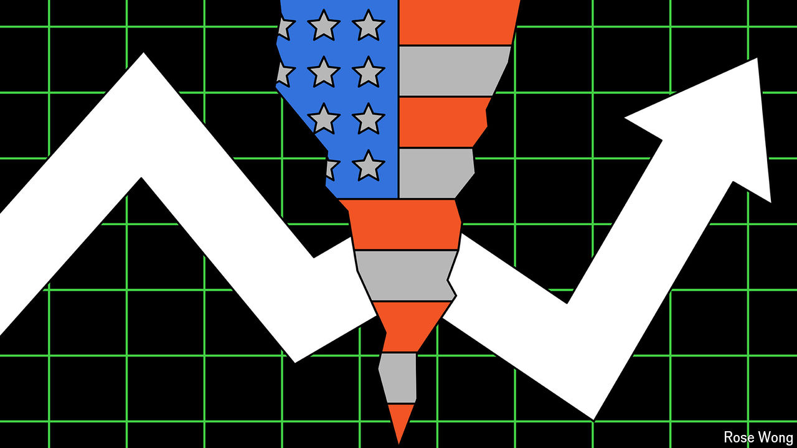
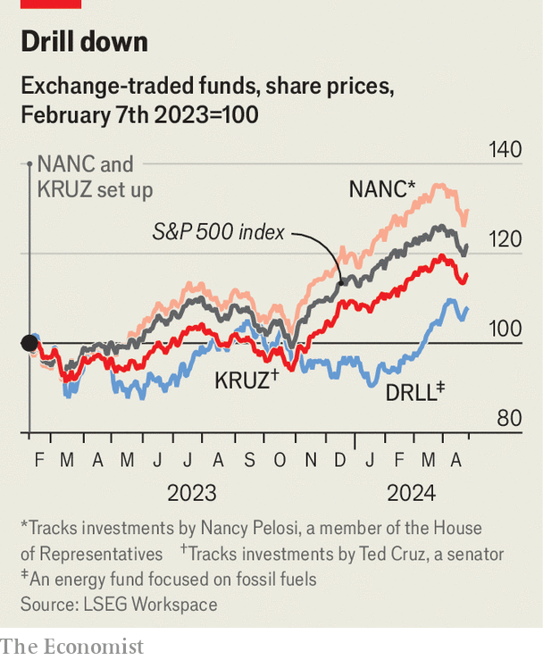
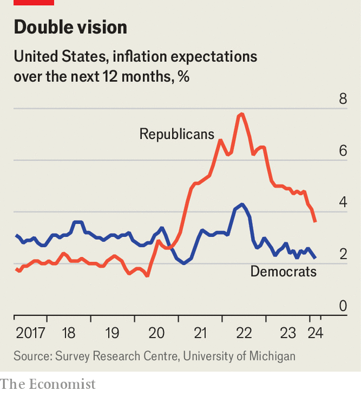

###### Broke capitalism

# How American politics has infected investing 

##### Beware: taking a stand can be expensive 

 

> Apr 21st 2024 

The hedge fund’s branding is a clue. 1789 Capital was set up last year and named after the year  proposed America’s bill of rights. It offers investors the chance to put money into what it says are three key themes: a parallel conservative economy catering to consumers who want to avoid being bombarded with liberal ideas; the shift away from free trade; and firms that have been penalised by the environment, social and governance (ESG) investment trend. Its founder, Omeed Malik, a former banker, has hosted fundraisers for , an anti-vaccination, long-shot presidential candidate. 


1789 Capital is part of a trend: American politics is infecting investing. A gap has opened up between how Democrats and Republicans view the world; many Americans want to express their political identities by any means possible; and others see their money as a way to sway businesses’ behaviour. All this is influencing investment decisions. The amount of money invested in, say, novelty exchange-traded funds (ETFs), such as those tracking the portfolios of certain politicians, is small, but other developments are more significant. Some $13bn has been withdrawn from BlackRock’s accounts, for instance, as Republican states boycott asset managers that support ESG. A bitter rematch between Donald Trump and Joe Biden will probably supercharge the trend. 

 


According to a working paper by Elena Pikulina of the University of British Columbia and co-authors, the portfolios of Democrat and Republican retail investors began to diverge half-way through Barack Obama’s presidency, before consistently widening. By combining data from investment advisers with county-level election results, the researchers show that investors in Republican-leaning counties shun stocks of firms where the chief executive has made donations to the Democrats, while those in Democrat-leaning counties are less likely to invest in a firm when there are concerns about its treatment of workers. Voters also indirectly influence decisions made by their political representatives, as can be seen with the ESG boycotts.

What motivates this behaviour? One possibility is that Democrats and Republicans simply disagree about the direction of the economy and, as a result, about which investments will perform best. Under this reading, rather than being the consequence of investors trying to achieve political outcomes, the divide is a product of politically inflected views of the world. A paper by Maarten Meeuwis of Washington University in St Louis and colleagues finds that the risk appetite of American investors shifts according to who is in the White House. After the presidential election in 2016 some Democrat-leaning investors sold stocks and bought bonds—a sign they were worried about the future. Republicans did the opposite. Although only a relatively small number of people made such moves, those who did typically shifted more than a quarter of their holdings.

The authors argue these decisions reflect differing interpretations of economic data. They mirror a divide between Democrats and Republicans on consumer confidence. Both are more upbeat about the economy when the president is from their own party, controlling for inflation and unemployment. A consumer-sentiment survey by the University of Michigan finds a significant divergence along political lines—bigger than that along the lines of age or income. During Mr Biden’s time in office, Republicans have on average expected 2.4 percentage points more inflation in the year ahead than Democrats. 

 


Yet different world views do not entirely explain the trend. It seems partisans are buying shares as an expression of support, too, much as they might put up a candidate’s poster. , Mr Trump’s social-media holding firm, surged when it listed on the Nasdaq in March, as supporters rushed to buy the stock. After Mr Trump’s win in 2016, punters in Democrat-leaning counties invested more in clean-energy firms, even though the result was likely to be bad news for such businesses. To these investors, returns matter less than identification with the cause, says Stephen Siegel of the University of Washington, one of Ms Pikulina’s co-authors. 

Partisan investors also hope to change business behaviour. Since Republican states began to pull money from BlackRock, the firm’s boss, Larry Fink, has begun to shy away from referring to esg. So have other prominent asset managers and bankers. Meanwhile, a study by Matthew Kahn of the University of Southern California and colleagues finds that when an American state’s pension fund becomes more Democrat-aligned—say, when a new governor comes in—the firms it is invested in reduce their carbon emissions quicker. 

Partisan investing is both problem and opportunity for financiers. The rise of ESG investing at first allowed asset managers to distinguish themselves from rivals. Around $120bn flowed into such funds in 2021. But in the final quarter of 2023 they saw net outflows for the first time. The difficulty now is to sell to both sides without annoying either—a task that is becoming harder as new topics enter the fray. In October Ron DeSantis, governor of Florida, gave Morningstar Sustainalytics, a data firm, 90 days to either “clarify its business practices or cease its boycott of Israel”. He argued that its ESG metrics classified companies as a risk for having invested in Israel. An independent report commissioned by Morningstar has recommended dropping a specific tag for companies that operate in “occupied territories”—advice that the firm intends to follow. Florida has since removed Morningstar from the warning list.

It is not just conservatives making a fuss. Vanguard, an asset manager, has been targeted by activists for exiting the Net Zero Asset Managers Initiative, an industry body. In January the Sunrise Project, a campaign group, began running advertisements in Pennsylvania, the firm’s home state, accusing it of giving in to bullies. 

At the same time, smaller firms can indulge partisans. There have long been funds that apply a liberal lens to investment decisions, such as Parnassus Investments, which was established in 1984. They are being joined by right-wing ones. As well as 1789 Capital, there is Strive Asset Management, set up in 2022 by Vivek Ramaswamy, an ertswhile Republican presidential candidate, which offers investors an American energy etf that focuses on fossil fuels and has the ticker DRLL. 

Taking a stand can be expensive. Researchers at the Federal Reserve and the University of Pennsylvania have found that anti-ESG boycotts raised the cost of interest on $32bn borrowed by Texan municipalities by $300m-500m, as banks with ESG policies withdrew from underwriting bond sales. Democrats who shifted out of stocks when Mr Trump won in 2016 would have lost out on a post-election rally. In the year after the vote, the S&amp;P 500 rose by 21%. 

Markets thrive on differences of opinion: every seller needs a buyer and every buyer needs a seller. Funds that offer investors a chance to express those opinions are not necessarily a bad thing. But American capitalism has been built on the pursuit of profit at all costs. In recent decades, investors have flocked to index funds, which track the market, offering diversification and low fees. To the extent that partisan investors are trying to reshape the economy to align with their values, rather than betting on beliefs about the economy, they are going to pay for it. ■


