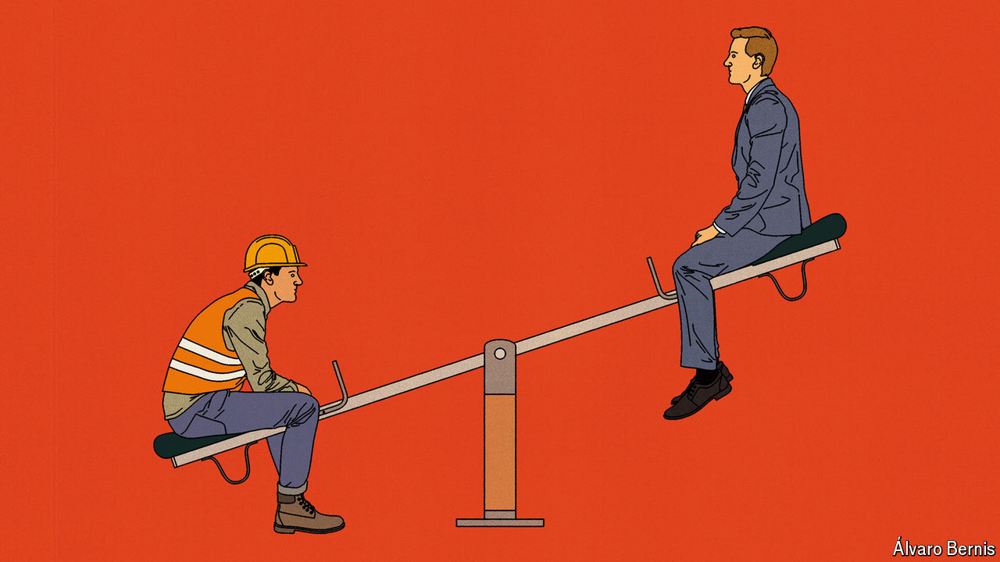

###### Free exchange

# Is inflation morally wrong? 

##### Workers think so. Economists disagree 

 

> Apr 25th 2024 

Where other historians saw a mob of hungry peasants, E.P. Thompson saw resistance to capitalism. Studying England’s 18th-century food riots, the Marxist historian coined the term “moral economy”. The rioters, he argued, were not motivated purely by empty bellies, but by a belief that the bakers, farmers and millers had violated paternalist customs, which suggested they should limit their profit, sell locally and not hold back grain. Gradually, Thompson argued, the moral economy was being displaced by a market economy, in which prices follow the amoral logic of supply and demand, rather than ideas of what would be a “fair price” in times of scarcity. 

Americans may not be rioting over bread prices, but they are angry. President Joe Biden now faces a tight race for re-election. Swing voters are particularly annoyed about inflation, as the price level has risen by a cumulative 19% since Mr Biden’s inauguration. Yet this frustrates many left-wing economists, who see the tight labour market and rising real wages in America as a great success. To them, inflation is an irritating—and now stubborn—by-product of the mixture of fiscal stimulus and industrial policy pursued by Mr Biden. It is not the main story. 

A new working paper by Stefanie Stantcheva of Harvard University helps explain the divergence. Ms Stantcheva asks, “Why do we dislike inflation?”, which updates a paper published in 1997 by Robert Shiller, who later won a Nobel prize in economics. Using two surveys, she posed Americans a series of closed questions, such as “How have your savings been affected by inflation?”, and open-ended ones, such as “How would you define ‘inflation’ in your own words?”. The results show that Thompson’s concept of the “moral economy”, which he thought had been displaced by the cold logic of the market, still has popular appeal. 

Americans who responded to Ms Stantcheva’s surveys were angry for a number of reasons. Most believed that inflation inevitably meant a reduction in real incomes. They said that rising prices made life more unaffordable and prompted them to worry they would not be able to afford the basics. Respondents did not see a trade-off between inflation and unemployment—referred to as the “Phillips curve” by economists—but thought that the two would rise in parallel. Some 70% did not view inflation as a sign of a booming economy, but as an indication of one in a “poor state”. Around a third saw reducing inflation as a bigger priority than financial stability, reducing unemployment or increasing growth. In short, respondents really hated rising prices.

Some of their beliefs reflected what has happened during the current spell of inflation. Following the covid-19 pandemic, real incomes did indeed fall, as prices rose faster than wages. It is only over the past couple of years that wages have grown sufficiently to make up the difference. The price of basics, such as food and fuel, has risen faster than other items in the inflation basket. And even if your income is rising, it is irritating to see a greater share go on necessities. Nor does inflation always accompany a strong labour market. During the global financial crisis of 2007-09, for instance, high commodity prices produced a situation in which inflation rose at the same time as the global economy weakened. During the inflation of the 1970s, which looms large in the popular memory, unemployment rose.

Why, then, are some economists more relaxed about rising prices? Inflation does present difficulties: it can undermine central-bank credibility and causes arbitrary redistribution from creditors to debtors. The constant updating of prices also carries costs for companies. Yet if all prices are adjusting at the same rate, the change is not as consequential as many workers believe. It no more means that workers are getting poorer than measuring someone’s height in feet rather than centimetres would mean that they are getting shorter. What is more, inflation is often the consequence of a hot labour market, as is the case in America at the moment. It should, therefore, be accompanied by low unemployment and rising wages, which help compensate for the irritation of prices changing more frequently. 

Thin gruel

Much like rioters in 18th-century England, Americans believe that price rises are fundamentally unfair. Respondents to Ms Stantcheva’s surveys suggested that inflation widened the gap between rich and poor, while businesses allowed prices to rise because of corporate greed. They also “tend to believe that employers have a lot of power and discretion in setting wages”, notes Ms Stantcheva. In their view, inflation is not a phenomenon that emerges from hundreds of millions of people taking trillions of decisions. It is something inflicted on them by people at the top of totem pole. 

Yet workers still gave little credit to businesses or the government for an astonishingly strong labour market. Wage rises were generally seen as the responsibility of the individual: a well-deserved reward for hard work. Those survey respondents who had received a pay rise were twice as likely to attribute it to their on-the-job performance as to inflation. However persuasive left wing-economists may be, Americans will not thank the Biden administration for what they see as their own success.

Riots are often counter-productive. In 18th-century England, according to Thompson, terrified farmers decided not to bring their crops to market. Shortages worsened in other parts of England as speculators were intimidated into keeping purchases in storage, rather than shipping them across the country. In a moral economy concerns about what is right and wrong outweigh efficiency, imposing a cost on those assigning blame as well as those being blamed. That does not make it any more comfortable for those being judged, as Mr Biden is now all too aware. ■


