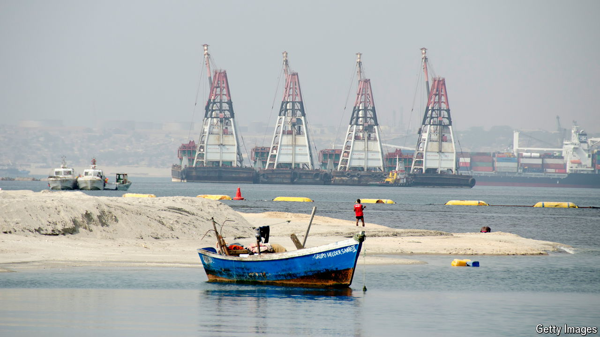

###### Desert dollars

# The UAE is using a wealth fund to gain diplomatic sway 

##### And to build holiday resorts 

 

> Apr 25th 2024 

Sovereign wealth funds seldom worry about foreign policy. Those that invest abroad typically do so in order to ensure stable returns or diversify holdings, meaning they tend to hold Treasuries and Western stocks. Many have started to spend more at home in order to advance national growth plans. But ADQ, one of the United Arab Emirates’s wealth funds, is heading in a different direction.

With $199bn of assets under management, an amount equivalent to two-fifths of the UAE’s GDP, the fund has decided to take a new approach. Although more than 80% of its capital is tied up in domestic infrastructure and related firms, such as Etihad Airways and AD Ports, this reflects spending in the years after the fund was established in 2018. The new ambition is to exert the UAE’s influence abroad—on which it is willing to spend big. 

Investments by Etihad and AD Ports, in things such as a cargo operator and a Congolese port, have made ADQ one of the most active wealth funds in Africa. Last year it signed $11.5bn of deals with Turkey, including in export financing and post-earthquake reconstruction; it is also in discussions about financing a railway across the Bosporus Strait, which would create a trade route linking Asia, Europe and the Middle East. ADQ’s biggest deal yet was signed in February, when the fund provided $24bn of a $35bn package to rescue Egypt from default. Rather than merely bankrolling the deal, ADQ’s cash bought a stretch of the country’s Mediterranean coast, which will become a holiday destination, financial hub and free-trade zone. 

This frenetic activity reflects the UAE’s belief that it has an opportunity to exert influence. Saudi Arabia is turning inward as it focuses on its “Vision 2030” agenda, intended to reduce its reliance on oil. The kingdom’s share of bail-outs in the Middle East fell to 39% in the decade to 2022, down from 65% in the four decades before that. Other countries in the Gulf are now rushing to spend, and the UAE is eager to win the race for influence.

ADQ’s investments are particularly attractive to potential recipients as they are akin to private-equity stakes. Much as buy-out barons take on illiquid investments, and then focus on improving operations, so ADQ attempts to expand ports and property empires, rather than passively sitting on purchases.

Thus ADQ’s investments often go hand-in-hand with trade deals, including one signed with Kenya on April 24th. The fund has joint ventures with countries including Azerbaijan, Jordan and Oman, all three of which have inked such agreements. It is also investing alongside Egypt and Turkey. As an ADQ paper states, such alliances align research-and-development efforts and create strategies to benefit portfolio firms with similar interests. They also forge closer alliances and help spread risk. 

Emirati rulers do not just want more influence over the countries that receive their investments, however. After ADQ’s deal with Egypt, for instance, the fund was able to help complete an IMF deal. Following this, the Egyptian pound was allowed to trade more freely, and duly sank. But for now the country is no longer teetering on the edge of collapse—and ADQ was able to get a difficult deal over the line. This will have boosted the UAE’s standing in Washington and beyond.

Financial results are less of a concern for the wealth fund’s administrators. ADQ has not been set explicit targets, as is typical with other similar institutions. Its reports do not provide many figures. “Our impact extends beyond financial returns, transcending social barriers with an immediate effect on people’s livelihoods,” Jaap Kalkman, ADQ’s investment boss, has said. Or to put it more plainly: mixing foreign-policy goals and investments is hardly a formula for guaranteed returns. ■


