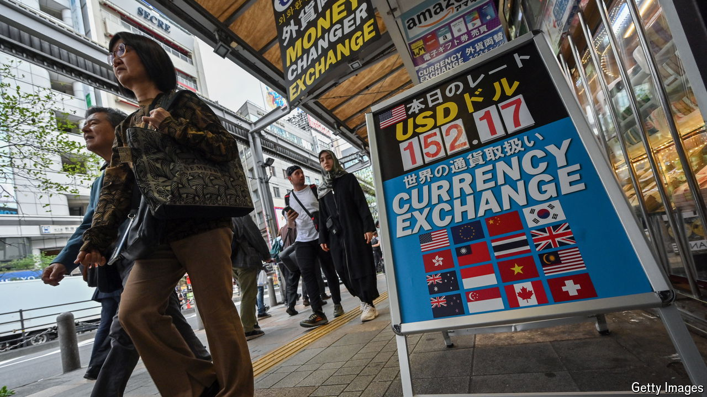
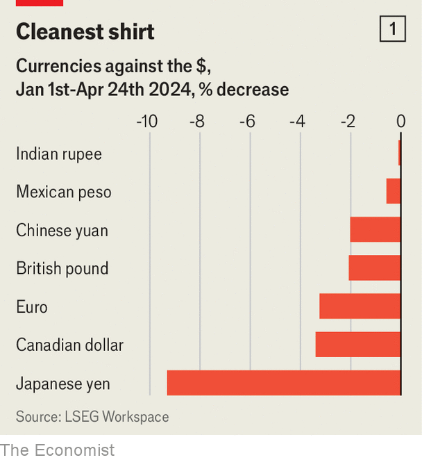
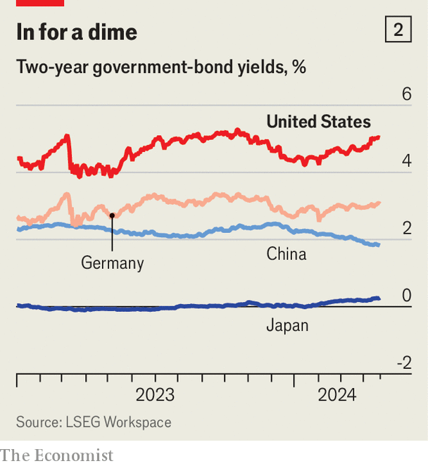

###### Battles to come

# Why a stronger dollar is dangerous 

##### It sets the stage for a nasty new Trump-China clash, among other things 

 

> Apr 23rd 2024 

The dollar is looking formidable. As American growth has stayed strong and investors have scaled back bets that the  will cut interest rates, money has flooded into the country’s markets—and the greenback has shot up. It has risen by 4% this year, measured against a trade-weighted basket of currencies; the fundamentals point to further appreciation. With a  looming, and both Democrats and Republicans determined to promote American , the world is on the verge of a new period of strong-dollar geopolitics.

 


This situation is made still more difficult by the fact that the currency’s strength reflects weakness elsewhere. By the end of 2023, America’s economy was 8% larger than at the end of 2019. Those of Britain, France, Germany and Japan each grew by less than 2% during the same period. The yen is at a 34-year low against the dollar. The euro has dropped to $1.07 from $1.10 at the start of the year (see chart 1). Some traders are now betting that the pair will reach parity by the beginning of next year. 

Should Donald Trump win in November, the scene is therefore set for a fight. A strong dollar tends to raise the price of American exports and lower the price of imports, widening the country’s persistent trade deficit—a bugbear of Mr Trump’s for many decades. , the architect of tariffs against China during Mr Trump’s time in the White House, wants to weaken the dollar, according to Politico, a news website. President Joe Biden has made no public pronouncements on the currency, but a strong dollar complicates his manufacturing agenda, too. 

Elsewhere, a mighty greenback is good for exporters that have costs denominated in other currencies. But high American interest rates and a strong dollar generate imported inflation, which is now exacerbated by relatively high oil prices. In addition, companies that have borrowed in dollars face steeper repayments. On April 18th Kristalina Georgieva, head of the IMF, warned about the impact of these developments on global financial stability.

Many countries have ample foreign-exchange reserves that they could sell to bolster their currencies: Japan has $1.3trn, India $643bn and South Korea $419bn. Yet any relief would be temporary. Although sales slowed the strengthening of the dollar in 2022, when the Fed began raising interest rates, they did not stop it. Central banks and finance ministries are loth to waste their holdings on fruitless fights.

Another option is international co-ordination to halt the greenback’s climb. The beginnings of this were on display on April 16th, when the finance ministers of America, Japan and South Korea issued a joint statement expressing concern about the slump of the yen and won. This may be the precursor to more intervention, in the form of joint sales of foreign-exchange reserves, to prevent the two Asian currencies from weakening further. 

 


But as much as these countries may want to be on the same page, economics is unavoidably pulling them apart. After all, yen and won weakness is driven by the gap in interest rates between America and other countries. South Korea’s two-year government bonds offer a return of around 3.5%, and Japan’s just 0.3%, while American Treasuries maturing at the same time offer 5% (see chart 2). If interest rates stay markedly higher in America, investors seeking returns face a straightforward choice—and their decisions will buttress the dollar.

Then there are countries with which America is less likely to co-operate. According to Goldman Sachs, a bank, China saw $39bn or so in foreign-exchange outflows in March—the fourth most of any month since 2016—as investors fled the country’s languishing economy. The yuan has weakened steadily against the dollar since the beginning of the year, and more rapidly from mid-March, since when the dollar has risen from 7.18 yuan to 7.25. Bank of America expects it to reach 7.45 by September, when America’s election campaign will be in full flow. That would place the yuan at its weakest since 2007, providing a boost to China’s latest export drive. Cheap Chinese electric vehicles may be about to become cheaper still.

Even protectionists in America may be willing to overlook allies’ weak currencies, at least for a time. They are less likely to do so for China. This raises the risk of further tariffs and sanctions, and maybe even the return of China to America’s list of currency manipulators. As long as America’s economy outperforms, the dollar is likely to remain strong. And as long as American politicians see that as a cause for concern, trade tensions are sure to rise. ■


