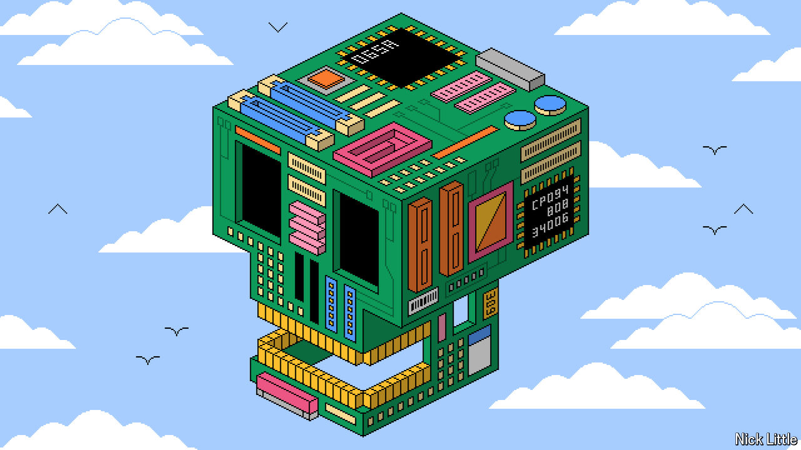
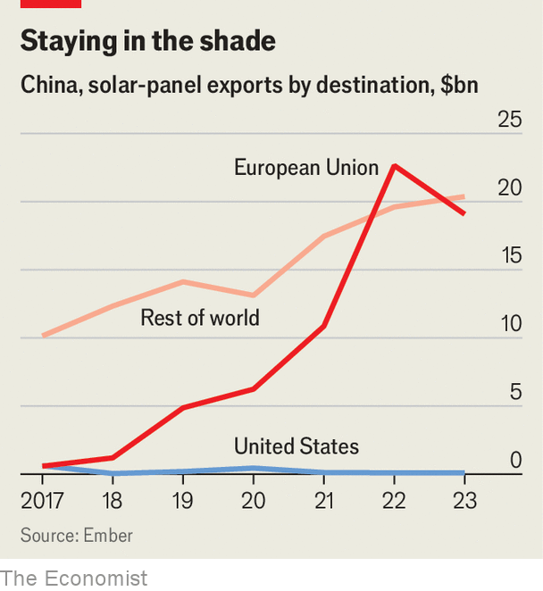

###### Autarky rules OK

# The tech wars are about to enter a fiery new phase 

##### America, China and the battle for supremacy 

 

> Apr 25th 2024 

FLOWS OF INFORMATION and energy underpin all economic activity, and advanced technologies support both. Hence the sky-high stakes in the tech wars between America and China. Started during Donald Trump’s first term in office, between 2017 and 2021, they have continued under Joe Biden. China’s leader, Xi Jinping, bridles at America’s export controls on “chokehold technologies”. The struggle is reshaping relationships and supply chains the world over. And its costs are mounting. Estimates vary, but the IMF reckons that the elimination of high-tech trade across rival blocs could cost as much as 1.2% of global GDP each year—about $1trn. 

Whether China or America controls energy and information technologies is an “ethno-civilisational question”, says Evan Ellis of the Army War College. The temperature of the confrontation is likely to rise over the coming years. Neither Mr Biden nor Mr Trump will shrink from challenging China, perhaps the issue which enjoys the highest level of bipartisan support in Washington. And for China to back down from what it sees as its rightful place in the global order is unthinkable for Mr Xi. 

The next stage of the tech wars will play out in two major arenas. One is chipmaking, which creates the world’s information-processing infrastructure, including the one that trains and runs artificially intelligent software. Any degree of Chinese control over the production of chips is intolerable to America. The other is green technology, as its components may become the backbone of the entire global economy. For China the strength of its companies in this arena is not just a natural consequence of two decades of focused industrial policy, but a confirmation of its important role as a global leader. 

At the moment the battle is over apps. On April 23rd Congress passed a bill asking the Chinese owners of TikTok, a video platform used by 170m Americans, to sell up in 270 days or face a ban. Days before Chinese authorities forced Apple to drop WhatsApp and Threads, platforms owned by Meta, from its Chinese app store. But despite the outcries, apps are a second-order concern as they require chips and energy to run—not the reverse. 

Consider the current positions of the two countries. America is pushing chipmakers to expand cutting-edge production on its shores. On April 8th the government announced $6.6bn in subsidies for Taiwan’s TSMC for three new fabs in Arizona. On April 15th came $6.4bn for South Korea’s Samsung to build fabs in Texas. The moves fall under its $280bn Chips and Science Act, an industrial policy introduced in 2022, which incentivises the creation of fabs and the training of staff for them. Also in America’s toolkit is the Inflation Reduction Act (IRA), a $369bn green-subsidy package passed in 2022. It supports domestic production of green gear through tax credits. Meanwhile, America maintains high tariffs on Chinese solar panels and EVs, of 14.25% and 25% respectively.

China has nonetheless raced ahead in green tech. Longi is the world’s largest solar-panel manufacturer; CATL is the largest battery maker and BYD is  for the title of the world’s largest maker of EVs. Chinese chipmaking has not panned out so spectacularly, however, despite government subsidies of about $150bn over the past ten years. That is to some degree a measure of America’s success in blocking the flow of chipmaking technology into the country over the past two years.

So what next when it comes to chipmaking? The first casualty in the tech wars was Huawei. It was the company on which the Trump administration honed the export controls that are now used on China as a whole. The question is what comes after America’s election in November. Whoever wins, the next president will almost certainly launch a new, Huawei-style campaign against other Chinese tech firms. This is partly because China hawks will pack any new American cabinet. 

Under a Trump presidency, foreign companies may have extra reasons to fret. TSMC is one such: in July last year Mr Trump grumbled that Taiwan had taken away America’s chip business. But it is South Korean chip firms, SK Hynix and Samsung, that stand out most, having invested some $35bn in China since 2020. “Trump 2.0 is going to play a lot more hardball with the Koreans,” says one congressional staffer who works on Chinese tech policy. Under Mr Trump, he says, American subsidies will come with a requirement not to invest in China at all.

Firms in related industries are on alert. MGI Tech, a spin-off of the Chinese giant BGI which makes genome-sequencing equipment, is likely to be a target. Republicans, in particular, are upset that MGI’s machines have been installed in European hospitals. “Major multilateral controls on quantum technology” being exported to China are also likely, says a Republican staffer. That may be intended to deny China access to quantum computing and sensing technologies which may become important in the future, rather than waiting until they prove themselves in the market.

American corporations are not entirely relaxed, either. Although advisers and lawyers believe the Chips Act will remain in force, some big companies, such as Intel, may be keen to know that the contracts governing their disbursements under it are ironclad. “We want to make sure that is legally binding,” says a chip executive. 

Tech bosses may also dislike discussions about reforming the Bureau of Industry and Security (BIS). This is the agency in charge of the export controls which have been used extensively over the past six years to attack Chinese technology firms. Many Republicans and some Democrats believe that BIS staff have been slow-pedalling the controls. But chip firms rely on the bureau’s machinery, according to one tech boss. Some would consider moving some operations abroad and altering supply chains if BIS comes under fire, so as to be freer of Washington’s control. 

If America acts against Chinese chipmakers, China lacks responses which are not obviously self-destructive. It found one last year: placing export controls on gallium and germanium, two materials which are small but important ingredients in the chipmaking process. China could do so because it supplied 98% and 60% of global output in 2022. Commodity-export controls are weak, however, compared with America’s grip on intellectual property. 

More powerful are Chinese efforts to dominate the production of less technologically advanced chips. One open question in the tech wars is the extent to which growing Chinese control of less advanced chip manufacturing can satisfy global demand for the sort of computation that is found in EVs and smart grids. 

What about green technologies? America has little it could deny China, and so its plan over the coming years is to withhold access to its market, the world’s second-largest, and to persuade allies to do the same. Mr Biden will probably continue down the climate-friendly path he has followed in office. He will reinforce links with allies and use public money to accelerate America’s decarbonisation while blocking many, if not all, Chinese imports. Mr Trump is a different story. Talk of the more aggressive, climate-agnostic approach that he is likely to adopt is already rattling executives in America and around the world.

The IRA should survive either man. “No Republican is going to say ‘I support it’, but I think they’re OK with the IRA continuing to exist,” says one Republican insider. That may be because $74bn of the $106bn IRA-stimulated investment to date has gone to Republican counties. An extreme aim may be to remove any and all Chinese components from the supply chains whose creation the IRA is encouraging. “The ability for Chinese companies to receive a single dime from the IRA is going to go,” says the same insider. It’s possible that the act morphs from a climate initiative into one exclusively supporting high-tech manufacturing in America. 

The automotive industry could be among those which struggle most amid an anti-green onslaught. Mr Trump has called EVs a “hoax” and says Chinese-made EVs will destroy America’s car industry. That leaves car firms in a bind. The biggest, says one lobbyist, have developed plans to establish joint ventures with Chinese battery companies on American soil. So far only Ford has spoken publicly about its plans to license technology from CATL; Republican attacks followed. “I know that companies have negotiated these things. I suspect they’re waiting, because if Trump gets elected these [deals] will disintegrate,” explains the lobbyist.

Chinese solar, EV and battery firms will keep trying to find ways into the American and European markets. That could be through joint ventures with domestic companies, or through factories built in countries such as Mexico with which America has a free-trade agreement. But China’s domestic market, and that of the world outside the West, provides plenty of opportunity; China installed more solar in 2023 than America has in total. In chips China has market power, but not technological dominance. With green tech it has both.

Uncovering the costs

The potential effects of prolonging the tech wars are sobering. Any American administration that fights China on every front could lose focus on the fronts that matter most. Chinese green-tech exports are booming all around the world (see chart), and installations within China are growing faster than anywhere else, so denying access to the American market may not do much to weaken the grip of Chinese firms. And a more unilateral approach to controlling the flow of advanced technologies into China may harm the fragile co-operative relationship that the Biden administration has built with the Japanese, among others, in recent years. American policy could also alienate European allies. American policymakers report a lack of interest from their European counterparts on export controls and outbound investment screening against China.

 


But the biggest costs of the tech wars could be the bifurcation of the world’s information and energy-technology industries, leading to sagging economic growth and slower decarbonisation. They will probably accelerate firms’ secretive efforts to develop offerings for the Chinese market over which the American government has little or no control. That could inadvertently give China more power to set technological standards in parts of the world that use its equipment.

The Biden administration’s approach to China and technology has been relatively predictable. For that reason, it has been less disruptive. By all accounts, Mr Trump would break with Mr Biden’s policy even though it is a continuation of his own first term. Unfortunately, an even more aggressive campaign may lead to worse outcomes for America, China and the world. ■

