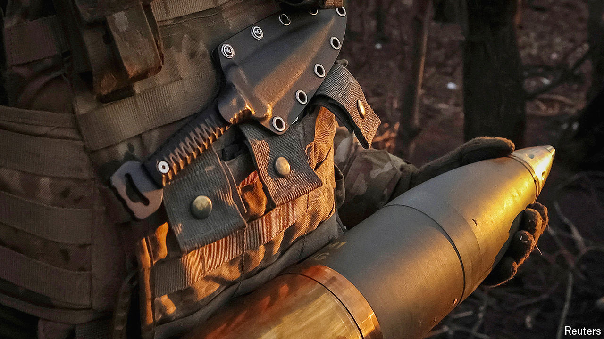

###### Good news, for now

# America’s latest aid will give Ukraine only a temporary reprieve 

##### The bitterness of the struggle in Washington is a sign of trouble ahead 

 

> Apr 24th 2024 

THROW A MAN a life jacket and you remove an immediate danger. But if he is miles from safety and the waters are frigid, he is still in peril. That, more or less, is how to think about Ukraine after President Joe Biden signed a  on April 24th. This will allocate $61bn-worth of military and financial assistance to help it fight back against the Russian invaders, as well as providing money for Israel and Taiwan. Had the cash not come through, as seemed possible during six months of congressional deadlock, Ukraine faced the prospect of losing yet more of its territory to a fresh Russian offensive expected early in the summer. Alas, although $61bn keeps Ukraine afloat, it remains far from the shore.

The good news for Ukraine is that the latest American package will soon be felt on the front lines. Since funds began to dwindle in the autumn, shortages of crucial supplies, especially shells, have become . Russia has been firing five or more rounds for every one Ukraine sends the other way. With munitions already stockpiled at American bases in Poland, that constraint will now be eased. As shells arrive, so Russia will find it more dangerous to concentrate men and tanks for fresh assaults. Getting much-needed drone- and missile-interceptors into Ukraine will take longer, but eventually Russia will no longer control the skies, especially over the front lines.


However, this news is tempered by some sobering facts. First, although the new package will boost Ukraine’s defensive capabilities, it is not enough to help it recapture the territory it has lost to Russia, which now amounts to around 18% of its land mass (half seized in 2014, half after the invasion in 2022). The lesson of last summer’s failed counter-offensive, which cost Ukraine dearly in terms of men and materiel, is that taking territory is hard. Drones and satellites have made the battlefield transparent, lifting the fog of war and making it easier to destroy concentrations of men and armour. Continued stalemate is now a more realistic hope for Ukraine.

Second, the battle in Congress to get the bill passed is a sign of trouble ahead. The $61bn roughly matches what America spent on Ukraine in the first 20 months or so of the war, after which its funding ran out. The new money may therefore be used up by the latter part of 2025. Even if funds are left over, by then a newly elected Donald Trump may decide not to use them. If Mr Biden is still president, the demoralising battle just fought will have to be fought again next year. This latest American package may turn out to be the last.

That is why European leaders would be wrong to see American aid as anything more than a temporary reprieve. The chances are that this war will drag on, possibly for many years. Since Ukraine drove the Russians back across the Dnieper river in November 2022, almost 18 months ago, the front line has barely shifted, despite an immense loss of life. Ukraine’s allies may urge it to trade land for security, but it is hard to see an agreement that could satisfy both Ukraine and Russia. At some point one side or the other may give up, but there is no sign of it yet. 

The West’s goal is, rightly, a stable, secure and prospering Ukraine that lies within defensible borders and is progressing towards membership of the European Union and NATO. The bitterness of the struggle in Washington means European leaders are on notice that they will have to carry more of the burden for bringing this about, and will need a larger defence industry. Although Europe is the biggest donor of financial and humanitarian aid to Ukraine, in terms of military assistance European and American spending have been roughly the same. Thanks to the American lifeline, Europe’s leaders have more time to sort out how to help Ukraine win. The size of the task means that their work is no less urgent. ■

