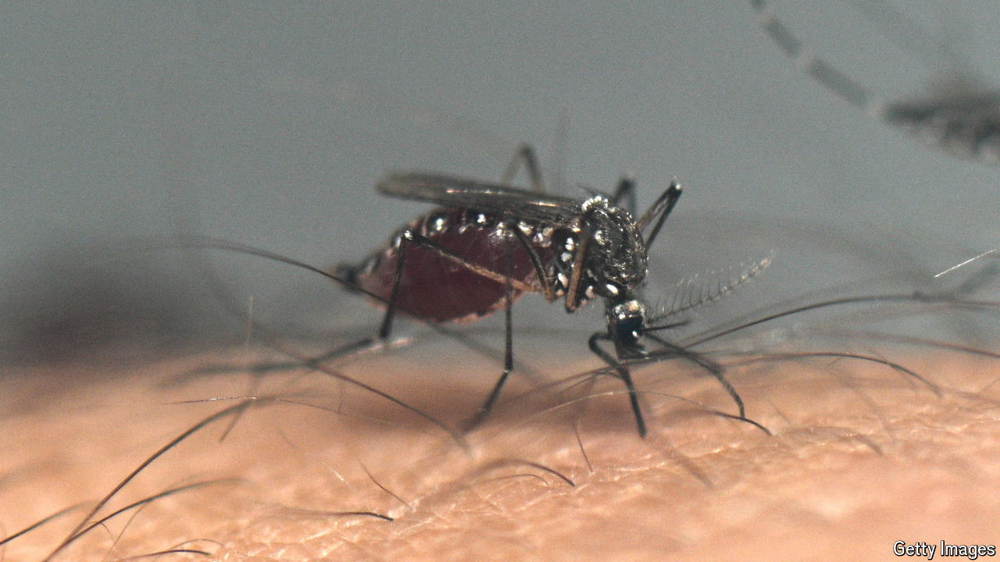
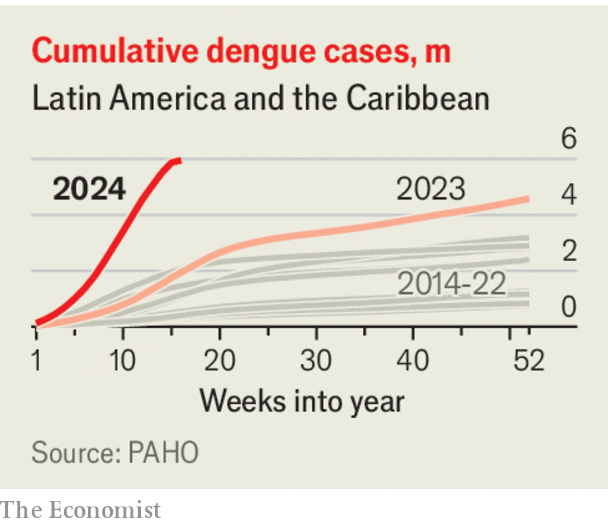

###### Breakbone blues

# As the planet warms, watch out for dengue fever 

##### A mosquito-borne disease is spreading—and must be curbed 

 

> Apr 25th 2024 

Unlike her stealthy, malaria-spreading cousin, the female signals her approach with an exasperating drone. Her bite is far worse than her buzz. If she carries a flavivirus pathogen, her victim can be infected with dengue fever. Most infections pass without symptoms, but an unfortunate few are racked with “breakbone fever”, which causes severe joint pain, haemorrhage and, occasionally, death. The after-effects, which are poorly understood, include fatigue and cognitive impairment. is so plentiful that the United States Centres for Disease Control and Prevention reckons 100m people around the world fall sick with dengue every year.

The number of people contracting dengue has risen dramatically. In 2000 about 20,000 people died of it, according to the World Health Organisation (WHO). This year at least 40,000 will perish. By contrast, between 2000 and 2022, deaths from malaria declined by 30%, the WHO says. 

 


The terrible fever and its after-effects are dengue’s greatest burdens. Cases have risen much faster than deaths. Latin America, the , had an average of 535,000 cases a year in 2000-05, according to the Pan American Health Organisation, an arm of the UN. In 2023 it suffered 4.6m. Already in 2024 there have been 5.9m (see chart).  sickens Brazilians so badly that it could drag down national GDP by 0.2%. Schools in parts of the country afflicted with dengue suffer dropout rates that are about 5% higher than those spared it. 

The suffering is likely to rise further and spread beyond the tropics. mosquitoes are sensitive to small changes in temperature and their range has been expanding as the planet warms. , the species that spreads malaria, is already established in most of the world.  is not. Modelling suggests that, on current trends of climate change, will spread into large parts of southern Europe and the United States, putting another 2bn people at risk of getting dengue.

Urbanisation also helps the disease spread. As people cluster in cities, each individual mosquito can bite more victims during its short, two-week lifespan. Cases are rising fast in places that had not previously suffered much from the disease, including Bangladesh and India. In recent years cases of dengue have been growing in California, southern Europe and subtropical Africa, too.

The world must prepare for much more of the fever. Although the rich northern hemisphere is increasingly at risk, it is the poorer parts of the world that will suffer most. Struggling economies can ill afford to have their productivity sapped by the disease. Nor will it be easy for them to pay for measures that might restrict its spread. Bed nets, a cheap and effective way to curb malaria, do not work for dengue, since , unlike , bites people during the day. 

Singapore has long done a fine job of fighting dengue. It helps that it is rich enough to pay armies of public-health workers to traipse through its streets, searching out the standing water in which mosquitoes breed, pipetting puddles and issuing fines. The city-state models outbreaks and then deploys platoons of insecticide sprayers in hazmat suits to the predicted epicentres. Latin American countries have hazmat armies too, but with modest budgets and vast areas to cover, they have not done much to slow dengue’s explosive growth in the region. Slums are hard places in which to track down mosquito breeding-grounds.

So it is wise to consider other approaches. Since 2016 Singapore has been running another, higher-tech dengue programme. Every week it releases 5m mosquitoes infected with wolbachia bacteria. This prevents them or their offspring from transmitting the virus that causes dengue and costs about $35m a year, or $6 per resident. Combined with new vaccines under development, it provides a way of fighting dengue that does not rely on legions of standing-water spotters. Trials of wolbachia infection in Colombia have seen a 94% drop in dengue incidents in the area where the mosquitoes are released. The world’s largest wolbachia-mosquito factory is due to start operations in the Brazilian city of Curitiba this year. As dengue spreads, other places should follow. The aim should be to turn ’ buzz into a nuisance, rather than a menace. ■


