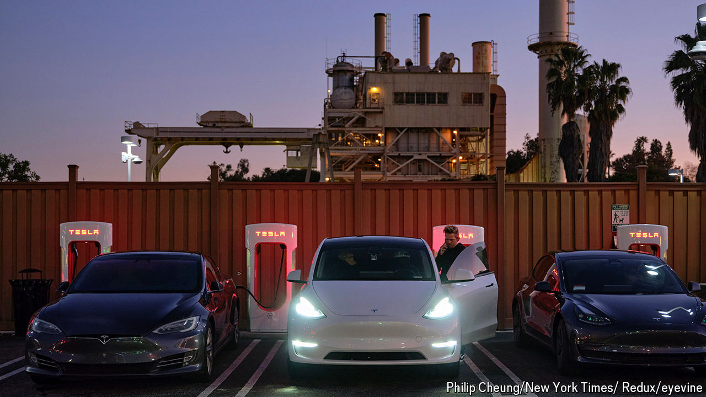
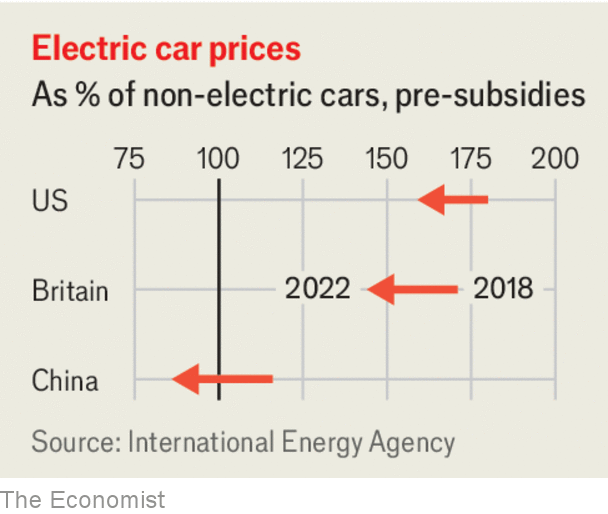

###### Back on the road

# Don’t be gloomy about Tesla and its EV rivals 

##### The industry has had a terrible few months. But demand is likely to pick up 

 

> Apr 24th 2024 

COULD DONALD TRUMP be right about electric vehicles? In March America’s former president, and its EV-basher-in-chief, complained that they “cost too much” and “don’t go far”. Many car buyers seem to agree. In America deliveries of EVs have not risen in the past three quarters. In greener-than-thou Europe they fell last month, by 11% year on year. On April 23rd Tesla, a byword for the electric revolution, , with falling sales and revenues. It has shed $330bn in stockmarket value since January 1st. Five ev , collectively worth close to $400bn in 2021, are valued at a mere $58bn today. 

Having raced to boost EV production, established carmakers are slamming on the brakes. Ford has delayed $12bn in planned EV investments. Mercedes-Benz now says it will reach its goal of selling as many EVs as petrol cars by 2030, five years later than originally promised. You may conclude that the  is in peril.

 


That would be much too gloomy. In fact there are good reasons to expect demand to pick up. The industry may well emerge from today’s dip on a more sustainable course towards carbon-free motoring. One reason for optimism is that the recent slowdown is partly cyclical. Sales grew rapidly in 2021 and 2022 as cash-rich consumers went on a post-pandemic spending spree. Many EVs that are not being bought now were purchased back then—as were lots of laptops, smartphones and other gizmos that are now languishing. Higher interest rates mean that Americans who paid less than 5% a year on a car loan two years ago now have to pay more than 8%. That is a problem, especially when in many places the typical EV remains 40-60% pricier than its petrol-powered alternative. 

Mr Trump may have a point on evs’ cost today, but not for much longer—another reason to dismiss the gloom. The green premium is narrowing for many models. Prices of battery minerals such as lithium have fallen, as have prices of the cells they go into. Five years ago electric SUVs were two to three times the cost of their gas-guzzling cousins, without being two to three times as good. Today you can buy a Ford F-150 Lightning for less than $40,000, just $4,000 more than the petrol version of the popular pickup—$4,000 that you earn back in a single year by not having to fill it up with petrol (which, in contrast to lithium, is not getting cheaper). It is easier to juice up, too, at one of roughly 200,000 charging ports across America, twice the number available in 2020. In  electric cars are already the cheaper option on average, says the International Energy Agency, an official forecaster, even before running costs. Small EVs are two-thirds the price of a comparable fossil-fuel runaround. A new survey by AlixPartners, a consultancy, found that 97% of Chinese car buyers say their next car will run on batteries. 

Western carmakers may also draw lessons from the Chinese experience. Whereas early adopters bought a Tesla as a status symbol, the Chinese are now buying cars made by its rival, BYD, because they are good value. Western makers should fixate less on high-end models and stop neglecting the middle-of-the-road. Until they do, high prices will keep demand subdued and economies of scale elusive. Ford expects its pickup-obsessed  to lose at least $5bn this year. 

The fact that investors are becoming more discerning should help. They are no longer prepared to pour billions into any e-startup with a passable slide deck. And they are rewarding firms with mass-market ambitions. Tesla’s stock price plunged when it was reported earlier this month that Elon Musk would scrap a $25,000 car in favour of a fleet of self-driving robots. The share price bounced back on April 23rd, after he performed a u-turn. Shares in General Motors, whose bosses talked up its coming mass-market EVs on an earnings call this week, have gained 25% so far this year. 

Western governments worried about climate change and  could do more to speed along the ev revolution, by giving . AlixPartners found that seven in ten Americans, Britons, French and Germans would consider an EV from China if it cost 20% less than a non-Chinese alternative—which is close to the real price difference. 

So far policymakers have focused on expanding  (which is welcome) and handing out subsidies (which is less so). They would do better to lift the barriers that keep Chinese EVs from their roads. That would please motorists and, by boosting competition, jolt incumbent carmakers into cleaning up their EV act. ■

