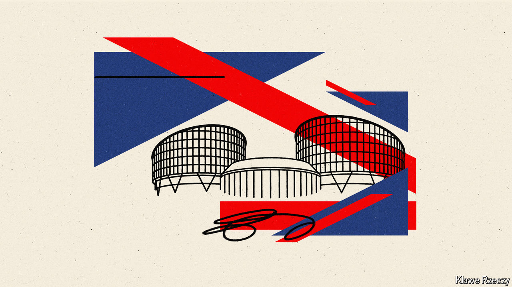

###### Brechrit?

# Why leaving the ECHR would be a bad idea for Britain 

##### The next litmus test of Tory purity 

 

> Apr 25th 2024 

In an ideal world, bad ideas would fade into irrelevance. In Britain’s ruling Conservative Party, they have a good chance of becoming official policy. Divorce the country’s ? Sure. Send asylum-seekers to Africa? Let’s do it. Now there is momentum behind another scheme: leaving the European Convention on Human Rights (ECHR). 

The ECHR is a set of individual rights and freedoms that Britain was the first country to sign up to after the second world war. For chunks of the Tory party, the ECHR has long been an irritant; now it is an affront. In 2022 the court that enforces it blocked flights ; this week Parliament passed a through-the-looking-glass law designating Rwanda a safe country and allowing ministers to ignore similar injunctions. Rishi Sunak, the prime minister, warned that no “foreign court” would stop the Rwanda scheme from getting off the ground. Leaving the ECHR will almost certainly be a  if Mr Sunak is turfed out at the next election.


The court, based in Strasbourg, is almost certain to be contentious. Laws based on rights lend themselves to wide-ranging judgments that can stray into politics. In April it ruled that Switzerland’s failure to combat climate change had violated the right to privacy and family life of a group of elderly women. The right to privacy was cited in an influential ECHR ruling in 2002 that let a British trans woman change her birth certificate. The court is also opaque; until recently, judges could issue emergency injunctions without being named.

But none of this adds up to a compelling argument for walking out of the ECHR. First, on the narrow issue of asylum, the judges in Strasbourg were backed up by Britain’s highest domestic court, which said last year that Rwanda was unsafe. That judgment was based on a myriad of international agreements and laws (indeed, a fairer target for Tory ire may be the Geneva Convention, which tells countries who should be granted asylum). The problem of illegal migration into Britain is compounded by domestic dysfunction. The country grants a higher proportion of asylum requests than either France or Germany, and takes so long to process them that many asylum-seekers can disappear into the crowds in the meantime. The ECHR is a useful scapegoat for a complex problem. 

Second, the costs of leaving are clearer than the benefits. Withdrawal from the ECHR would bear no comparison with Brexit in terms of its impact, but it would suck up time and energy for little obvious reward. Adherence to the convention is sewn into the Good Friday Agreement, the deal struck in 1998 to end 30 years of sectarian strife in Northern Ireland, and into the post-Brexit trade agreement with the European Union. It would also send another bad signal about Britain to the wider world. It is axiomatic that international obligations impose constraints on national governments. A mid-size, open economy whose appeal rests on the rule of law does not want a reputation for resiling from agreements it does not much like. 

That is especially true when reform is an option—the third argument for staying in. The court can be pragmatic: recent changes to the rules about judges’ anonymity, along with much tougher criteria for issuing emergency injunctions, owed much to pressure from Britain. The  was less sweeping than it might seem. The court can also be reformed. Since 1951 its members have agreed on 16 amending “protocols”; one was introduced by Britain in 2013 and underlined that national authorities are often better placed to make decisions. Tory hardliners seem wholly uninterested in changing things from within.

Given its commanding lead in the polls, the position of the Labour Party matters more in the short term than that of the Tory party—and Labour has no plans to quit the ECHR if it wins the election. But the trajectory of the Conservatives, one of Britain’s two big parties, is not some minor detail. If leaving the ECHR becomes the Tories’ settled position, it will show that quixotic pursuits matter more to them than the country’s pressing problems. And another bad idea will be further advanced on the path to becoming policy. ■

